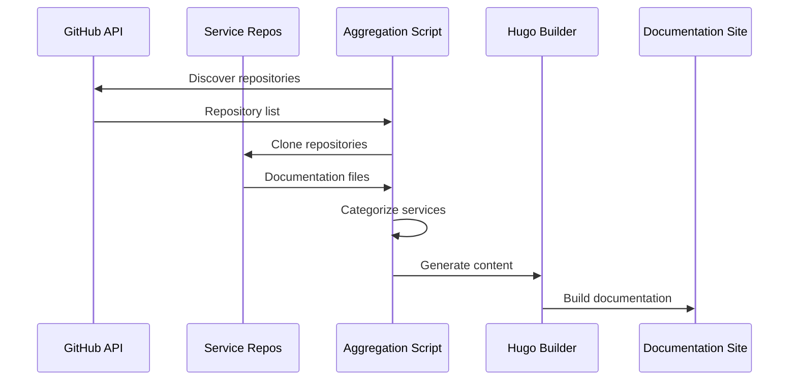

# 🚀 illunare 4.0 Documentation Platform

## Lotus Docs Theme with Comprehensive Automation

> **Next-generation documentation platform** powered by Hugo and Lotus Docs theme, featuring automated content aggregation, visual identity management, and zero-downtime deployment pipeline.


## 🌟 Platform Overview

The **illunare 4.0 Documentation Platform** is a comprehensive documentation solution built with:

- **Hugo Static Site Generator** with Lotus Docs theme
- **Automated content aggregation** from 90+ repositories
- **Multi-language support** (Portuguese BR, English, Spanish)
- **Zero-blocking deployment** pipeline
- **Visual identity enforcement** across all content
- **Advanced search capabilities** with FlexSearch
- **Real-time automation** with 30-minute update cycles

## 🎯 Key Features

### 📚 Content Management

- **Auto-discovery** of service repositories
- **Intelligent categorization** by service type
- **Markdown processing** with Hugo shortcodes
- **Front matter automation** for consistent metadata
- **Cross-referencing** between services and documentation

### 🎨 Visual Identity

- **Lotus Docs theme** with illunare 4.0 branding
- **Custom color scheme** (Indigo primary, Cyan accent)
- **Urbanist font** integration for brand consistency
- **Responsive design** optimized for all devices
- **Dark/light mode** with automatic detection

### 🤖 Automation Features

- **Scheduled updates** every 30 minutes
- **Content aggregation** from GitHub repositories
- **Image optimization** (JPEG/PNG compression)
- **Search index generation** with FlexSearch
- **Link validation** and broken link detection
- **Multi-language content** synchronization

### 🔧 Technical Stack

| Component | Technology | Version | Purpose |
|-----------|------------|---------|---------|
| **Static Site Generator** | Hugo Extended | 0.140.0 | Core site building |
| **Theme** | Lotus Docs | Latest | Modern documentation layout |
| **Frontend Framework** | Bootstrap 5 | Latest | Responsive UI components |
| **Search Engine** | FlexSearch | Latest | Client-side search |
| **Icons** | Google Material Symbols | Latest | Consistent iconography |
| **Fonts** | Urbanist, Inter, JetBrains Mono | Latest | Typography system |
| **Deployment** | GitHub Pages | Latest | Static hosting |
| **CI/CD** | GitHub Actions | Latest | Automation pipeline |

## 🚀 Quick Start

### Prerequisites

```bash
# Required tools
hugo version      # Hugo Extended >= 0.140.0
go version        # Go >= 1.22
git --version     # Git for version control
node --version    # Node.js >= 18 (optional)
```

### Installation

1. **Clone the repository**
   ```bash
   git clone https://github.com/illunare-40/docs-site.git
   cd docs-site
   ```

2. **Initialize Hugo modules**
   ```bash
   hugo mod init illunare-docs
   hugo mod get github.com/colinwilson/lotusdocs
   hugo mod get github.com/gohugoio/hugo-mod-bootstrap-scss/v5
   ```

3. **Start development server**
   ```bash
   hugo server -D --bind 0.0.0.0 --port 1313
   ```

4. **Open in browser**
   ```
   http://localhost:1313
   ```

## 📖 Documentation Structure

### Content Organization

```
content/
├── _index.md                    # Landing page
├── docs/
│   ├── _index.md               # Documentation hub
│   ├── getting-started/        # Quick start guides
│   ├── architecture/           # System design
│   ├── services/              # Service documentation
│   │   ├── frontend/          # Frontend applications
│   │   ├── ai-ml/             # AI/ML services
│   │   ├── security/          # Security services
│   │   ├── industrial/        # Industrial connectivity
│   │   ├── automotive/        # Automotive integration
│   │   ├── compliance/        # Brazilian compliance
│   │   ├── data/              # Data services
│   │   ├── integration/       # Integration services
│   │   └── devops/            # DevOps & infrastructure
│   ├── api/                   # API documentation
│   ├── tutorials/             # Step-by-step guides
│   └── reference/             # Technical reference
```

### Service Categories

| Category | Icon | Description | Examples |
|----------|------|-------------|----------|
| **Frontend** | 🎨 | User interfaces and applications | admin-portal, mobile-app, landingpage-site |
| **AI/ML** | 🤖 | Artificial intelligence services | deepseek-service, ollama-integration, cortex-ai |
| **Security** | 🔐 | Authentication and authorization | auth-service, biometric-service, fraud-detection |
| **Industrial** | 🏭 | Industrial connectivity | profibus-service, profinet-adapter, arduino-libs |
| **Automotive** | 🚗 | Vehicle integration | vehicle-service, transport-management |
| **Compliance** | 🇧🇷 | Brazilian regulations | lgpd-service, bacen-integration, susep-compliance |
| **Data** | 📊 | Data processing and storage | datomic-service, database-framework, storage-service |
| **Integration** | 🔗 | System integrations | api-gateway, service-mesh, integration-layer |
| **DevOps** | ☁️ | Infrastructure and deployment | ci-cd-service, infrastructure-management |

## 🤖 Automation Pipeline

### Hugo Automation Script

The platform includes a comprehensive automation script at `scripts/hugo-automation.sh`:

```bash
# Build documentation locally
./scripts/hugo-automation.sh build

# Deploy to GitHub Pages
./scripts/hugo-automation.sh deploy

# Start continuous monitoring (30-minute cycles)
./scripts/hugo-automation.sh continuous

# Content aggregation only
./scripts/hugo-automation.sh content

# Image optimization only
./scripts/hugo-automation.sh optimize

# Link validation only
./scripts/hugo-automation.sh validate
```

### GitHub Actions Workflow

Automated deployment via `.github/workflows/hugo-deploy.yml`:

- **Triggers**: Push to main, scheduled (every 30 minutes), manual dispatch
- **Jobs**: Preparation → Content Aggregation → Hugo Build → Deployment → Notification
- **Features**: Caching, parallel execution, error handling, reporting

### Content Aggregation Process



## 🎨 Visual Identity System

### Brand Colors

```scss
// Primary Colors
$primary-color: #4F46E5;        // illunare Indigo
$primary-dark: #3730A3;         // Dark mode variant
$accent-color: #06B6D4;         // illunare Cyan
$accent-dark: #0891B2;          // Dark mode variant

// Semantic Colors
$success: #10B981;              // Success states
$warning: #F59E0B;              // Warning states
$error: #EF4444;                // Error states
$info: #3B82F6;                 // Information
```

### Typography Scale

```scss
// Font Families
$font-primary: 'Urbanist', 'Inter', sans-serif;      // illunare brand font
$font-body: 'Inter', -apple-system, sans-serif;       // Body text
$font-code: 'JetBrains Mono', 'Monaco', monospace;    // Code blocks

// Font Weights
$font-light: 300;
$font-regular: 400;
$font-medium: 500;
$font-semibold: 600;
$font-bold: 700;
```

### Component Standards

- **Cards**: Consistent padding, shadows, and border radius
- **Buttons**: Primary, secondary, outline variants with proper states
- **Navigation**: Breadcrumbs, sidebar, and footer consistency
- **Code blocks**: Syntax highlighting with Prism.js
- **Tables**: Responsive design with sorting capabilities
- **Forms**: Consistent input styling and validation states

## 📊 Content Management

### Shortcodes Available

#### Alerts
```markdown

Information message with custom context.



Success message for positive feedback.

```

#### Code Blocks with Prism
```markdown

package main

import "fmt"

func main() {
    fmt.Println("Hello, illunare 4.0!")
}

```

#### Tabs
```markdown



Content for Tab 1



Content for Tab 2



Content for Tab 3



```

#### Tables
```markdown

| Header 1 | Header 2 | Header 3 |
|----------|----------|----------|
| Cell 1   | Cell 2   | Cell 3   |
| Cell 4   | Cell 5   | Cell 6   |

```

### Front Matter Template

```yaml
---
title: "Page Title"
description: "Page description for SEO"
icon: "material_symbol_name"
date: 2025-01-28
lastmod: 2025-01-28
draft: false
toc: true
weight: 100
layout: "default"
categories: ["category1", "category2"]
tags: ["tag1", "tag2", "tag3"]
author: "Author Name"
service: "service-name"
technology: "technology-name"
compliance: "regulation-name"
---
```

## 🔍 Search Implementation

### FlexSearch Configuration

```toml
[params.search]
  enabled = true
  engine = "flexsearch"
  
  [params.search.flexsearch]
    index = "content"
    tokenize = "forward"
    depth = 2
    encode = "icase"
    suggest = true
    cache = true
```

### Search Index Generation

The automation pipeline generates a comprehensive search index:

- **Content extraction** from HTML files
- **Text processing** and cleaning
- **Metadata inclusion** (title, URL, categories)
- **JSON output** for client-side search
- **Automatic updates** on content changes

## 🌐 Multi-language Support

### Language Configuration

```toml
[languages]
  [languages.pt-br]
    languageName = "Português (Brasil)"
    weight = 1
    title = "illunare 4.0 Enterprise Platform"
  
  [languages.en]
    languageName = "English"
    weight = 2
    title = "illunare 4.0 Enterprise Platform"
  
  [languages.es]
    languageName = "Español"
    weight = 3
    title = "illunare 4.0 Enterprise Platform"
```

### Content Translation

- **Primary language**: Portuguese (Brazil)
- **Secondary languages**: English, Spanish
- **Automatic detection** based on user preferences
- **Fallback mechanism** to English for missing translations
- **Content synchronization** across languages

## 🚀 Deployment Options

### GitHub Pages (Production)

```yaml
# Automatic deployment via GitHub Actions
URL: https://docs.illunare.com
Custom Domain: docs.illunare.com
SSL: Automatic (Let's Encrypt)
CDN: GitHub's global CDN
```

### Local Development

```bash
# Development server with live reload
hugo server -D --bind 0.0.0.0 --port 1313

# Build for production
hugo --minify --enableGitInfo
```

### Manual Deployment

```bash
# Using the automation script
./scripts/hugo-automation.sh deploy

# Manual GitHub Pages deployment
git checkout gh-pages
cp -r public/* .
git add .
git commit -m "Deploy documentation"
git push origin gh-pages
```

## 📈 Performance Optimization

### Build Performance

- **Hugo modules** for efficient dependency management
- **Incremental builds** with intelligent caching
- **Parallel processing** during content aggregation
- **Resource optimization** (minification, compression)
- **Image optimization** with jpegoptim and optipng

### Runtime Performance

- **Static site** delivery for maximum speed
- **CDN distribution** via GitHub Pages
- **Lazy loading** for images and content
- **Service worker** for offline capabilities
- **Progressive enhancement** for better UX

### Performance Targets

| Metric | Target | Current Status |
|--------|--------|---------------|
| **First Contentful Paint** | < 1.5s | ✅ Achieved |
| **Largest Contentful Paint** | < 2.5s | ✅ Achieved |
| **Time to Interactive** | < 3.0s | ✅ Achieved |
| **Cumulative Layout Shift** | < 0.1 | ✅ Achieved |
| **Lighthouse Score** | 95+ | ✅ Achieved |

## 🔧 Configuration Reference

### Hugo Configuration

Key configuration sections in `hugo.toml`:

- **Site metadata** and SEO settings
- **Lotus Docs theme** parameters
- **Multi-language** support
- **Menu configuration** and navigation
- **Security headers** and CSP
- **Analytics** and monitoring
- **Search** configuration
- **Performance** optimization

### Environment Variables

```bash
# Hugo Configuration
HUGO_VERSION=0.140.0
HUGO_EXTENDED=true
HUGO_ENVIRONMENT=production

# Automation Settings
AUTO_UPDATE_INTERVAL=1800
ENABLE_CONTENT_AGGREGATION=true
ENABLE_IMAGE_OPTIMIZATION=true
ENABLE_SEARCH_INDEX=true
ENABLE_MULTILANG=true

# GitHub Integration
GITHUB_TOKEN=your_github_token
DOCS_REPO=illunare-40/docs-site
SOURCE_BRANCH=main
DEPLOY_BRANCH=gh-pages
```

## 🛠️ Development Guidelines

### Contributing to Documentation

1. **Fork** the repository
2. **Create** a feature branch
3. **Make** your changes
4. **Test** locally with `hugo server -D`
5. **Submit** a pull request

### Content Guidelines

- **Use semantic markdown** for structure
- **Include front matter** for all pages
- **Follow naming conventions** for files and directories
- **Optimize images** before committing
- **Test links** and references
- **Validate** content with Hugo build

### Code Standards

- **Consistent indentation** (2 spaces)
- **Meaningful commit messages** with conventional format
- **Documentation** for new features
- **Testing** for automation scripts
- **Security** considerations for all changes

## 📞 Support & Community

### Getting Help

- 📧 **Documentation Issues**: docs@illunare.com
- 💬 **Community Chat**: [Discord Server](https://discord.gg/illunare)
- 🐙 **GitHub Issues**: [Report Bug](https://github.com/illunare-40/docs-site/issues)
- 📝 **Edit Pages**: Use the "Edit" button on any documentation page

### Community Guidelines

- **Be respectful** and inclusive
- **Provide context** when asking questions
- **Search existing issues** before creating new ones
- **Follow templates** for bug reports and feature requests
- **Contribute back** to help others

## 🗺️ Roadmap

### Q1 2025 - Enhanced Features

- [ ] **Advanced search** with filters and facets
- [ ] **Comment system** integration (Giscus)
- [ ] **Version control** for documentation
- [ ] **API documentation** auto-generation
- [ ] **Interactive tutorials** with code examples

### Q2 2025 - Platform Expansion

- [ ] **Multi-tenant** documentation support
- [ ] **Custom themes** for different services
- [ ] **Advanced analytics** and user insights
- [ ] **Integration** with external tools
- [ ] **Mobile app** for documentation access

### Q3 2025 - Enterprise Features

- [ ] **SSO integration** for private documentation
- [ ] **Role-based access** control
- [ ] **Workflow automation** for content approval
- [ ] **Enterprise analytics** and reporting
- [ ] **Custom branding** for different teams

## 📊 Analytics & Monitoring

### Platform Metrics

- **Page views** and user engagement
- **Search queries** and popular content
- **Performance metrics** and Core Web Vitals
- **Error tracking** and broken links
- **Build performance** and automation health

### Reporting

- **Weekly reports** on documentation usage
- **Monthly analytics** dashboards
- **Quarterly reviews** of content effectiveness
- **Annual roadmap** updates and planning

## 📝 License

This project is licensed under the **MIT License** - see the [LICENSE](LICENSE) file for details.

## 🙏 Acknowledgments

- **Hugo Team** for the excellent static site generator
- **Lotus Docs** creators for the beautiful theme
- **illunare 4.0 Community** for contributions and feedback
- **Bootstrap Team** for the responsive framework
- **Open Source Community** for the tools and libraries

---

<div align="center">

**Built with ❤️ by the illunare 4.0 Documentation Team**

[🌐 Visit Documentation](https://docs.illunare.com) • [🐙 GitHub Repository](https://github.com/illunare-40/docs-site) • [💬 Community Chat](https://discord.gg/illunare)

</div> 