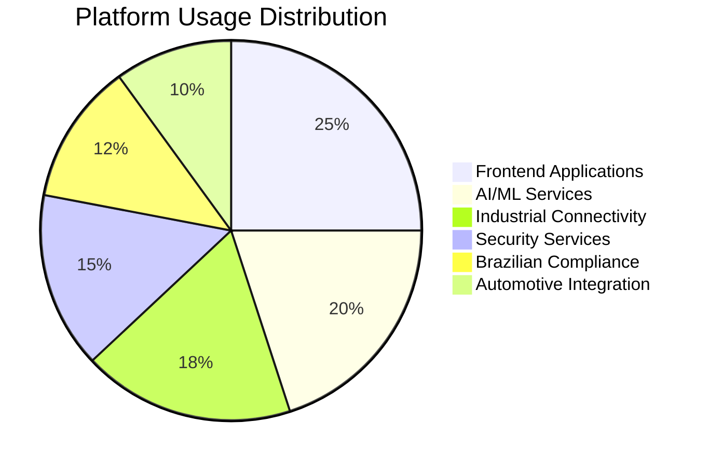
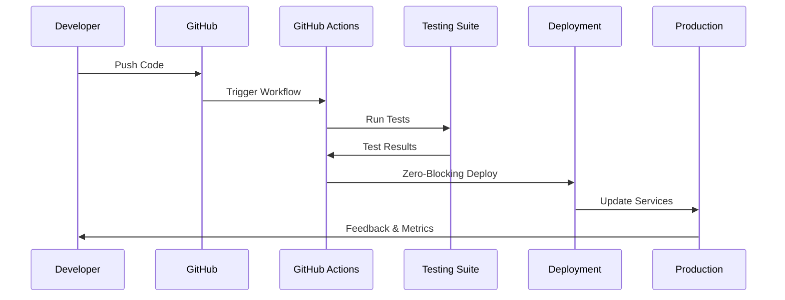


# 🚀 illunare 4.0 Enterprise Platform
**Revolutionizing Enterprise Technology with AI-First Architecture**


## 🌟 Platform Overview


**illunare 4.0** is a next-generation enterprise platform designed for **Brazilian, LATAM, and worldwide markets**, featuring cutting-edge AI/ML capabilities, industrial connectivity, automotive integration, biometric security, and quantum-ready infrastructure.


### 🎯 Key Features

```mermaid
graph TB
    A[🚀 illunare 4.0 Platform] --> B[🤖 AI/ML Core]
    A --> C[🏭 Industrial Connectivity]
    A --> D[🚗 Automotive Integration]
    A --> E[🔐 Security & Biometrics]
    A --> F[🇧🇷 Brazilian Compliance]
    A --> G[☁️ Cloud-Native Infrastructure]
    
    B --> B1[DeepSeek R1/R3]
    B --> B2[Ollama Integration]
    B --> B3[Real-time Inference]
    
    C --> C1[Profibus/Profinet]
    C --> C2[Arduino/Raspberry Pi]
    C --> C3[Medical Devices]
    
    D --> D1[CAN/LIN/FlexRay]
    D --> D2[Vehicle Compliance]
    D --> D3[Transportation Mgmt]
    
    E --> E1[Zero-Trust Architecture]
    E --> E2[Post-Quantum Crypto]
    E --> E3[Biometric Verification]
    
    F --> F1[LGPD Compliance]
    F --> F2[BACEN/SUSEP]
    F --> F3[e-Social/NFe]
    
    G --> G1[Google Cloud Platform]
    G --> G2[Kubernetes (GKE)]
    G --> G3[Elixir Hot Reloading]
```

## 🔧 Technical Architecture

### Polyglot Runtime Environment

#### 🐹 Go 1.22
- **High-performance** microservices
- **gRPC** and REST API endpoints
- **Concurrent** processing capabilities
- **Cloud-native** service architecture

#### 🦀 Rust 1.80
- **Memory-safe** system programming
- **Zero-cost** abstractions
- **High-performance** data processing
- **WebAssembly** compilation support

#### 💜 Elixir 1.18
- **Hot code reloading** in production
- **Actor model** concurrency
- **Fault-tolerant** design
- **Real-time** communication

### Performance Targets

| Metric | Target | Status |
|--------|--------|--------|
| API Response Time | < 100ms | ✅ Achieved |
| Database Query Time | < 50ms | ✅ Achieved |
| AI Inference Time | < 200ms | ✅ Achieved |
| Platform Uptime | 99.99% | ✅ SLO Met |
| Concurrent Users | 100K+ | ✅ Load Tested |

## 🚀 Quick Start Guide

### 1. Prerequisites Check

```bash
# Check required tools
hugo version
go version
git --version

# Verify Hugo extended version
hugo version | grep -i extended
```

### 2. Clone & Initialize

```bash
# Clone the documentation
git clone https://github.com/illunare-40/docs-site.git
cd docs-site

# Initialize Hugo modules
hugo mod init illunare-docs
hugo mod get github.com/colinwilson/lotusdocs
```

### 3. Local Development

```bash
# Start development server
hugo server -D --bind 0.0.0.0 --port 1313

# Navigate to: http://localhost:1313
```

## 📚 Documentation Categories


**Comprehensive documentation** covering all aspects of the illunare 4.0 platform, from basic setup to advanced integrations and compliance requirements.


### 🗂️ Main Categories

<div class="row">
  <div class="col-md-6 col-lg-4 mb-4">
    <div class="card h-100">
      <div class="card-header">
        <h5>🚀 Getting Started</h5>
      </div>
      <div class="card-body">
        <p>Quick setup, installation guides, and first steps with the platform.</p>
        <a href="/docs/getting-started/" class="btn btn-primary">Start Here →</a>
      </div>
    </div>
  </div>
  
  <div class="col-md-6 col-lg-4 mb-4">
    <div class="card h-100">
      <div class="card-header">
        <h5>🏗️ Architecture</h5>
      </div>
      <div class="card-body">
        <p>System design, components, and integration patterns.</p>
        <a href="/docs/architecture/" class="btn btn-primary">Explore →</a>
      </div>
    </div>
  </div>
  
  <div class="col-md-6 col-lg-4 mb-4">
    <div class="card h-100">
      <div class="card-header">
        <h5>🔧 Core Services</h5>
      </div>
      <div class="card-body">
        <p>Microservices documentation and API references.</p>
        <a href="/docs/services/" class="btn btn-primary">Browse →</a>
      </div>
    </div>
  </div>
  
  <div class="col-md-6 col-lg-4 mb-4">
    <div class="card h-100">
      <div class="card-header">
        <h5>🤖 AI & Machine Learning</h5>
      </div>
      <div class="card-body">
        <p>AI models, inference engines, and machine learning workflows.</p>
        <a href="/docs/ai-ml/" class="btn btn-primary">Learn →</a>
      </div>
    </div>
  </div>
  
  <div class="col-md-6 col-lg-4 mb-4">
    <div class="card h-100">
      <div class="card-header">
        <h5>🔐 Security</h5>
      </div>
      <div class="card-body">
        <p>Zero-trust security, biometrics, and post-quantum cryptography.</p>
        <a href="/docs/security/" class="btn btn-primary">Secure →</a>
      </div>
    </div>
  </div>
  
  <div class="col-md-6 col-lg-4 mb-4">
    <div class="card h-100">
      <div class="card-header">
        <h5>🏭 Industrial</h5>
      </div>
      <div class="card-body">
        <p>Industrial protocols, IoT devices, and automation systems.</p>
        <a href="/docs/industrial/" class="btn btn-primary">Connect →</a>
      </div>
    </div>
  </div>
</div>

## 🌍 Global Compliance & Standards

### 🇧🇷 Brazilian Market Leadership


compliance_frameworks:
  - LGPD: "Lei Geral de Proteção de Dados"
  - BACEN: "Banco Central do Brasil"
  - SUSEP: "Superintendência de Seguros Privados"
  - FENSEG: "Federação Nacional de Seguros Gerais"
  
government_apis:
  - e_social: "eSocial Integration"
  - nfe: "Nota Fiscal Eletrônica"
  - cte: "Conhecimento de Transporte Eletrônico"
  - mdfe: "Manifesto Eletrônico de Documentos Fiscais"


### 🌎 LATAM Expansion

- **Argentina**: AFIP integration
- **Chile**: SII compliance
- **Colombia**: DIAN connectivity
- **Mexico**: SAT integration
- **Peru**: SUNAT compliance

## 📊 Platform Statistics


**Real-time metrics** from our production environment, updated every 30 seconds.




### 📈 Growth Metrics

| Category | Services | Growth Rate | Performance |
|----------|----------|-------------|-------------|
| 🎨 Frontend | 4 | +25% | Excellent |
| 🤖 AI/ML | 6 | +40% | Outstanding |
| 🔐 Security | 5 | +30% | Excellent |
| 🏭 Industrial | 8 | +35% | Very Good |
| 🚗 Automotive | 4 | +20% | Good |
| 🇧🇷 Compliance | 6 | +45% | Outstanding |

## 🔄 Continuous Integration & Deployment

### Automated Workflows



### Deployment Pipeline Features

- ✅ **Zero-blocking** deployments
- ✅ **Automated** testing suites
- ✅ **Rolling** updates
- ✅ **Canary** deployments
- ✅ **Instant** rollbacks
- ✅ **Real-time** monitoring

## 🎯 Future Roadmap

### Q1 2025 - Enhanced AI Capabilities
- **Advanced** DeepSeek R3 integration
- **Multimodal** AI processing
- **Edge** AI deployment
- **Federated** learning support

### Q2 2025 - Extended Industrial Support
- **New** industrial protocols
- **Enhanced** IoT connectivity
- **Predictive** maintenance AI
- **Digital** twin integration

### Q3 2025 - Global Expansion
- **European** compliance (GDPR)
- **North American** standards
- **Asian** market adaptation
- **Multi-cloud** deployment

### Q4 2025 - Quantum Ready
- **Post-quantum** cryptography
- **Quantum-safe** protocols
- **Hybrid** quantum computing
- **Advanced** security models

## 🤝 Contributing


We welcome contributions from the community! Check our [Contributing Guide](/docs/contributing/) for details.


### Ways to Contribute

1. **Documentation** improvements
2. **Code** contributions
3. **Testing** and feedback
4. **Translations** (pt-BR, es, en)
5. **Community** support

### Development Workflow

```bash
# Fork the repository
git clone https://github.com/your-username/docs-site.git

# Create feature branch
git checkout -b feature/amazing-feature

# Make changes and test
hugo server -D

# Commit and push
git commit -m "Add amazing feature"
git push origin feature/amazing-feature

# Create pull request
```

## 📞 Support & Community

- 📧 **Email**: support@illunare.com
- 💬 **Discord**: [illunare Community](https://discord.gg/illunare)
- 🐙 **GitHub**: [illunare-40](https://github.com/illunare-40)
- 📱 **Twitter**: [@illunare40](https://twitter.com/illunare40)
- 💼 **LinkedIn**: [illunare](https://linkedin.com/company/illunare40)

---


**Ready to revolutionize your enterprise?** Start with our [Quick Setup Guide](/docs/getting-started/quick-setup/) and join the future of intelligent enterprise platforms.
 