# 📖 illunare 4.0 Documentation Hub


Welcome to the **comprehensive documentation** for the illunare 4.0 Enterprise Platform. This hub provides organized access to all technical documentation, guides, tutorials, and references.


## 🚀 Quick Navigation

### For Developers
- [🔧 API Reference](/docs/api/) - Complete API documentation
- [🏗️ Architecture Guide](/docs/architecture/) - System design and patterns
- [💻 SDK & Libraries](/docs/api/sdks/) - Development tools and libraries

### For DevOps Engineers
- [☁️ Infrastructure Setup](/docs/devops/infrastructure/) - Cloud deployment guides
- [🔄 CI/CD Pipelines](/docs/devops/cicd/) - Automation workflows
- [📊 Monitoring & Observability](/docs/devops/monitoring/) - Platform monitoring

### For Business Users
- [🚀 Getting Started](/docs/getting-started/) - Quick start guides
- [🏭 Industrial Solutions](/docs/industrial/) - Industrial connectivity
- [🇧🇷 Compliance](/docs/compliance/) - Brazilian regulations

## 📚 Documentation Categories

### 🌟 Core Platform

#### Platform Overview
- **Introduction** to illunare 4.0
- **Key features** and capabilities
- **Technology stack** overview
- **Performance** metrics and SLAs
- **Roadmap** and future plans

[Explore Platform Overview →](/docs/platform-overview/)

#### System Architecture
- **Microservices** design patterns
- **Data flow** and integration
- **Security** architecture
- **Scalability** and performance
- **Deployment** strategies

[Explore Architecture →](/docs/architecture/)

#### Core Services
- **Frontend** applications
- **Backend** microservices
- **Integration** services
- **Data** processing pipelines
- **AI/ML** inference engines

[Browse Services →](/docs/services/)

### 🤖 AI & Machine Learning

```mermaid
graph LR
    A[🧠 AI Core] --> B[🔍 Decision Layer]
    A --> C[🛡️ Security Guardian]
    A --> D[🎯 Cortex AI]
    A --> E[🦾 DeepSeek & Ollama]
    
    B --> F[Real-time Inference]
    C --> G[Threat Detection]
    D --> H[Cognitive Processing]
    E --> I[Language Models]
```

**AI/ML Documentation Sections:**
- [🧠 AI Decision Layer](/docs/ai-ml/decision-layer/) - Core AI processing
- [🛡️ Security Guardian](/docs/ai-ml/security-guardian/) - AI-powered security
- [🎯 Cortex AI Service](/docs/ai-ml/cortex/) - Cognitive computing
- [🦾 DeepSeek & Ollama](/docs/ai-ml/deepseek-ollama/) - Language models
- [🏗️ ML Infrastructure](/docs/ai-ml/infrastructure/) - Training and deployment

### 🔐 Security & Compliance

| Security Layer | Technology | Compliance |
|----------------|------------|------------|
| **Authentication** | Zero-Trust + Biometrics | LGPD, BACEN |
| **Encryption** | Post-Quantum Crypto | SUSEP, FENSEG |
| **Network** | mTLS + Istio | ISO 27001 |
| **Data** | End-to-End Encryption | SOC 2 Type II |
| **Identity** | RBAC + ABAC | GDPR Ready |

**Security Documentation:**
- [🔐 Zero-Trust Architecture](/docs/security/zero-trust/) - Security model
- [🔏 Biometric Verification](/docs/security/biometrics/) - Identity systems
- [🛡️ Post-Quantum Cryptography](/docs/security/post-quantum/) - Future-proof security
- [🚨 Anti-Abuse Protection](/docs/security/anti-abuse/) - Threat prevention

### 🏭 Industrial Connectivity


**Industry 4.0 Ready** - Connect with industrial equipment using modern protocols and legacy system adapters.


#### Supported Protocols

  

    <h5>🔌 Industrial Protocols</h5>
    <ul>
      <li>Profibus DP/PA</li>
      <li>Profinet RT/IRT</li>
      <li>Modbus TCP/RTU</li>
      <li>OPC-UA</li>
      <li>EtherCAT</li>
      <li>DeviceNet</li>
    </ul>
  

  

    <h5>🖥️ Computing Platforms</h5>
    <ul>
      <li>Arduino (Uno, Mega, ESP32)</li>
      <li>Raspberry Pi (3B+, 4, 5)</li>
      <li>Industrial PCs</li>
      <li>Edge Computing Devices</li>
      <li>SCADA Systems</li>
      <li>HMI Interfaces</li>
    </ul>
  

**Industrial Documentation:**
- [🏭 Profibus Integration](/docs/industrial/profibus/) - Legacy system connection
- [🌐 Profinet RJ45 Adapters](/docs/industrial/profinet/) - Modern Ethernet
- [🔧 Arduino Libraries](/docs/industrial/arduino/) - IoT device integration
- [🍓 Raspberry Pi Support](/docs/industrial/raspberry-pi/) - Edge computing

### 🚗 Automotive Integration

```mermaid
graph TB
    A[🚗 Automotive Platform] --> B[🔧 Vehicle Systems]
    A --> C[📡 Communication]
    A --> D[📋 Compliance]
    A --> E[🚛 Fleet Management]
    
    B --> B1[Engine Control]
    B --> B2[Safety Systems]
    B --> B3[Infotainment]
    
    C --> C1[CAN Bus]
    C --> C2[LIN Networks]
    C --> C3[FlexRay]
    
    D --> D1[ECE Regulations]
    D --> D2[UNECE Standards]
    D --> D3[Local Compliance]
    
    E --> E1[Logistics]
    E --> E2[Tracking]
    E --> E3[Maintenance]
```

**Automotive Documentation:**
- [🚗 Vehicle Compliance](/docs/automotive/compliance/) - Regulatory standards
- [🚛 Transportation Management](/docs/automotive/transportation/) - Fleet operations
- [🔌 Integration Patterns](/docs/automotive/integration/) - System connectivity
- [📦 Supply Chain](/docs/automotive/supply-chain/) - Logistics automation

### 🇧🇷 Brazilian Compliance & LATAM


brazilian_compliance:
  data_protection:
    - LGPD: "Lei Geral de Proteção de Dados"
    - privacy_by_design: true
    - consent_management: automated
  
  financial_regulations:
    - BACEN: "Banco Central do Brasil"
    - SUSEP: "Superintendência de Seguros Privados"
    - pix_integration: supported
  
  tax_compliance:
    - e_social: integrated
    - nfe: "Nota Fiscal Eletrônica"
    - cte: "Conhecimento de Transporte"
    - mdfe: "Manifesto Eletrônico"
  
  industry_standards:
    - fenseg: "Federação Nacional de Seguros"
    - anbima: supported
    - febraban: integrated


**Compliance Documentation:**
- [🇧🇷 LGPD Implementation](/docs/compliance/lgpd/) - Data protection compliance
- [🏦 FenSeg Integration](/docs/compliance/fenseg/) - Insurance federation
- [🛡️ SUSEP Compliance](/docs/compliance/susep/) - Insurance regulations
- [👥 E-Social Bridge](/docs/compliance/e-social/) - Employment social security
- [💰 Tax Calculation LATAM](/docs/compliance/tax-latam/) - Multi-country taxation

## 🛠️ Development Resources

### 📡 API Reference

#### REST APIs
- **OpenAPI 3.0** specifications
- **Interactive** documentation
- **Authentication** methods
- **Rate limiting** policies
- **Error handling** guides

[REST API Docs →](/docs/api/rest/)

#### GraphQL
- **Schema** definitions
- **Query** examples
- **Mutation** operations
- **Subscription** real-time updates
- **Federation** patterns

[GraphQL Docs →](/docs/api/graphql/)

#### gRPC Services
- **Protocol** buffer definitions
- **Service** interfaces
- **Streaming** operations
- **Load balancing**
- **Circuit breakers**

[gRPC Docs →](/docs/api/grpc/)

#### WebSocket APIs
- **Real-time** communication
- **Event** streaming
- **Connection** management
- **Message** formatting
- **Error** handling

[WebSocket Docs →](/docs/api/websocket/)

### 💻 SDK & Libraries

| Language | Package | Version | Status |
|----------|---------|---------|--------|
| **Go** | `github.com/illunare-40/go-sdk` | v4.0.0 | ✅ Stable |
| **Rust** | `illunare-sdk` | v4.0.0 | ✅ Stable |
| **Elixir** | `illunare` | v4.0.0 | ✅ Stable |
| **TypeScript** | `@illunare/sdk` | v4.0.0 | ✅ Stable |
| **Python** | `illunare-sdk` | v4.0.0 | ✅ Stable |
| **Java** | `com.illunare:sdk` | v4.0.0 | ✅ Stable |

## 📊 Monitoring & Observability

### 📈 Platform Metrics

```mermaid
graph LR
    A[📊 Metrics] --> B[🔍 Traces]
    A --> C[📝 Logs]
    A --> D[🚨 Alerts]
    
    B --> E[OpenTelemetry]
    C --> F[Structured Logging]
    D --> G[SLO-based Alerting]
    
    E --> H[Jaeger]
    F --> I[Loki]
    G --> J[Prometheus]
```

**Observability Stack:**
- **Metrics**: Prometheus + Grafana
- **Tracing**: OpenTelemetry + Jaeger
- **Logging**: Loki + Grafana
- **Alerting**: AlertManager + PagerDuty
- **Dashboards**: Custom Grafana dashboards

### 🎯 SLO Targets

| Service Category | Availability | Latency P95 | Error Rate |
|------------------|--------------|-------------|------------|
| **Core APIs** | 99.99% | <100ms | <0.1% |
| **AI/ML Services** | 99.9% | <200ms | <0.5% |
| **Data Services** | 99.95% | <50ms | <0.2% |
| **Frontend Apps** | 99.9% | <500ms | <1% |

## 🔄 Documentation Updates & Automation


**Automated Updates** - This documentation is automatically updated every 30 minutes with the latest information from all repositories.


### 📝 Content Management Workflow

### 🤖 Automation Features

- ✅ **Auto-discovery** of service repositories
- ✅ **Content aggregation** from multiple sources
- ✅ **Markdown processing** with Hugo
- ✅ **Link validation** and checking
- ✅ **Image optimization** and compression
- ✅ **Search indexing** with FlexSearch
- ✅ **Multi-language** support (pt-BR, en, es)

## 🎓 Learning Paths

### 👨‍💻 For New Developers

1. **Start Here**: [Platform Overview](/docs/platform-overview/)
2. **Setup**: [Development Environment](/docs/getting-started/development/)
3. **First API**: [Hello World Tutorial](/docs/tutorials/hello-world/)
4. **Advanced**: [Microservices Development](/docs/tutorials/microservices/)

### 🏗️ For Architects

1. **Architecture**: [System Design](/docs/architecture/overview/)
2. **Patterns**: [Integration Patterns](/docs/architecture/patterns/)
3. **Security**: [Zero-Trust Model](/docs/security/zero-trust/)
4. **Scale**: [Performance Optimization](/docs/architecture/performance/)

### ☁️ For DevOps

1. **Infrastructure**: [Cloud Setup](/docs/devops/infrastructure/)
2. **Deployment**: [CI/CD Pipelines](/docs/devops/cicd/)
3. **Monitoring**: [Observability](/docs/devops/monitoring/)
4. **Operations**: [Production Management](/docs/devops/operations/)

## 📞 Support & Feedback


Need help or have feedback about the documentation? We're here to help!


### 🤝 Getting Help

- 📧 **Documentation Issues**: docs@illunare.com
- 💬 **Community Chat**: [Discord Server](https://discord.gg/illunare)
- 🐙 **GitHub Issues**: [Report Documentation Bug](https://github.com/illunare-40/docs-site/issues)
- 📝 **Edit This Page**: Use the "Edit" button on any page

### 📈 Documentation Metrics

- **Total Pages**: 200+ comprehensive guides
- **Update Frequency**: Every 30 minutes
- **Languages**: Portuguese (BR), English, Spanish
- **Contributors**: 25+ active contributors
- **Coverage**: 95% of platform features documented

---


**Ready to dive deeper?** Choose your path from the categories above or use the search function to find specific information. The illunare 4.0 platform is designed to empower your enterprise with cutting-edge technology and comprehensive documentation to support your journey.
 