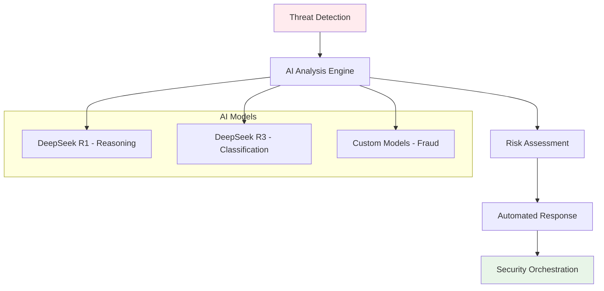

# 🤖 AI & DeepSeek R1/R3 Integration

<div class="ai-container">
  <div class="hero-section">
    <h2>🧠 Next-Generation AI Intelligence</h2>
    <p class="hero-subtitle">
      Harness the power of DeepSeek R1/R3 reasoning models for enterprise automation, 
      intelligent decision-making, and advanced analytics.
    </p>
    <div class="ai-badges">
      <span class="badge badge-ai">DeepSeek R1/R3</span>
      <span class="badge badge-reasoning">Advanced Reasoning</span>
      <span class="badge badge-multilingual">PT-BR + EN</span>
      <span class="badge badge-realtime">Real-time</span>
    </div>
  </div>
</div>

---

## 🚀 **AI Platform Overview**

illunare 4.0 integrates cutting-edge artificial intelligence capabilities to transform enterprise operations:

### **🧠 DeepSeek R1/R3 Models**
- **Advanced Reasoning** - Complex problem-solving and logical inference
- **Code Generation** - Intelligent code creation and optimization
- **Multilingual Support** - Native Portuguese (Brazil) and English
- **Real-time Processing** - Sub-second response times
- **Context Awareness** - Understanding business domain and user intent

### **🛡️ Security Guardian**


---

## 🔧 **Integration Architecture**

### **AI Service Stack**

=== "🏗️ Core Architecture"
    ```python
    # illunare AI Architecture
    from illunare.ai import (
        DeepSeekClient,
        SecurityGuardian, 
        FraudDetector,
        RecommendationEngine
    )
    
    class IllunareAI:
        def __init__(self):
            # Initialize DeepSeek clients
            self.reasoning_model = DeepSeekClient(
                model="deepseek-r1",
                endpoint="https://ai.illunare.com/deepseek"
            )
            
            self.classification_model = DeepSeekClient(
                model="deepseek-r3",
                endpoint="https://ai.illunare.com/deepseek"
            )
            
            # Initialize specialized services
            self.security = SecurityGuardian(self.reasoning_model)
            self.fraud_detector = FraudDetector(self.classification_model)
            self.recommendations = RecommendationEngine()
    ```

=== "🌐 API Gateway Integration"
    ```yaml
    # API Gateway Configuration
    ai_services:
      deepseek:
        models:
          - name: "deepseek-r1"
            type: "reasoning"
            endpoint: "/api/v1/ai/reasoning"
            max_tokens: 8192
            temperature: 0.7
            
          - name: "deepseek-r3" 
            type: "classification"
            endpoint: "/api/v1/ai/classification"
            max_tokens: 4096
            temperature: 0.3
            
      security:
        threat_detection:
          endpoint: "/api/v1/security/analyze"
          real_time: true
          confidence_threshold: 0.85
          
      fraud_prevention:
        transaction_analysis:
          endpoint: "/api/v1/fraud/analyze"
          models: ["deepseek-r3", "custom-fraud-v2"]
          response_time_sla: "50ms"
    ```

=== "🔄 Real-time Processing"
    ```go
    // Go Implementation - Real-time AI Processing
    package ai
    
    import (
        "context"
        "encoding/json"
        "time"
        
        "github.com/illunare-40/illunare/pkg/ai/deepseek"
        "github.com/illunare-40/illunare/pkg/streaming"
    )
    
    type AIProcessor struct {
        deepseek    *deepseek.Client
        streaming   *streaming.WebSocketManager
        rateLimiter *RateLimiter
    }
    
    func (ai *AIProcessor) ProcessRealTime(ctx context.Context, input *AIRequest) (*AIResponse, error) {
        // Rate limiting
        if !ai.rateLimiter.Allow() {
            return nil, ErrRateLimitExceeded
        }
        
        // Process with DeepSeek
        response, err := ai.deepseek.ProcessWithReasoning(ctx, &deepseek.Request{
            Model:       "deepseek-r1",
            Messages:    input.Messages,
            Temperature: 0.7,
            MaxTokens:   2048,
            Language:    input.Language, // "pt-BR" or "en"
        })
        
        if err != nil {
            return nil, err
        }
        
        // Stream response for real-time UX
        ai.streaming.Broadcast(input.SessionID, response)
        
        return &AIResponse{
            Content:    response.Choices[0].Message.Content,
            Confidence: response.Confidence,
            Timestamp:  time.Now(),
        }, nil
    }
    ```

---

## 🛡️ **Security & Threat Intelligence**

### **AI-Powered Security Guardian**

The Security Guardian uses DeepSeek R1's reasoning capabilities to analyze threats in real-time:

```python
from illunare.ai.security import SecurityGuardian
import asyncio

class ThreatAnalyzer:
    def __init__(self):
        self.guardian = SecurityGuardian(
            model="deepseek-r1",
            confidence_threshold=0.85,
            response_time_sla=50  # milliseconds
        )
    
    async def analyze_threat(self, request_data):
        """Analyze incoming request for potential threats"""
        
        # Extract features for analysis
        features = {
            "ip_address": request_data.get("ip"),
            "user_agent": request_data.get("user_agent"),
            "request_pattern": request_data.get("pattern"),
            "payload_size": len(request_data.get("payload", "")),
            "geographical_location": await self.get_geo_location(request_data.get("ip")),
            "time_of_request": request_data.get("timestamp")
        }
        
        # AI-powered threat assessment
        analysis = await self.guardian.assess_threat(features, reasoning_prompt=f"""
        Analyze this request for potential security threats:
        
        IP: {features['ip_address']}
        User Agent: {features['user_agent']}
        Request Pattern: {features['request_pattern']}
        Payload Size: {features['payload_size']} bytes
        Location: {features['geographical_location']}
        Time: {features['time_of_request']}
        
        Consider:
        1. Known attack patterns (SQL injection, XSS, CSRF)
        2. Anomalous behavior indicators
        3. Geographical risk factors
        4. Request frequency and timing
        5. Payload analysis for malicious content
        
        Provide threat level (LOW/MEDIUM/HIGH/CRITICAL) with reasoning.
        """)
        
        return {
            "threat_level": analysis.threat_level,
            "confidence": analysis.confidence,
            "reasoning": analysis.reasoning,
            "recommended_action": analysis.action,
            "timestamp": analysis.timestamp
        }

# Example usage
analyzer = ThreatAnalyzer()

# Real-time threat detection
threat_result = await analyzer.analyze_threat({
    "ip": "192.168.1.100",
    "user_agent": "Mozilla/5.0...",
    "pattern": "/api/v1/users/../../../etc/passwd",
    "payload": malicious_payload,
    "timestamp": "2025-01-15T10:30:00Z"
})

print(f"Threat Level: {threat_result['threat_level']}")
print(f"Reasoning: {threat_result['reasoning']}")
```

### **Adaptive Fraud Detection**

```javascript
// JavaScript/Node.js - Fraud Detection Service
const { DeepSeekClient } = require('@illunare/ai-sdk');

class FraudDetectionEngine {
  constructor() {
    this.deepseek = new DeepSeekClient({
      model: 'deepseek-r3',
      endpoint: 'https://ai.illunare.com/deepseek',
      apiKey: process.env.DEEPSEEK_API_KEY
    });
  }

  async analyzeTransaction(transaction) {
    const features = this.extractFeatures(transaction);
    
    const fraudAnalysis = await this.deepseek.classify({
      input: features,
      prompt: `
        Analyze this financial transaction for fraud indicators:
        
        Amount: R$ ${transaction.amount}
        Merchant: ${transaction.merchant}
        Location: ${transaction.location}
        Time: ${transaction.timestamp}
        User Pattern: ${features.userPattern}
        Device: ${features.deviceFingerprint}
        
        Brazilian Banking Regulations:
        - BACEN regulations for suspicious transactions
        - PIS/COFINS compliance requirements
        - LGPD data protection considerations
        
        Classify as: LEGITIMATE, SUSPICIOUS, or FRAUDULENT
        Provide confidence score and explanation.
      `,
      temperature: 0.3, // Lower temperature for more consistent classifications
      maxTokens: 1024
    });

    return {
      classification: fraudAnalysis.classification,
      confidence: fraudAnalysis.confidence,
      riskFactors: fraudAnalysis.riskFactors,
      recommendedAction: this.getRecommendedAction(fraudAnalysis),
      complianceNotes: fraudAnalysis.complianceNotes
    };
  }

  extractFeatures(transaction) {
    return {
      userPattern: this.getUserTransactionPattern(transaction.userId),
      deviceFingerprint: transaction.deviceFingerprint,
      velocityCheck: this.checkTransactionVelocity(transaction),
      locationAnomaly: this.checkLocationAnomaly(transaction),
      amountDeviation: this.checkAmountDeviation(transaction)
    };
  }

  getRecommendedAction(analysis) {
    switch (analysis.classification) {
      case 'LEGITIMATE':
        return 'APPROVE';
      case 'SUSPICIOUS':
        return analysis.confidence > 0.7 ? 'REVIEW' : 'APPROVE_WITH_MONITORING';
      case 'FRAUDULENT':
        return 'BLOCK';
      default:
        return 'REVIEW';
    }
  }
}

// Usage example
const fraudEngine = new FraudDetectionEngine();

const transaction = {
  id: 'txn_12345',
  amount: 15000.00,
  merchant: 'Electronics Store SP',
  location: 'São Paulo, Brazil',
  timestamp: '2025-01-15T14:30:00-03:00',
  userId: 'user_67890',
  deviceFingerprint: 'fp_abcdef123456'
};

const fraudResult = await fraudEngine.analyzeTransaction(transaction);
console.log('Fraud Analysis:', fraudResult);
```

---

## 🎯 **Intelligent Recommendations**

### **Business Intelligence Engine**

```python
from illunare.ai.recommendations import IntelligentRecommendationEngine
from illunare.data import DataWarehouse

class BusinessIntelligenceEngine:
    def __init__(self):
        self.recommendation_engine = IntelligentRecommendationEngine(
            models=["deepseek-r1", "deepseek-r3"],
            data_sources=["sales", "inventory", "customer_behavior", "market_trends"]
        )
        self.data_warehouse = DataWarehouse()
    
    async def generate_business_insights(self, business_context):
        """Generate actionable business insights using AI"""
        
        # Gather comprehensive business data
        business_data = await self.gather_business_data(business_context)
        
        # AI-powered analysis
        insights = await self.recommendation_engine.analyze(
            data=business_data,
            reasoning_prompt=f"""
            Analyze this Brazilian enterprise business data:
            
            Industry: {business_context.industry}
            Region: {business_context.region}
            Company Size: {business_context.company_size}
            Market Segment: {business_context.market_segment}
            
            Business Data Summary:
            - Revenue Trend: {business_data.revenue_trend}
            - Customer Acquisition: {business_data.customer_metrics}
            - Operational Efficiency: {business_data.efficiency_metrics}
            - Market Position: {business_data.market_analysis}
            - Compliance Status: {business_data.compliance_status}
            
            Consider Brazilian market factors:
            1. Economic indicators (SELIC rate, inflation)
            2. Regulatory environment (LGPD, labor laws)
            3. Regional market dynamics
            4. Seasonal business patterns
            5. Currency fluctuation impacts
            
            Provide specific, actionable recommendations for:
            - Revenue optimization
            - Cost reduction opportunities
            - Market expansion strategies
            - Operational improvements
            - Risk mitigation
            """,
            language="pt-BR"
        )
        
        return {
            "executive_summary": insights.summary,
            "key_recommendations": insights.recommendations,
            "risk_assessment": insights.risks,
            "opportunity_analysis": insights.opportunities,
            "implementation_roadmap": insights.roadmap,
            "roi_projections": insights.roi_estimates
        }
    
    async def gather_business_data(self, context):
        """Gather comprehensive business data from multiple sources"""
        return await self.data_warehouse.aggregate([
            "sales_performance",
            "customer_analytics", 
            "operational_metrics",
            "market_intelligence",
            "compliance_tracking",
            "financial_indicators"
        ], context.date_range)

# Example usage for Brazilian retail company
business_context = {
    "industry": "E-commerce Retail",
    "region": "Southeast Brazil",
    "company_size": "Mid-market (500 employees)",
    "market_segment": "Consumer Electronics",
    "date_range": "2024-Q4"
}

bi_engine = BusinessIntelligenceEngine()
insights = await bi_engine.generate_business_insights(business_context)

print("🎯 Business Intelligence Insights:")
print(f"Executive Summary: {insights['executive_summary']}")
print(f"Top Recommendations: {insights['key_recommendations'][:3]}")
```

---

## 🌐 **Multi-Language Support**

### **Portuguese (Brazil) + English Integration**

```typescript
// TypeScript - Multi-language AI Service
import { DeepSeekClient, LanguageDetector } from '@illunare/ai-sdk';

interface AIMessage {
  content: string;
  language: 'pt-BR' | 'en';
  context?: Record<string, any>;
}

class MultilingualAIService {
  private deepseekPT: DeepSeekClient;
  private deepseekEN: DeepSeekClient;
  private languageDetector: LanguageDetector;

  constructor() {
    // Portuguese-optimized model
    this.deepseekPT = new DeepSeekClient({
      model: 'deepseek-r1',
      language: 'pt-BR',
      culturalContext: 'brazilian_business',
      endpoint: 'https://ai.illunare.com/pt-br'
    });

    // English-optimized model  
    this.deepseekEN = new DeepSeekClient({
      model: 'deepseek-r1',
      language: 'en',
      culturalContext: 'international_business',
      endpoint: 'https://ai.illunare.com/en'
    });

    this.languageDetector = new LanguageDetector();
  }

  async processMessage(message: string, context?: Record<string, any>): Promise<AIMessage> {
    // Detect language
    const detectedLanguage = await this.languageDetector.detect(message);
    const language = detectedLanguage.language as 'pt-BR' | 'en';
    
    // Select appropriate model
    const client = language === 'pt-BR' ? this.deepseekPT : this.deepseekEN;
    
    // Process with cultural context
    const response = await client.process({
      message,
      context: {
        ...context,
        language,
        businessCulture: language === 'pt-BR' ? 'brazilian' : 'international',
        regulations: language === 'pt-BR' 
          ? ['LGPD', 'CLT', 'Marco_Civil_Internet']
          : ['GDPR', 'SOC2', 'ISO27001']
      }
    });

    return {
      content: response.content,
      language,
      context: response.enrichedContext
    };
  }

  async translateAndProcess(message: string, targetLanguage: 'pt-BR' | 'en'): Promise<AIMessage> {
    const sourceLanguage = await this.languageDetector.detect(message);
    
    if (sourceLanguage.language === targetLanguage) {
      return this.processMessage(message);
    }

    // Translate with business context preservation
    const translatedMessage = await this.translateWithContext(message, targetLanguage);
    return this.processMessage(translatedMessage);
  }

  private async translateWithContext(text: string, targetLang: 'pt-BR' | 'en'): Promise<string> {
    const translationPrompt = targetLang === 'pt-BR' 
      ? `Traduza para português brasileiro mantendo contexto empresarial e termos técnicos: ${text}`
      : `Translate to English maintaining business context and technical terms: ${text}`;

    const result = await this.deepseekEN.process({
      message: translationPrompt,
      context: { task: 'translation', preserveBusinessTerms: true }
    });

    return result.content;
  }
}

// Usage examples
const aiService = new MultilingualAIService();

// Portuguese query about LGPD compliance
const ptResponse = await aiService.processMessage(
  "Como implementar conformidade LGPD na nossa plataforma de e-commerce?",
  { domain: 'compliance', industry: 'ecommerce' }
);

// English query about industrial connectivity  
const enResponse = await aiService.processMessage(
  "How to integrate Profibus with our manufacturing equipment?",
  { domain: 'industrial', equipment: 'manufacturing' }
);

console.log('Portuguese Response:', ptResponse.content);
console.log('English Response:', enResponse.content);
```

---

## 📊 **Performance & Analytics**

### **AI Model Performance Metrics**

```python
from illunare.ai.monitoring import AIPerformanceMonitor
from illunare.metrics import MetricsCollector

class AIAnalytics:
    def __init__(self):
        self.monitor = AIPerformanceMonitor()
        self.metrics = MetricsCollector()
    
    async def track_model_performance(self):
        """Monitor AI model performance across all services"""
        
        performance_data = await self.monitor.collect_metrics([
            "deepseek_r1_reasoning",
            "deepseek_r3_classification", 
            "security_guardian",
            "fraud_detector",
            "recommendation_engine"
        ])
        
        analytics = {
            "response_times": {
                "deepseek_r1": f"{performance_data.deepseek_r1.avg_response_time}ms",
                "deepseek_r3": f"{performance_data.deepseek_r3.avg_response_time}ms",
                "security_guardian": f"{performance_data.security.avg_response_time}ms"
            },
            "accuracy_metrics": {
                "fraud_detection_accuracy": f"{performance_data.fraud.accuracy}%",
                "threat_detection_precision": f"{performance_data.security.precision}%",
                "recommendation_relevance": f"{performance_data.recommendations.relevance}%"
            },
            "throughput": {
                "requests_per_second": performance_data.overall.rps,
                "concurrent_users": performance_data.overall.concurrent_users,
                "daily_ai_interactions": performance_data.overall.daily_interactions
            },
            "cost_optimization": {
                "token_efficiency": performance_data.cost.token_efficiency,
                "compute_optimization": performance_data.cost.compute_savings,
                "monthly_ai_costs": f"R$ {performance_data.cost.monthly_cost}"
            }
        }
        
        return analytics

# Real-time analytics dashboard data
ai_analytics = AIAnalytics()
performance_report = await ai_analytics.track_model_performance()

print("🤖 AI Performance Analytics:")
print(f"DeepSeek R1 Response Time: {performance_report['response_times']['deepseek_r1']}")
print(f"Fraud Detection Accuracy: {performance_report['accuracy_metrics']['fraud_detection_accuracy']}")
print(f"Daily AI Interactions: {performance_report['throughput']['daily_ai_interactions']}")
```

---

## 🔧 **Integration Examples**

### **Quick Start Integration**

=== "🐍 Python SDK"
    ```python
    from illunare.ai import IllunareAI
    
    # Initialize AI client
    ai = IllunareAI(
        api_key="your-api-key",
        endpoint="https://ai.illunare.com",
        language="pt-BR"  # or "en"
    )
    
    # Simple reasoning query
    response = await ai.reason(
        "Como otimizar a cadeia de suprimentos para reduzir custos?"
    )
    print(response.content)
    
    # Security analysis
    threat_analysis = await ai.security.analyze_threat({
        "ip": "suspicious.ip.address",
        "payload": request_payload
    })
    
    # Fraud detection
    fraud_result = await ai.fraud.analyze_transaction({
        "amount": 5000.00,
        "merchant": "Online Store",
        "user_id": "user_123"
    })
    ```

=== "🟨 JavaScript/Node.js"
    ```javascript
    const { IllunareAI } = require('@illunare/ai-sdk');
    
    const ai = new IllunareAI({
      apiKey: process.env.ILLUNARE_API_KEY,
      endpoint: 'https://ai.illunare.com',
      language: 'pt-BR'
    });
    
    // Business intelligence query
    const businessInsights = await ai.reasoning.analyze({
      query: 'Analyze Q4 sales performance and suggest improvements',
      context: {
        industry: 'retail',
        region: 'brazil',
        dataRange: '2024-Q4'
      }
    });
    
    console.log('Business Insights:', businessInsights);
    
    // Real-time recommendation
    const recommendations = await ai.recommendations.generate({
      userId: 'user_456',
      context: 'product_browsing',
      preferences: userPreferences
    });
    ```

=== "🦀 Rust Integration"
    ```rust
    use illunare_ai::{IllunareAI, AIConfig, Language};
    use tokio;
    
    #[tokio::main]
    async fn main() -> Result<(), Box<dyn std::error::Error>> {
        let config = AIConfig::new()
            .api_key("your-api-key")
            .endpoint("https://ai.illunare.com")
            .language(Language::PortugueseBR);
            
        let ai = IllunareAI::new(config).await?;
        
        // High-performance threat detection
        let threat_result = ai.security()
            .analyze_request(&incoming_request)
            .await?;
            
        match threat_result.threat_level {
            ThreatLevel::Critical => {
                // Immediate blocking
                return ai.security().block_ip(&request.ip).await;
            },
            ThreatLevel::High => {
                // Enhanced monitoring
                ai.security().monitor_enhanced(&request.ip).await?;
            },
            _ => {
                // Normal processing
            }
        }
        
        Ok(())
    }
    ```

---

## 🎯 **Use Cases & Applications**

### **1. 🏭 Industrial AI Applications**

```python
# Industrial Equipment Optimization
from illunare.ai.industrial import IndustrialAI

class SmartManufacturing:
    def __init__(self):
        self.ai = IndustrialAI(
            models=["deepseek-r1"],
            protocols=["profibus", "profinet", "opcua"]
        )
    
    async def optimize_production_line(self, equipment_data):
        """AI-powered production optimization"""
        
        optimization = await self.ai.analyze_equipment(
            data=equipment_data,
            reasoning_prompt="""
            Analyze this industrial equipment data for optimization opportunities:
            
            Equipment Status: {equipment_status}
            Production Metrics: {production_metrics}
            Energy Consumption: {energy_data}
            Quality Indicators: {quality_metrics}
            Maintenance Schedule: {maintenance_data}
            
            Provide recommendations for:
            1. Production efficiency improvements
            2. Energy consumption optimization  
            3. Predictive maintenance scheduling
            4. Quality enhancement strategies
            5. Cost reduction opportunities
            """.format(**equipment_data)
        )
        
        return optimization.recommendations
```

### **2. 🚗 Automotive Intelligence**

```javascript
// Automotive Fleet Optimization
const { AutomotiveAI } = require('@illunare/automotive-ai');

class FleetIntelligence {
  constructor() {
    this.ai = new AutomotiveAI({
      compliance: ['INMETRO', 'CONTRAN'],
      region: 'brazil'
    });
  }

  async optimizeFleetOperations(fleetData) {
    const optimization = await this.ai.analyzeFleet({
      vehicles: fleetData.vehicles,
      routes: fleetData.routes,
      drivers: fleetData.drivers,
      regulations: ['brazilian_traffic_laws', 'environmental_standards'],
      prompt: `
        Optimize this Brazilian fleet operation:
        
        Fleet Size: ${fleetData.vehicles.length} vehicles
        Daily Routes: ${fleetData.routes.length} routes
        Fuel Consumption: ${fleetData.avgFuelConsumption} L/100km
        Compliance Status: ${fleetData.complianceStatus}
        
        Consider Brazilian regulations:
        - CONTRAN vehicle standards
        - Environmental emission limits
        - Driver working hour restrictions
        - Route optimization for urban areas
        
        Provide actionable optimization strategies.
      `
    });

    return optimization;
  }
}
```

### **3. 💼 Business Process Automation**

```python
# Business Process Intelligence
class BusinessProcessAI:
    def __init__(self):
        self.ai = IllunareAI(language="pt-BR")
    
    async def analyze_business_process(self, process_data):
        """Analyze and optimize business processes"""
        
        analysis = await self.ai.reason(f"""
        Analise este processo empresarial brasileiro:
        
        Processo: {process_data.name}
        Duração Média: {process_data.avg_duration}
        Custo por Execução: R$ {process_data.cost_per_execution}
        Taxa de Erro: {process_data.error_rate}%
        Conformidade LGPD: {process_data.lgpd_compliance}
        
        Identifique:
        1. Gargalos no processo
        2. Oportunidades de automação
        3. Redução de custos
        4. Melhorias na qualidade
        5. Riscos de conformidade
        
        Forneça recomendações específicas e mensuráveis.
        """)
        
        return analysis
```

---

## 📞 **Support & Next Steps**

### **Getting Started**

1. **[API Documentation](../api/ai-services.md)** - Complete AI API reference
2. **[SDK Installation](../guides/ai-sdk-setup.md)** - Language-specific SDK setup
3. **[Model Training](../ai-ml/custom-models.md)** - Train custom models
4. **[Performance Tuning](../ai-ml/optimization.md)** - Optimize AI performance

### **Enterprise AI Support**

- 🤖 **AI Consultation:** [ai-consulting@illunare.com](mailto:ai-consulting@illunare.com)
- 📊 **Custom Models:** [custom-ai@illunare.com](mailto:custom-ai@illunare.com)
- 🔬 **Research Partnership:** [research@illunare.com](mailto:research@illunare.com)
- 📞 **Technical Support:** +55 11 9999-8888

---

<div class="ai-cta-section">
  <h3>🚀 Ready to Implement AI Intelligence?</h3>
  <p>Transform your enterprise with DeepSeek R1/R3 powered by illunare 4.0</p>
  <div class="cta-buttons">
    <a href="../quick-start/" class="btn btn-primary">🤖 Start AI Integration</a>
    <a href="../api/ai-services/" class="btn btn-secondary">📖 API Documentation</a>
    <a href="mailto:ai-consulting@illunare.com" class="btn btn-outline">💬 AI Consultation</a>
  </div>
</div> 