# 🤖 AI & Machine Learning

## Overview

illunare 4.0 provides cutting-edge AI and machine learning capabilities with advanced threat detection, fraud prevention, and intelligent automation.

## 🧠 DeepSeek & Ollama Integration

### DeepSeek R1/R3 Models

```python
from illunare.ai import DeepSeekClient, ModelManager

class DeepSeekIntegration:
    def __init__(self):
        self.client = DeepSeekClient(
            api_key="your-deepseek-key",
            model_version="r3"
        )
        self.manager = ModelManager()
        
    def analyze_business_data(self, data, context="business"):
        prompt = f"""
        Analyze the following business data and provide insights:
        Context: {context}
        Data: {data}
        
        Please provide:
        1. Key patterns identified
        2. Potential risks or opportunities
        3. Recommended actions
        4. Confidence level (0-1)
        """
        
        response = self.client.generate(
            prompt=prompt,
            max_tokens=2048,
            temperature=0.3
        )
        
        return {
            "analysis": response.text,
            "confidence": response.confidence,
            "processing_time": response.elapsed_time
        }
    
    def process_with_rag(self, query, knowledge_base):
        # Retrieval-Augmented Generation
        relevant_docs = self.manager.retrieve_relevant_documents(
            query=query,
            knowledge_base=knowledge_base,
            top_k=5
        )
        
        enhanced_prompt = f"""
        Question: {query}
        
        Relevant context:
        {self.format_documents(relevant_docs)}
        
        Based on the context above, provide a comprehensive answer.
        """
        
        return self.client.generate(enhanced_prompt)
```

### Ollama On-Premise Deployment

```python
from illunare.ai import OllamaManager, LocalModelServer

class OllamaDeployment:
    def __init__(self):
        self.ollama = OllamaManager()
        self.server = LocalModelServer()
        
    def setup_local_models(self):
        # Deploy models locally for privacy and security
        models = [
            {
                "name": "llama3.1:8b",
                "use_case": "general_purpose",
                "gpu_required": True
            },
            {
                "name": "codellama:7b",
                "use_case": "code_generation",
                "gpu_required": False
            },
            {
                "name": "mistral:7b",
                "use_case": "business_analysis",
                "gpu_required": False
            }
        ]
        
        for model in models:
            self.ollama.pull_model(model["name"])
            self.server.deploy_model(
                model_name=model["name"],
                use_case=model["use_case"],
                gpu_enabled=model["gpu_required"]
            )
    
    def process_sensitive_data(self, data, model="llama3.1:8b"):
        # Process sensitive data locally without external API calls
        response = self.ollama.generate(
            model=model,
            prompt=data,
            stream=False,
            options={
                "temperature": 0.1,
                "top_k": 10,
                "top_p": 0.9
            }
        )
        
        return response
```

## 🛡️ AI Security Guardian

### Real-time Threat Detection

```python
from illunare.ai.security import ThreatDetector, BehavioralAnalysis

class AISecurityGuardian:
    def __init__(self):
        self.detector = ThreatDetector()
        self.behavioral = BehavioralAnalysis()
        self.ml_models = self.load_security_models()
        
    def analyze_request(self, request_data):
        # Multi-layer security analysis
        threat_score = 0.0
        
        # 1. Pattern-based analysis
        pattern_score = self.detector.analyze_patterns(request_data)
        
        # 2. Behavioral analysis
        behavior_score = self.behavioral.analyze_user_behavior(
            user_id=request_data.get("user_id"),
            current_request=request_data
        )
        
        # 3. ML-based anomaly detection
        anomaly_score = self.ml_models["anomaly"].predict(
            self.extract_features(request_data)
        )
        
        # 4. Combine scores with weights
        threat_score = (
            pattern_score * 0.3 +
            behavior_score * 0.4 +
            anomaly_score * 0.3
        )
        
        return self.make_security_decision(threat_score, request_data)
    
    def make_security_decision(self, threat_score, request_data):
        if threat_score >= 0.9:
            return {
                "action": "BLOCK",
                "reason": "High threat detected",
                "confidence": threat_score
            }
        elif threat_score >= 0.7:
            return {
                "action": "QUARANTINE",
                "reason": "Suspicious activity",
                "confidence": threat_score,
                "additional_verification": True
            }
        else:
            return {
                "action": "ALLOW",
                "confidence": 1.0 - threat_score
            }
```

### Adaptive Threat Intelligence

```python
from illunare.ai.security import ThreatIntelligence, FeedbackLoop

class AdaptiveThreatIntelligence:
    def __init__(self):
        self.intelligence = ThreatIntelligence()
        self.feedback = FeedbackLoop()
        
    def update_threat_models(self, new_threats):
        # Continuous learning from new threat data
        for threat in new_threats:
            # Extract features from threat
            features = self.extract_threat_features(threat)
            
            # Update ML models
            self.intelligence.update_model(features, threat.label)
            
            # Update threat signatures
            if threat.has_signature():
                self.intelligence.add_signature(threat.signature)
    
    def get_threat_prediction(self, data):
        # Real-time threat prediction
        features = self.extract_features(data)
        
        prediction = self.intelligence.predict_threat(features)
        
        # Log prediction for feedback loop
        self.feedback.log_prediction(
            features=features,
            prediction=prediction,
            timestamp=datetime.now()
        )
        
        return prediction
```

## 🕵️ Fraud Detection

### Real-time Fraud Analysis

```python
from illunare.ai.fraud import FraudDetector, TransactionAnalyzer

class FraudDetectionSystem:
    def __init__(self):
        self.detector = FraudDetector()
        self.analyzer = TransactionAnalyzer()
        self.risk_models = self.load_fraud_models()
        
    def analyze_transaction(self, transaction):
        # Multi-dimensional fraud analysis
        risk_factors = {}
        
        # 1. Transaction pattern analysis
        risk_factors["pattern"] = self.analyzer.analyze_transaction_pattern(
            transaction=transaction,
            user_history=self.get_user_history(transaction.user_id)
        )
        
        # 2. Behavioral analysis
        risk_factors["behavior"] = self.analyzer.analyze_user_behavior(
            user_id=transaction.user_id,
            transaction=transaction,
            time_window="30d"
        )
        
        # 3. Network analysis
        risk_factors["network"] = self.analyzer.analyze_network_risk(
            ip_address=transaction.ip_address,
            device_fingerprint=transaction.device_id
        )
        
        # 4. ML-based risk scoring
        risk_factors["ml_score"] = self.risk_models["transaction"].predict(
            self.extract_transaction_features(transaction)
        )
        
        # Calculate overall risk score
        overall_risk = self.calculate_composite_risk(risk_factors)
        
        return self.make_fraud_decision(overall_risk, transaction)
    
    def make_fraud_decision(self, risk_score, transaction):
        if risk_score >= 0.8:
            return {
                "decision": "BLOCK",
                "reason": "High fraud risk detected",
                "risk_score": risk_score,
                "recommended_action": "Manual review required"
            }
        elif risk_score >= 0.5:
            return {
                "decision": "CHALLENGE",
                "reason": "Moderate fraud risk",
                "risk_score": risk_score,
                "verification_methods": ["SMS", "EMAIL", "BIOMETRIC"]
            }
        else:
            return {
                "decision": "APPROVE",
                "risk_score": risk_score
            }
```

## 🏗️ ML Infrastructure

### Model Management Pipeline

```python
from illunare.ml import ModelPipeline, ExperimentTracker

class MLInfrastructure:
    def __init__(self):
        self.pipeline = ModelPipeline()
        self.tracker = ExperimentTracker()
        
    def deploy_model_pipeline(self, model_config):
        # Create comprehensive ML pipeline
        pipeline_steps = [
            ("data_validation", self.pipeline.create_data_validator()),
            ("feature_engineering", self.pipeline.create_feature_engineer()),
            ("model_training", self.pipeline.create_model_trainer(model_config)),
            ("model_validation", self.pipeline.create_model_validator()),
            ("deployment", self.pipeline.create_model_deployer())
        ]
        
        # Execute pipeline
        for step_name, step in pipeline_steps:
            self.tracker.log_step_start(step_name)
            result = step.execute()
            self.tracker.log_step_completion(step_name, result)
            
        return self.pipeline.get_deployment_info()
    
    def monitor_model_performance(self, model_id):
        # Continuous model monitoring
        metrics = self.pipeline.get_model_metrics(model_id)
        
        performance_report = {
            "accuracy": metrics.accuracy,
            "precision": metrics.precision,
            "recall": metrics.recall,
            "f1_score": metrics.f1_score,
            "data_drift": metrics.data_drift_score,
            "model_drift": metrics.model_drift_score,
            "prediction_latency": metrics.avg_latency_ms
        }
        
        # Check for model degradation
        if metrics.accuracy < 0.85 or metrics.data_drift_score > 0.3:
            self.trigger_model_retraining(model_id)
            
        return performance_report
```

### AutoML Pipeline

```python
from illunare.ml import AutoMLEngine, HyperparameterTuner

class AutoMLPipeline:
    def __init__(self):
        self.automl = AutoMLEngine()
        self.tuner = HyperparameterTuner()
        
    def auto_train_model(self, dataset, target_column, problem_type):
        # Automated machine learning pipeline
        
        # 1. Automated data preprocessing
        preprocessed_data = self.automl.preprocess_data(
            dataset=dataset,
            target_column=target_column,
            problem_type=problem_type
        )
        
        # 2. Automated feature selection
        selected_features = self.automl.select_features(
            data=preprocessed_data,
            target=target_column,
            method="mutual_info"
        )
        
        # 3. Automated model selection
        candidate_models = self.automl.get_candidate_models(problem_type)
        
        # 4. Hyperparameter tuning
        best_models = []
        for model in candidate_models:
            tuned_model = self.tuner.tune_hyperparameters(
                model=model,
                data=preprocessed_data[selected_features],
                target=preprocessed_data[target_column],
                method="bayesian_optimization"
            )
            best_models.append(tuned_model)
        
        # 5. Model ensemble
        ensemble = self.automl.create_ensemble(best_models)
        
        return {
            "best_model": ensemble,
            "preprocessing_pipeline": preprocessed_data.pipeline,
            "selected_features": selected_features,
            "performance_metrics": ensemble.get_metrics()
        }
```

## 📊 AI Analytics Dashboard

```mermaid
graph TB
    subgraph "🔍 Data Sources"
        A[User Behavior]
        B[System Logs]
        C[Transaction Data]
        D[Security Events]
    end
    
    subgraph "🤖 AI Processing"
        E[DeepSeek Analysis]
        F[Ollama Models]
        G[Security Guardian]
        H[Fraud Detection]
    end
    
    subgraph "📊 Insights"
        I[Threat Dashboard]
        J[Fraud Analytics]
        K[User Risk Scores]
        L[Predictive Alerts]
    end
    
    A --> E
    B --> F
    C --> G
    D --> H
    E --> I
    F --> J
    G --> K
    H --> L
```



## 🚀 Quick Setup

### 1. Install AI/ML SDK

```bash
pip install illunare-ai-ml
pip install illunare-deepseek
pip install illunare-ollama
```

### 2. Configure AI Services

```yaml
# ai-config.yml
ai:
  deepseek:
    enabled: true
    model_version: "r3"
    api_endpoint: "https://api.deepseek.com"
    
  ollama:
    enabled: true
    local_deployment: true
    models:
      - "llama3.1:8b"
      - "codellama:7b"
      - "mistral:7b"
      
  security_guardian:
    enabled: true
    threat_threshold: 0.7
    real_time_monitoring: true
    
  fraud_detection:
    enabled: true
    risk_threshold: 0.5
    ml_models: ["xgboost", "neural_network"]
```

### 3. Start AI Services

```bash
illunare-cli ai start --config ai-config.yml
```

## 🔗 Integration Examples

- [DeepSeek API Documentation](../api/ai/deepseek.md)
- [Ollama Integration Guide](../guides/ai/ollama-setup.md)
- [Security Guardian Configuration](../security/ai-guardian.md)
- [Fraud Detection Models](../reference/fraud-models.md) 