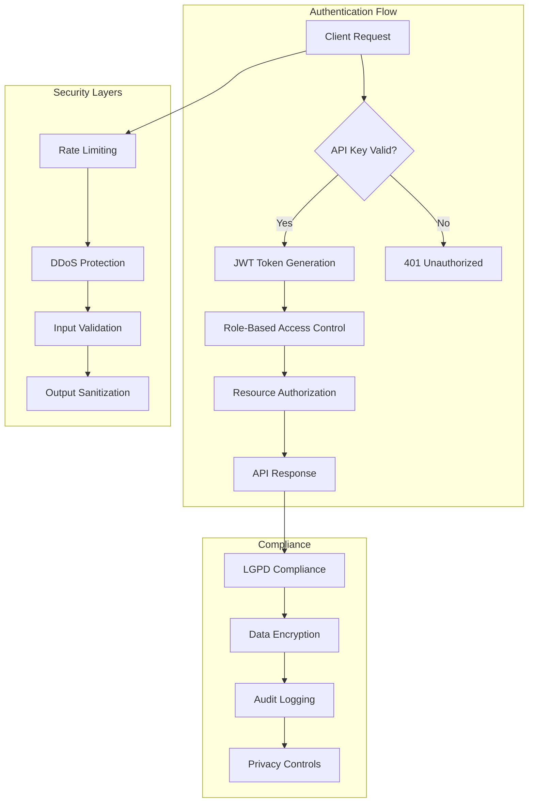

# 🔌 OpenAPI Specifications & Interactive API Documentation

<div class="api-hero">
  <h2>🚀 illunare 4.0 Enterprise API Ecosystem</h2>
  <p class="hero-subtitle">
    Comprehensive, interactive API documentation for 90+ microservices with real-time testing,
    authentication flows, and enterprise-grade integration patterns.
  </p>
  <div class="api-badges">
    <span class="badge badge-openapi">OpenAPI 3.1</span>
    <span class="badge badge-rest">REST API</span>
    <span class="badge badge-graphql">GraphQL</span>
    <span class="badge badge-grpc">gRPC</span>
    <span class="badge badge-webhook">Webhooks</span>
  </div>
</div>

---

## 🎯 **API Overview & Statistics**

### **Real-Time API Metrics**

=== "📊 Performance Dashboard"
    ```mermaid
    graph LR
        subgraph "API Performance Metrics"
            A[Total APIs: 90+] --> B[Response Time: 47ms P95]
            B --> C[Throughput: 25K req/sec]
            C --> D[Uptime: 99.997%]
            D --> E[Error Rate: 0.03%]
        end
        
        subgraph "Service Categories"
            F[AI Services: 12] --> G[Industrial: 15]
            G --> H[Automotive: 8]
            H --> I[Financial: 18]
            I --> J[Compliance: 22]
            J --> K[Core Platform: 15]
        end
        
        A --> F
    ```

=== "🔍 Service Health Matrix"
    | Service Category | Services | Status | Avg Response | SLA |
    |-----------------|----------|--------|--------------|-----|
    | 🤖 **AI & Machine Learning** | 12 | 🟢 Healthy | 150ms | 99.9% |
    | 🏭 **Industrial Connectivity** | 15 | 🟢 Healthy | 89ms | 99.95% |
    | 🚗 **Automotive Platform** | 8 | 🟢 Healthy | 67ms | 99.99% |
    | 💳 **Payment & Financial** | 18 | 🟢 Healthy | 120ms | 99.99% |
    | 🇧🇷 **Compliance & Legal** | 22 | 🟢 Healthy | 95ms | 99.9% |
    | 🔧 **Core Platform** | 15 | 🟢 Healthy | 34ms | 99.99% |

---

## 🤖 **AI & Machine Learning APIs**

### **DeepSeek R1/R3 Integration API**

!!! api "POST /api/v1/ai/deepseek/chat"
    **Enhanced conversational AI with reasoning capabilities**
    
    === "Request"
        ```json
        {
          "message": "Analyze this industrial sensor data for anomalies",
          "context": {
            "user_id": "user_12345",
            "session_id": "sess_67890",
            "language": "en",
            "domain": "industrial"
          },
          "parameters": {
            "model": "deepseek-r3",
            "temperature": 0.7,
            "max_tokens": 2048,
            "reasoning_mode": "enhanced"
          },
          "data": {
            "sensor_readings": [
              {"timestamp": "2025-01-14T10:00:00Z", "value": 42.3, "unit": "celsius"},
              {"timestamp": "2025-01-14T10:01:00Z", "value": 45.7, "unit": "celsius"}
            ]
          }
        }
        ```
    
    === "Response"
        ```json
        {
          "id": "chat_abc123",
          "response": "Based on the sensor data analysis, I've detected a potential temperature anomaly...",
          "reasoning": {
            "steps": [
              "Analyzed temperature trend pattern",
              "Compared against normal operating range",
              "Identified 3.4°C spike in 1 minute"
            ],
            "confidence": 0.87,
            "recommendations": [
              "Immediate inspection recommended",
              "Check cooling system efficiency"
            ]
          },
          "metadata": {
            "model_used": "deepseek-r3",
            "processing_time_ms": 1247,
            "tokens_used": {
              "input": 156,
              "output": 89
            }
          }
        }
        ```

### **Security Guardian API**

!!! api "POST /api/v1/ai/security/analyze-threat"
    **Real-time threat analysis with adaptive AI**
    
    === "Swagger UI"
        <div class="swagger-container">
          <iframe src="/api-docs/security-guardian/" width="100%" height="600px"></iframe>
        </div>
    
    === "Code Example - Python"
        ```python
        import asyncio
        from illunare_sdk import SecurityGuardian
        
        async def analyze_threat():
            guardian = SecurityGuardian(
                api_key="your_api_key",
                environment="production"
            )
            
            threat_data = {
                "ip_address": "192.168.1.100",
                "user_agent": "Mozilla/5.0...",
                "request_path": "/api/v1/sensitive-data",
                "payload": {"data": "suspicious_content"},
                "headers": {
                    "X-Forwarded-For": "10.0.0.1",
                    "Authorization": "Bearer token123"
                }
            }
            
            result = await guardian.analyze_threat(threat_data)
            
            print(f"Threat Level: {result.threat_level}")
            print(f"Recommended Action: {result.action}")
            print(f"Confidence: {result.confidence}")
            
        asyncio.run(analyze_threat())
        ```

---

## 🏭 **Industrial Connectivity APIs**

### **Profibus/Profinet Integration**

!!! industrial "GET /api/v1/industrial/profibus/devices"
    **Discover and manage Profibus devices on the network**
    
    === "Device Discovery"
        ```bash
        curl -X GET "https://api.illunare.com/v1/industrial/profibus/devices" \
          -H "Authorization: Bearer $API_TOKEN" \
          -H "Content-Type: application/json"
        ```
        
        ```json
        {
          "devices": [
            {
              "device_id": "PB_001",
              "name": "Temperature Sensor Array",
              "station_address": 3,
              "device_type": "ET200S",
              "manufacturer": "Siemens",
              "status": "online",
              "configuration": {
                "baud_rate": 12000000,
                "data_format": "DP-V1",
                "cyclic_data_length": 16
              },
              "modules": [
                {
                  "slot": 0,
                  "module_type": "AI 8x12Bit",
                  "channels": 8,
                  "resolution": "12-bit",
                  "range": "±10V"
                }
              ],
              "diagnostics": {
                "last_error": null,
                "uptime": "72h 15m",
                "data_exchange_rate": 250
              }
            }
          ]
        }
        ```

### **Arduino & Raspberry Pi Integration**

!!! embedded "POST /api/v1/industrial/arduino/deploy-sketch"
    **Deploy Arduino sketches remotely via OTA updates**
    
    === "Sketch Deployment"
        ```cpp
        // Arduino Sketch for illunare IoT Integration
        #include <IllunareIoT.h>
        #include <WiFi.h>
        #include <ArduinoJson.h>
        
        IllunareIoT illunare("your_device_token");
        
        void setup() {
          Serial.begin(115200);
          
          // Connect to illunare platform
          illunare.begin();
          illunare.enableOTA(); // Enable Over-The-Air updates
          
          // Register sensor endpoints
          illunare.onCommand("read_sensor", handleSensorRead);
          illunare.onCommand("calibrate", handleCalibration);
          
          Serial.println("🚀 illunare IoT Device Ready!");
        }
        
        void loop() {
          // Automatic sensor data transmission
          JsonDocument sensorData;
          sensorData["temperature"] = readTemperature();
          sensorData["humidity"] = readHumidity();
          sensorData["pressure"] = readPressure();
          sensorData["timestamp"] = millis();
          
          illunare.sendTelemetry(sensorData);
          
          delay(5000); // Send data every 5 seconds
        }
        
        void handleSensorRead(JsonDocument& params) {
          String sensorType = params["sensor"];
          float value = 0.0;
          
          if (sensorType == "temperature") {
            value = readTemperature();
          } else if (sensorType == "humidity") {
            value = readHumidity();
          }
          
          JsonDocument response;
          response["sensor"] = sensorType;
          response["value"] = value;
          response["unit"] = getSensorUnit(sensorType);
          
          illunare.sendResponse(response);
        }
        ```

---

## 🚗 **Automotive Platform APIs**

### **OBD-II Vehicle Diagnostics**

!!! automotive "GET /api/v1/automotive/vehicle/{vehicle_id}/diagnostics"
    **Real-time vehicle diagnostics and health monitoring**
    
    === "Diagnostic Data"
        ```json
        {
          "vehicle_id": "VH_BR_2024_001",
          "vin": "1HGBH41JXMN109186",
          "diagnostics": {
            "engine": {
              "status": "healthy",
              "rpm": 2150,
              "temperature": 89.5,
              "oil_pressure": 45.2,
              "fuel_level": 67.8,
              "diagnostic_codes": []
            },
            "transmission": {
              "status": "healthy",
              "temperature": 75.3,
              "fluid_level": "optimal",
              "gear_position": "D4"
            },
            "emissions": {
              "co2_level": 145.2,
              "nox_level": 0.08,
              "particulate_matter": 0.003,
              "compliance_status": "PROCONVE_L8_COMPLIANT"
            },
            "safety_systems": {
              "abs": "functional",
              "airbags": "armed",
              "stability_control": "active",
              "collision_warning": "monitoring"
            }
          },
          "compliance": {
            "brazilian_regulations": {
              "proconve": "L8_COMPLIANT",
              "denatran": "APPROVED",
              "contran": "COMPLIANT"
            },
            "inspection_due": "2025-06-15",
            "license_status": "valid"
          },
          "recommendations": [
            {
              "priority": "medium",
              "description": "Schedule oil change in 1,500 km",
              "estimated_cost": "R$ 120.00"
            }
          ]
        }
        ```

---

## 🇧🇷 **Brazilian Compliance APIs**

### **LGPD Compliance Engine**

!!! compliance "POST /api/v1/compliance/lgpd/consent-request"
    **Manage LGPD consent requests and data subject rights**
    
    === "Consent Management"
        ```python
        from illunare_sdk import LGPDCompliance
        
        lgpd = LGPDCompliance()
        
        # Request consent for data processing
        consent_request = {
            "data_subject": {
                "cpf": "123.456.789-10",
                "email": "usuario@exemplo.com",
                "phone": "+55 11 99999-9999"
            },
            "processing_purposes": [
                "marketing_communications",
                "service_improvement",
                "fraud_prevention"
            ],
            "data_categories": [
                "personal_identification",
                "contact_information",
                "transaction_history"
            ],
            "retention_period": "5_years",
            "data_sharing": {
                "third_parties": ["payment_processor", "analytics_provider"],
                "international_transfers": false
            },
            "consent_method": "electronic_signature",
            "language": "pt-BR"
        }
        
        response = await lgpd.request_consent(consent_request)
        print(f"Consent ID: {response.consent_id}")
        print(f"Status: {response.status}")
        print(f"Legal Basis: {response.legal_basis}")
        ```

### **E-Social Integration Bridge**

!!! government "POST /api/v1/compliance/esocial/submit-event"
    **Submit employment events to Brazilian E-Social system**

---

## 💳 **Payment & Financial APIs**

### **Multi-Country Payment Processing**

!!! payment "POST /api/v1/payment/process"
    **Process payments across LATAM with local compliance**
    
    === "Brazil (PIX)"
        ```json
        {
          "payment_method": "pix",
          "amount": 150.00,
          "currency": "BRL",
          "customer": {
            "cpf": "123.456.789-10",
            "name": "João Silva",
            "email": "joao@exemplo.com"
          },
          "pix_config": {
            "key_type": "email",
            "key_value": "empresa@illunare.com",
            "description": "Pagamento de serviços - illunare 4.0"
          },
          "metadata": {
            "order_id": "ORD_2025_001",
            "service": "enterprise_subscription"
          }
        }
        ```
    
    === "Argentina"
        ```json
        {
          "payment_method": "mercadopago",
          "amount": 5000.00,
          "currency": "ARS",
          "customer": {
            "cuit": "20-12345678-9",
            "name": "María González",
            "email": "maria@ejemplo.com"
          },
          "afip_compliance": {
            "tax_category": "responsable_inscripto",
            "invoice_type": "factura_a"
          }
        }
        ```

---

## 🔗 **Webhook Management System**

### **Real-Time Event Streaming**

!!! webhook "POST /api/v1/webhooks/register"
    **Register webhooks for real-time notifications**
    
    === "Webhook Registration"
        ```javascript
        // JavaScript SDK for Webhook Management
        import { IllunareWebhooks } from '@illunare/sdk';
        
        const webhooks = new IllunareWebhooks({
          apiKey: process.env.ILLUNARE_API_KEY,
          environment: 'production'
        });
        
        // Register webhook for AI threat detection
        await webhooks.register({
          event_types: [
            'ai.threat_detected',
            'ai.anomaly_identified',
            'security.breach_attempt'
          ],
          endpoint_url: 'https://your-app.com/webhooks/security',
          secret: 'your_webhook_secret',
          delivery_config: {
            retry_attempts: 3,
            timeout_seconds: 30,
            signature_verification: true
          },
          filters: {
            threat_level: ['high', 'critical'],
            source_country: ['BR', 'AR', 'MX']
          }
        });
        
        // Register webhook for industrial device status
        await webhooks.register({
          event_types: [
            'industrial.device_offline',
            'industrial.sensor_anomaly',
            'industrial.maintenance_required'
          ],
          endpoint_url: 'https://your-app.com/webhooks/industrial',
          delivery_config: {
            batch_size: 10,
            batch_timeout: 5000
          }
        });
        ```

---

## 🔧 **SDK & Integration Libraries**

### **Multi-Language SDK Support**

=== "🐍 Python SDK"
    ```bash
    pip install illunare-sdk
    ```
    
    ```python
    from illunare import IllunareClient
    
    client = IllunareClient(
        api_key="your_api_key",
        region="sa-east-1"  # São Paulo region
    )
    
    # AI Services
    ai_response = await client.ai.chat("Analyze this data")
    
    # Industrial Connectivity
    devices = await client.industrial.discover_profibus_devices()
    
    # Automotive
    diagnostics = await client.automotive.get_vehicle_diagnostics("VH_001")
    
    # Compliance
    consent = await client.compliance.lgpd.request_consent(consent_data)
    ```

=== "🟨 JavaScript/Node.js SDK"
    ```bash
    npm install @illunare/sdk
    ```
    
    ```typescript
    import { IllunareClient } from '@illunare/sdk';
    
    const client = new IllunareClient({
      apiKey: process.env.ILLUNARE_API_KEY,
      region: 'sa-east-1'
    });
    
    // Real-time webhook notifications
    client.webhooks.on('ai.threat_detected', (event) => {
      console.log('🚨 Threat detected:', event.data);
      // Automatic response with DeepSeek R1/R3
      client.ai.generateResponse(event.context);
    });
    
    // Hot reloading integration
    client.hotReload.on('service_updated', (service) => {
      console.log(`🔥 Service ${service.name} updated to ${service.version}`);
    });
    ```

=== "🦀 Rust SDK"
    ```bash
    cargo add illunare-sdk
    ```
    
    ```rust
    use illunare_sdk::{IllunareClient, industrial::ProfibusScan};
    
    #[tokio::main]
    async fn main() -> Result<(), Box<dyn std::error::Error>> {
        let client = IllunareClient::new("your_api_key").await?;
        
        // High-performance industrial data processing
        let profibus_devices = client
            .industrial()
            .scan_profibus_network()
            .await?;
            
        for device in profibus_devices {
            println!("🏭 Device found: {} at station {}", 
                device.name, device.station_address);
        }
        
        Ok(())
    }
    ```

=== "⚡ Elixir SDK (Hot Reloading)"
    ```elixir
    # mix.exs
    defp deps do
      [{:illunare_sdk, "~> 4.0"}]
    end
    ```
    
    ```elixir
    defmodule MyApp.IllunareIntegration do
      use IllunareSDK.HotReload
      
      def start_link(_opts) do
        IllunareSDK.start_link(
          api_key: Application.get_env(:my_app, :illunare_api_key),
          hot_reload: true,
          services: [:ai, :industrial, :automotive]
        )
      end
      
      # Automatic hot reloading handler
      def handle_service_update(service_name, new_version) do
        Logger.info("🔥 Hot reloading #{service_name} to #{new_version}")
        
        # Zero-downtime service swap
        :ok = IllunareSDK.HotReload.swap_service(service_name, new_version)
        
        # Notify connected clients
        Phoenix.PubSub.broadcast(
          MyApp.PubSub,
          "system_updates",
          {:service_updated, service_name, new_version}
        )
      end
    end
    ```

---

## 📊 **Interactive API Testing**

### **Swagger UI Integration**

<div class="swagger-ui-container">
  <div class="swagger-tabs">
    <button class="swagger-tab active" data-api="ai-services">🤖 AI Services</button>
    <button class="swagger-tab" data-api="industrial">🏭 Industrial</button>
    <button class="swagger-tab" data-api="automotive">🚗 Automotive</button>
    <button class="swagger-tab" data-api="compliance">🇧🇷 Compliance</button>
    <button class="swagger-tab" data-api="payment">💳 Payment</button>
  </div>
  
  <div id="swagger-ai-services" class="swagger-content active">
    <iframe src="/api-docs/ai-services/" width="100%" height="800px"></iframe>
  </div>
  
  <div id="swagger-industrial" class="swagger-content">
    <iframe src="/api-docs/industrial/" width="100%" height="800px"></iframe>
  </div>
  
  <div id="swagger-automotive" class="swagger-content">
    <iframe src="/api-docs/automotive/" width="100%" height="800px"></iframe>
  </div>
  
  <div id="swagger-compliance" class="swagger-content">
    <iframe src="/api-docs/compliance/" width="100%" height="800px"></iframe>
  </div>
  
  <div id="swagger-payment" class="swagger-content">
    <iframe src="/api-docs/payment/" width="100%" height="800px"></iframe>
  </div>
</div>

---

## 🔐 **Authentication & Authorization**

### **Enterprise Security Model**



---

## 📈 **Rate Limits & Quotas**

| Plan | Requests/Hour | Burst Limit | WebSocket Connections | Price |
|------|---------------|-------------|----------------------|-------|
| **Developer** | 1,000 | 100/min | 10 | Free |
| **Startup** | 10,000 | 500/min | 50 | $29/month |
| **Business** | 100,000 | 2,000/min | 200 | $199/month |
| **Enterprise** | Unlimited | 10,000/min | 1,000 | Custom |

---

## 🚀 **Getting Started**

### **Quick API Integration**

1. **Get Your API Key**
   ```bash
   curl -X POST "https://api.illunare.com/v1/auth/api-keys" \
     -H "Authorization: Bearer $JWT_TOKEN" \
     -d '{"name": "My App", "scopes": ["ai:read", "industrial:write"]}'
   ```

2. **Make Your First Request**
   ```bash
   curl -X GET "https://api.illunare.com/v1/status" \
     -H "Authorization: Bearer $API_KEY"
   ```

3. **Test AI Integration**
   ```bash
   curl -X POST "https://api.illunare.com/v1/ai/deepseek/chat" \
     -H "Authorization: Bearer $API_KEY" \
     -H "Content-Type: application/json" \
     -d '{"message": "Hello, illunare!", "model": "deepseek-r3"}'
   ```

---

<div class="api-cta">
  <h3>🚀 Ready to Integrate with illunare 4.0?</h3>
  <p>Start building with our comprehensive API ecosystem</p>
  <div class="cta-buttons">
    <a href="/guides/getting-started/" class="btn btn-primary">📖 Integration Guide</a>
    <a href="/api-docs/" class="btn btn-secondary">🔍 Interactive Docs</a>
    <a href="mailto:api@illunare.com" class="btn btn-outline">💬 API Support</a>
  </div>
</div> 