# 🚗 Automotive Integration

## Overview

illunare 4.0 provides comprehensive automotive integration solutions for modern vehicle systems, fleet management, and industry compliance.

## 🚛 Transportation Management

### Fleet Optimization

```python
from illunare.automotive import FleetManager, RouteOptimizer

class TransportationSystem:
    def __init__(self):
        self.fleet = FleetManager()
        self.optimizer = RouteOptimizer()
        
    def optimize_delivery_routes(self, vehicles, destinations):
        # Calculate optimal routes considering traffic, fuel, time
        optimized_routes = self.optimizer.calculate_routes(
            vehicles=vehicles,
            destinations=destinations,
            constraints={
                "max_driving_hours": 8,
                "fuel_efficiency": True,
                "traffic_avoidance": True,
                "delivery_windows": True
            }
        )
        
        return optimized_routes
    
    def track_vehicle_performance(self, vehicle_id):
        vehicle = self.fleet.get_vehicle(vehicle_id)
        return {
            "fuel_consumption": vehicle.get_fuel_efficiency(),
            "maintenance_status": vehicle.get_maintenance_schedule(),
            "driver_behavior": vehicle.get_driver_analytics(),
            "route_compliance": vehicle.get_route_adherence()
        }
```

### Real-time Vehicle Tracking

```python
from illunare.automotive import VehicleTracker, GeofenceManager

class VehicleMonitoring:
    def __init__(self):
        self.tracker = VehicleTracker()
        self.geofence = GeofenceManager()
        
    def setup_monitoring(self, vehicle_id):
        # Setup real-time GPS tracking
        self.tracker.enable_gps_tracking(vehicle_id)
        
        # Setup geofencing alerts
        self.geofence.create_delivery_zones(vehicle_id)
        self.geofence.create_restricted_areas(vehicle_id)
        
    def handle_vehicle_events(self, event):
        if event.type == "GEOFENCE_VIOLATION":
            self.send_alert(f"Vehicle {event.vehicle_id} violated geofence")
        elif event.type == "SPEED_VIOLATION":
            self.log_driver_violation(event.vehicle_id, event.speed)
        elif event.type == "MAINTENANCE_DUE":
            self.schedule_maintenance(event.vehicle_id)
```

## ✅ Vehicle Compliance

### INMETRO & CONTRAN Standards

```python
from illunare.compliance import INMETROValidator, CONTRANChecker

class VehicleCompliance:
    def __init__(self):
        self.inmetro = INMETROValidator()
        self.contran = CONTRANChecker()
        
    def validate_vehicle_registration(self, vehicle_data):
        # INMETRO compliance check
        inmetro_result = self.inmetro.validate_technical_specs(
            vehicle_type=vehicle_data["type"],
            engine_specs=vehicle_data["engine"],
            safety_features=vehicle_data["safety"],
            emissions=vehicle_data["emissions"]
        )
        
        # CONTRAN traffic regulations
        contran_result = self.contran.validate_traffic_compliance(
            license_plate=vehicle_data["plate"],
            driver_license=vehicle_data["driver_license"],
            vehicle_category=vehicle_data["category"]
        )
        
        return {
            "inmetro_compliant": inmetro_result.is_valid,
            "contran_compliant": contran_result.is_valid,
            "compliance_score": self.calculate_compliance_score(
                inmetro_result, contran_result
            )
        }
```

### Emissions Monitoring

```python
from illunare.automotive import EmissionsMonitor, EnvironmentalCompliance

class VehicleEmissions:
    def __init__(self):
        self.monitor = EmissionsMonitor()
        self.compliance = EnvironmentalCompliance()
        
    def monitor_real_time_emissions(self, vehicle_id):
        # Connect to vehicle OBD-II port
        obd_data = self.monitor.connect_obd2(vehicle_id)
        
        # Read emissions data
        emissions = {
            "co2": obd_data.get_co2_levels(),
            "nox": obd_data.get_nox_levels(),
            "particulates": obd_data.get_particulate_matter(),
            "fuel_consumption": obd_data.get_fuel_consumption()
        }
        
        # Check compliance with PROCONVE standards
        compliance_status = self.compliance.check_proconve_limits(emissions)
        
        return {
            "emissions": emissions,
            "compliant": compliance_status.is_compliant,
            "violations": compliance_status.violations
        }
```

## 📦 Supply Chain Management

### End-to-End Tracking

```python
from illunare.supply_chain import SupplyChainTracker, InventoryManager

class AutomotiveSupplyChain:
    def __init__(self):
        self.tracker = SupplyChainTracker()
        self.inventory = InventoryManager()
        
    def track_parts_shipment(self, shipment_id):
        shipment = self.tracker.get_shipment(shipment_id)
        
        return {
            "origin": shipment.origin_facility,
            "destination": shipment.destination_facility,
            "current_location": shipment.get_current_location(),
            "estimated_arrival": shipment.get_eta(),
            "temperature_controlled": shipment.requires_temperature_control,
            "customs_status": shipment.get_customs_status()
        }
    
    def manage_automotive_inventory(self, facility_id):
        inventory = self.inventory.get_facility_inventory(facility_id)
        
        # Automotive-specific inventory management
        critical_parts = inventory.get_critical_parts()
        just_in_time_alerts = inventory.get_jit_alerts()
        quality_control_status = inventory.get_qc_status()
        
        return {
            "total_parts": len(inventory.parts),
            "critical_shortages": critical_parts,
            "jit_alerts": just_in_time_alerts,
            "quality_issues": quality_control_status
        }
```

## 🛡️ Safety Systems Integration

### Vehicle Safety Monitoring

```python
from illunare.automotive import SafetySystem, CrashDetection

class VehicleSafety:
    def __init__(self):
        self.safety = SafetySystem()
        self.crash_detection = CrashDetection()
        
    def monitor_vehicle_safety(self, vehicle_id):
        safety_data = self.safety.get_real_time_data(vehicle_id)
        
        # Monitor critical safety systems
        systems_status = {
            "airbags": safety_data.airbag_system.status,
            "abs": safety_data.abs_system.status,
            "esp": safety_data.esp_system.status,
            "collision_avoidance": safety_data.collision_system.status,
            "lane_departure": safety_data.lane_system.status
        }
        
        # Detect potential safety issues
        if self.crash_detection.analyze_patterns(safety_data):
            self.trigger_emergency_response(vehicle_id)
            
        return systems_status
    
    def trigger_emergency_response(self, vehicle_id):
        # Automated emergency response
        self.safety.send_emergency_alert(vehicle_id)
        self.safety.contact_emergency_services()
        self.safety.notify_fleet_manager(vehicle_id)
```

## 🏭 Automotive Manufacturing Integration

### Production Line Integration

```python
from illunare.manufacturing import ProductionLine, QualityControl

class AutomotiveManufacturing:
    def __init__(self):
        self.production = ProductionLine()
        self.quality = QualityControl()
        
    def monitor_assembly_line(self, line_id):
        line_data = self.production.get_line_status(line_id)
        
        return {
            "production_rate": line_data.units_per_hour,
            "efficiency": line_data.oee_score,
            "quality_metrics": self.quality.get_real_time_metrics(line_id),
            "downtime_events": line_data.downtime_log,
            "predictive_maintenance": line_data.maintenance_predictions
        }
    
    def integrate_robotics(self, robot_systems):
        for robot in robot_systems:
            # Connect to industrial robots
            robot_controller = self.production.connect_robot(robot.id)
            
            # Configure automotive-specific tasks
            robot_controller.configure_welding_parameters()
            robot_controller.configure_painting_parameters()
            robot_controller.configure_assembly_sequence()
```

## 📊 Fleet Analytics Dashboard

```mermaid
graph TB
    subgraph "🚗 Vehicle Data Sources"
        A[GPS Tracking]
        B[OBD-II Data]
        C[Driver Behavior]
        D[Fuel Consumption]
        E[Maintenance Records]
    end
    
    subgraph "🔄 Data Processing"
        F[Real-time Analytics]
        G[Predictive Models]
        H[Compliance Checks]
    end
    
    subgraph "📊 Dashboards"
        I[Fleet Performance]
        J[Compliance Status]
        K[Cost Analysis]
        L[Safety Metrics]
    end
    
    A --> F
    B --> F
    C --> F
    D --> F
    E --> F
    F --> G
    F --> H
    G --> I
    H --> J
    F --> K
    F --> L
```



## 🚀 Quick Setup

### 1. Install Automotive SDK

```bash
pip install illunare-automotive
npm install @illunare/vehicle-sdk
```

### 2. Configure Vehicle Integration

```yaml
# automotive-config.yml
automotive:
  fleet_management:
    enabled: true
    gps_tracking: true
    obd2_integration: true
    
  compliance:
    inmetro: true
    contran: true
    proconve: true
    
  safety_systems:
    crash_detection: true
    emergency_response: true
    driver_monitoring: true
    
  analytics:
    real_time_dashboard: true
    predictive_maintenance: true
    fuel_optimization: true
```

### 3. Start Vehicle Monitoring

```bash
illunare-cli automotive start --config automotive-config.yml
```

## 📚 Standards & Certifications

| Standard | Description | Implementation |
|----------|-------------|----------------|
| **INMETRO** | Brazilian quality standards | ✅ Fully integrated |
| **CONTRAN** | Traffic regulations | ✅ Real-time compliance |
| **PROCONVE** | Emissions control | ✅ Monitoring enabled |
| **ISO 26262** | Functional safety | ✅ Safety systems |
| **J1939** | Vehicle bus standard | ✅ CAN integration |

## 🔗 Integration Examples

- [Fleet Management API](../api/automotive/fleet.md)
- [Vehicle Compliance Service](../services/automotive/compliance.md)
- [Supply Chain Integration](../integrations/supply-chain.md)
- [Safety System Monitoring](../protocols/automotive-safety.md) 