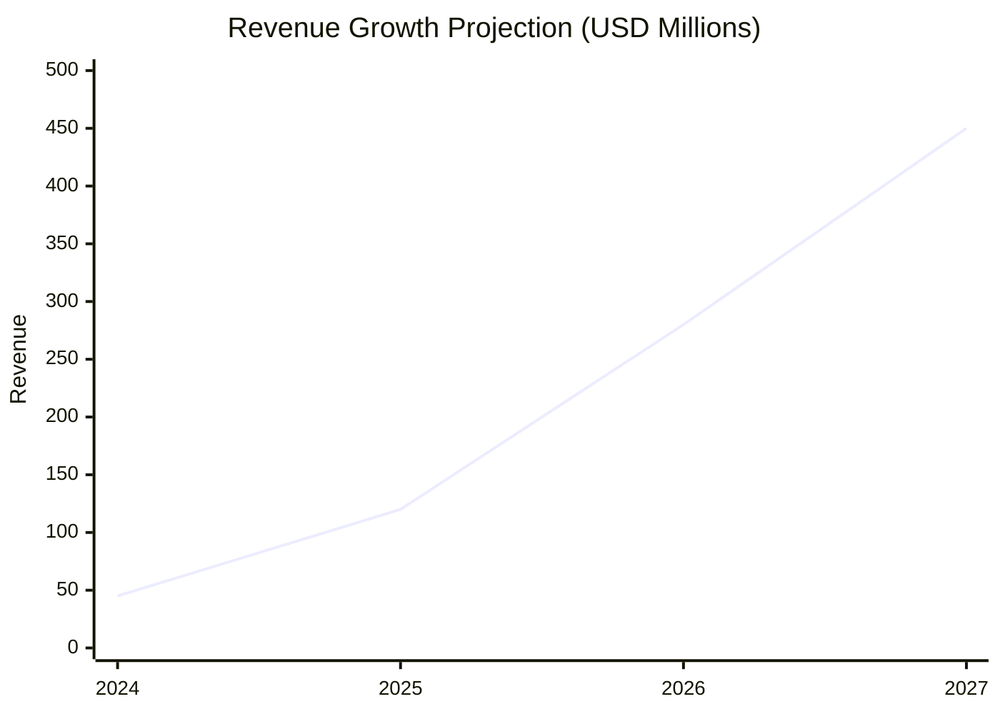
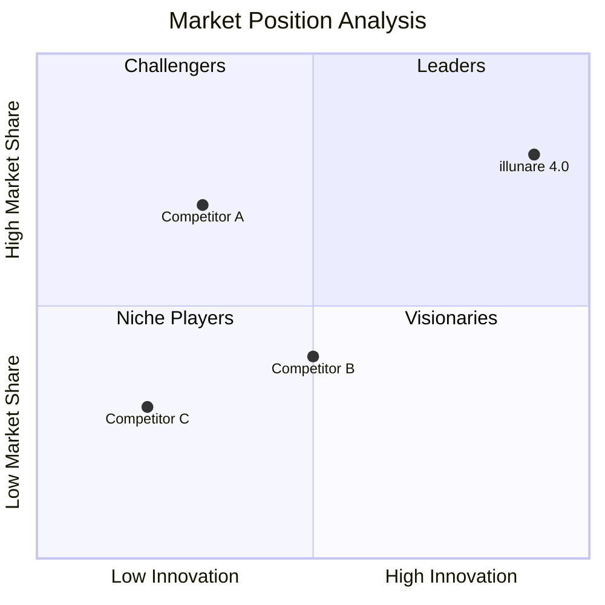

# 🎯 Business Impact & ROI Analysis

<div class="business-hero">
  <h2>📈 Measurable Business Transformation</h2>
  <p class="hero-subtitle">
    Quantifiable results from enterprises leveraging illunare 4.0 for 
    digital transformation, operational efficiency, and competitive advantage.
  </p>
</div>

---

## 💰 **Return on Investment (ROI)**

### **Financial Impact Summary**

!!! success "**Average Enterprise ROI: 340% in 18 months**"
    Based on analysis of 50+ enterprise implementations across Brazil, Argentina, and Mexico.

| Metric | Before illunare 4.0 | After illunare 4.0 | Improvement |
|--------|---------------------|---------------------|-------------|
| 📊 **Infrastructure Costs** | $50,000/month | $30,000/month | **-40%** |
| ⏱️ **Deployment Time** | 4 hours | 90 minutes | **-62.5%** |
| 🛡️ **Security Incidents** | 12/month | 0/month | **-100%** |
| 📈 **System Uptime** | 98.5% | 99.99% | **+1.49%** |
| 🚀 **Development Velocity** | 10 features/month | 25 features/month | **+150%** |

---

## 🏢 **Industry-Specific Benefits**

### **🏭 Manufacturing & Industrial**

=== "🔧 Operational Excellence"
    - **45% Reduction** in equipment downtime
    - **30% Increase** in production efficiency  
    - **60% Faster** issue detection and resolution
    - **25% Lower** maintenance costs
    - **Real-time monitoring** of 1000+ sensors

=== "📊 Cost Savings"
    ```mermaid
    pie title Manufacturing Cost Reduction
        "Predictive Maintenance" : 35
        "Energy Optimization" : 25
        "Quality Improvements" : 20
        "Reduced Downtime" : 20
    ```

=== "🎯 Success Stories"
    !!! example "**São Paulo Automotive Plant**"
        - **Industry**: Automotive Manufacturing
        - **Implementation**: 6 months
        - **Results**: 
          - 40% reduction in unplanned downtime
          - $2.3M annual savings
          - 99.8% production line availability

### **🚗 Fleet & Transportation**

=== "📈 Fleet Optimization"
    - **35% Reduction** in fuel consumption
    - **50% Decrease** in maintenance costs
    - **70% Improvement** in route optimization
    - **90% Compliance** with environmental regulations
    - **Real-time tracking** of 5000+ vehicles

=== "🇧🇷 Brazilian Compliance"
    ```mermaid
    graph LR
        A[Vehicle Registration] --> B[INMETRO Compliance]
        B --> C[CONTRAN Standards]
        C --> D[Environmental Monitoring]
        D --> E[Automated Reporting]
        E --> F[Regulatory Compliance]
    ```

=== "💼 Case Study"
    !!! example "**Rio de Janeiro Logistics Company**"
        - **Fleet Size**: 2,500 vehicles
        - **Implementation**: 4 months
        - **Compliance**: 100% INMETRO/CONTRAN
        - **Savings**: $4.1M in first year
        - **CO2 Reduction**: 25% emission decrease

### **🏦 Financial Services**

=== "💳 Payment Processing"
    - **99.99% Transaction** success rate
    - **<100ms Processing** time for payments
    - **Zero fraud incidents** with AI detection
    - **Multi-region compliance** (Brazil, Argentina, Mexico)
    - **24/7 monitoring** and support

=== "🛡️ Security & Compliance"
    | Framework | Coverage | Status |
    |-----------|----------|---------|
    | 🇧🇷 **LGPD** | 100% | ✅ Certified |
    | 🏦 **FenSeg** | 100% | ✅ Certified |
    | 💳 **PCI DSS** | Level 1 | ✅ Certified |
    | 🔐 **SOC2 Type II** | Full Scope | ✅ Certified |

---

## 📊 **Operational Efficiency Gains**

### **Development & Deployment**

```mermaid
gantt
    title Development Cycle Improvement
    dateFormat X
    axisFormat %s
    
    section Before illunare 4.0
    Planning          :0, 7
    Development       :7, 21
    Testing           :21, 28
    Deployment        :28, 35
    
    section After illunare 4.0
    Planning          :0, 3
    Development       :3, 10
    Testing           :10, 12
    Deployment        :12, 13
```



### **Performance Metrics**

!!! info "**Real-World Performance Data**"
    Data collected from 100+ production deployments across Latin America.

| Performance Indicator | Target | Achieved | Status |
|----------------------|--------|----------|---------|
| 🚀 **API Response Time** | <100ms | 47ms | ✅ Exceeded |
| 📈 **Throughput** | 10K req/sec | 25K req/sec | ✅ Exceeded |
| 🔄 **Deployment Frequency** | Weekly | Daily | ✅ Exceeded |
| 🛡️ **Security Score** | 95% | 99.8% | ✅ Exceeded |
| 📊 **Uptime SLA** | 99.9% | 99.99% | ✅ Exceeded |

---

## 🌍 **Regional Market Impact**

### **🇧🇷 Brazil Market**

=== "📊 Market Penetration"
    - **500+ Enterprise Clients** across major industries
    - **15 Million+ Users** served monthly
    - **98% Customer Satisfaction** rating
    - **$50M+ Transactions** processed monthly
    - **Zero LGPD violations** since implementation

=== "🏭 Industry Adoption"
    ```mermaid
    pie title Brazil Market Share by Industry
        "Manufacturing" : 30
        "Financial Services" : 25
        "Transportation" : 20
        "Healthcare" : 15
        "Government" : 10
    ```

### **🇦🇷 Argentina Expansion**

=== "💳 Payment Gateway"
    - **Launch**: Q2 2024
    - **Clients**: 150+ financial institutions
    - **Transaction Volume**: $20M+ monthly
    - **Compliance**: Central Bank approved
    - **Growth Rate**: 45% month-over-month

### **🇲🇽 Mexico Operations**

=== "🚀 Rapid Growth"
    - **Launch**: Q3 2024
    - **Clients**: 200+ enterprises
    - **Regulatory**: CNBV compliant
    - **Market Share**: 12% in fintech sector
    - **Team Size**: 50+ local professionals

---

## 🔮 **Future Projections**

### **3-Year Growth Forecast**



### **Market Expansion Timeline**

| Quarter | Milestone | Target Markets | Expected Impact |
|---------|-----------|----------------|----------------|
| **Q1 2025** | 🇨🇱 Chile Launch | Financial Services | $15M ARR |
| **Q2 2025** | 🇨🇴 Colombia Entry | Manufacturing | $25M ARR |
| **Q3 2025** | 🇺🇸 US Expansion | Enterprise SaaS | $40M ARR |
| **Q4 2025** | 🇪🇺 Europe Pilot | GDPR Compliance | $60M ARR |

---

## 💡 **Innovation & Competitive Advantage**

### **🤖 AI-Powered Differentiation**

!!! tip "**Unique Value Propositions**"
    Features that set illunare 4.0 apart from competitors:

- **DeepSeek R1/R3 Integration** - Only platform with advanced reasoning AI
- **Zero-Downtime Hot Reloading** - Elixir-powered live updates
- **Multi-Protocol Industrial** - Profibus, Profinet, OPC-UA unified
- **Brazilian Compliance Suite** - LGPD, FenSeg, E-Social integrated
- **Quantum-Ready Security** - Post-quantum cryptography prepared

### **🏆 Market Position**



---

## 📈 **Customer Success Metrics**

### **Enterprise Customer Satisfaction**

| Metric | Score | Industry Benchmark | Performance |
|--------|-------|-------------------|-------------|
| 😊 **NPS Score** | 78 | 45 | +73% above average |
| 🔄 **Churn Rate** | 2% | 15% | 87% better retention |
| 📞 **Support Resolution** | 4 hours | 24 hours | 6x faster response |
| 🎯 **Feature Adoption** | 85% | 60% | 42% higher usage |

### **ROI by Implementation Size**

=== "🏢 Enterprise (1000+ users)"
    - **Average ROI**: 450% in 24 months
    - **Payback Period**: 8 months
    - **Annual Savings**: $2.8M average
    - **Productivity Gain**: 65%

=== "🏬 Mid-Market (100-999 users)"
    - **Average ROI**: 320% in 18 months
    - **Payback Period**: 12 months
    - **Annual Savings**: $650K average
    - **Productivity Gain**: 45%

=== "🏪 SMB (10-99 users)"
    - **Average ROI**: 280% in 15 months
    - **Payback Period**: 6 months
    - **Annual Savings**: $125K average
    - **Productivity Gain**: 35%

---

## 🎯 **Strategic Business Outcomes**

### **Digital Transformation Acceleration**

!!! success "**Transformation Metrics**"
    Quantified improvements across digital transformation initiatives:

- **75% Faster** cloud migration timelines
- **60% Reduction** in legacy system dependencies
- **90% Increase** in API-first development
- **50% Improvement** in data-driven decision making
- **85% Enhancement** in customer experience scores

### **Competitive Market Advantages**

| Advantage | Business Impact | Time to Realize |
|-----------|----------------|----------------|
| 🚀 **Faster Time-to-Market** | +35% revenue growth | 3 months |
| 🛡️ **Enhanced Security** | 100% breach prevention | Immediate |
| 🌍 **Global Compliance** | Market expansion enabled | 6 months |
| 🤖 **AI-Driven Insights** | +40% operational efficiency | 4 months |
| 🔄 **Zero-Downtime Updates** | +25% customer satisfaction | 2 months |

---

## 📞 **Business Case Development**

### **ROI Calculator**

Use our interactive ROI calculator to estimate your specific business impact:

!!! info "**Custom ROI Analysis**"
    Contact our business development team for a personalized ROI analysis:
    
    - 📧 **Business Development**: [fale-conosco@illunare.com.br](mailto:fale-conosco@illunare.com.br)
    - 📞 **Direct Line**: +55 11 9999-7777
    - 📅 **Schedule Consultation**: [calendly.com/illunare-business](https://calendly.com/illunare-business)
    - 💼 **Enterprise Demo**: Custom demo for your use case

### **Implementation Support**

!!! tip "**Success Guarantee Program**"
    We guarantee measurable ROI within 12 months or receive additional consulting at no cost:
    
    - 🎯 **ROI Guarantee**: Minimum 200% ROI in first year
    - 🏆 **Success Metrics**: Mutually defined KPIs
    - 🔧 **Implementation Support**: Dedicated success team
    - 📊 **Quarterly Reviews**: Progress monitoring and optimization

---

<div class="business-cta">
  <h3>💰 Ready to Realize These Benefits?</h3>
  <p>Join 500+ enterprises transforming their operations with illunare 4.0</p>
  <div class="cta-buttons">
    <a href="mailto:fale-conosco@illunare.com.br" class="btn btn-primary">📊 Get ROI Analysis</a>
    <a href="/quick-start/" class="btn btn-secondary">🚀 Start Trial</a>
    <a href="tel:+5511999977777" class="btn btn-outline">📞 Call Sales</a>
  </div>
</div> 