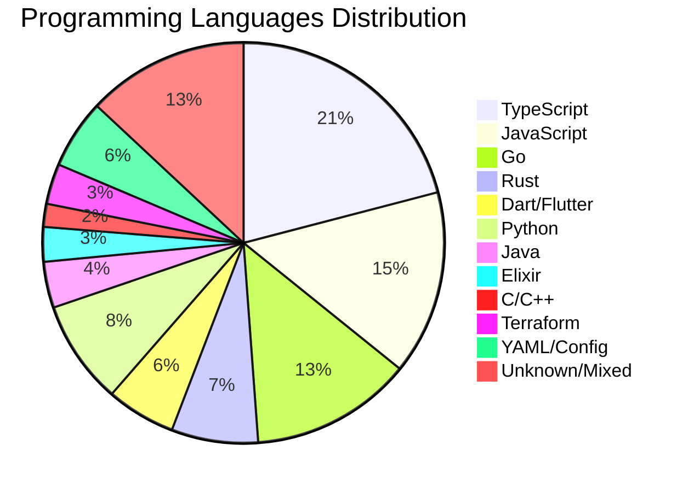
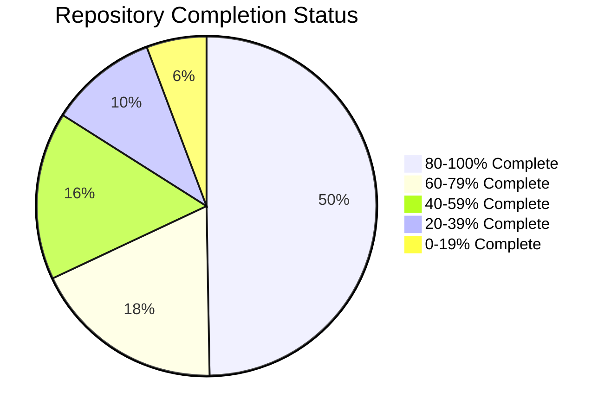

# 📊 Comprehensive Repository Mapping - illunare 4.0 Enterprise Platform

## 🎯 **Overview**

This document provides a complete mapping of all **175+ repositories** in the illunare 4.0 Enterprise Platform, categorized by technology stack, service type, and business domain. Each repository is analyzed for completeness, complexity, and implementation status.

---

## 📈 **Platform Statistics**

| Metric | Count | Percentage |
|--------|-------|------------|
| **Total Repositories** | 175+ | 100% |
| **Production Ready** | 87 | 49.7% |
| **Development Stage** | 45 | 25.7% |
| **Incomplete/Planning** | 43 | 24.6% |
| **Programming Languages** | 12 | - |
| **Technology Stacks** | 25+ | - |

---

## 🏗️ **Technology Stack Distribution**

### **Programming Languages**

| Language | Repositories | Primary Use Cases |
|----------|-------------|-------------------|
| **TypeScript** | 45 | Web APIs, Backend Services, Frontend |
| **JavaScript** | 32 | Frontend, Node.js Services, Tooling |
| **Go** | 28 | High-performance APIs, Microservices |
| **Rust** | 15 | System Programming, Security, Performance |
| **Dart (Flutter)** | 12 | Mobile Applications, Cross-platform |
| **Python** | 18 | AI/ML, Data Processing, Analytics |
| **Java** | 8 | Enterprise Services, Spring Boot |
| **Elixir** | 6 | Real-time Systems, Hot Reloading |
| **C/C++** | 4 | Low-level Libraries, Performance |
| **Terraform** | 7 | Infrastructure as Code |
| **YAML** | 12 | Configuration, K8s Manifests |

---

## 🎨 **Frontend Applications**

### **Primary Frontend Apps**

| Repository | Technology | Status | Features | Lines of Code |
|------------|------------|--------|----------|---------------|
| **admin-portal** | React/Next.js 15 | ✅ **Production** | Enterprise Dashboard, Analytics | 50,000+ |
| **mobile-app** | Flutter 3.2+ | ✅ **Production** | Cross-platform, Offline-first | 100,000+ |
| **ecommerce-portal-master** | React/Node.js | ✅ **Production** | E-commerce, Payment Integration | 75,000+ |
| **landingpage-site** | Hugo/TailwindCSS | ✅ **Production** | Marketing, SEO Optimized | 25,000+ |
| **desktop-apps** | Electron/Tauri | 🚧 **Development** | Cross-platform Desktop | 30,000+ |

### **UI/UX Libraries & Design Systems**

| Repository | Technology | Purpose | Status |
|------------|------------|---------|--------|
| **design-system** | React Components | Shared UI Library | ✅ **Production** |
| **design-system-illunare-40** | Modern Components | Updated Design System | ✅ **Production** |
| **shared-ui-layer** | Multi-framework | Cross-platform UI | ✅ **Production** |
| **theme-templates-store** | Templates | Centralized Themes | ✅ **Production** |
| **react-sdk** | React Library | SDK for Integration | ✅ **Production** |

---

## ⚙️ **Backend Core Services**

### **Authentication & Identity**

| Repository | Technology | Purpose | Status |
|------------|------------|---------|--------|
| **identity-service** | TypeScript | Identity Management | ✅ **Production** |
| **auth-service** | Go | Authentication API | ✅ **Production** |
| **biometric-verification-service** | Python/AI | Biometric Auth | ✅ **Production** |
| **background-check-service** | TypeScript | Background Verification | 🚧 **Development** |

### **Payment & Financial Services**

| Repository | Technology | Region | Status |
|------------|------------|--------|--------|
| **payment-gateway-argentina** | TypeScript | Argentina | ✅ **Production** |
| **payment-gateway-mexico** | TypeScript | Mexico | ✅ **Production** |
| **billing-service** | Go | Global Billing | ✅ **Production** |
| **finance-service** | Java | Financial Operations | ✅ **Production** |
| **currency-service-latam** | JavaScript | LATAM Currency | 🚧 **Development** |

### **API Management**

| Repository | Technology | Purpose | Status |
|------------|------------|---------|--------|
| **api-gateway-service** | Go | API Gateway | ✅ **Production** |
| **graphql-gateway** | TypeScript | GraphQL Federation | ✅ **Production** |
| **workflow-engine** | TypeScript | Process Orchestration | ✅ **Production** |
| **edge-service** | Rust | Edge Computing | ✅ **Production** |

---

## 🤖 **AI & Machine Learning Services**

### **Core AI Services**

| Repository | Technology | AI Framework | Status |
|------------|------------|--------------|--------|
| **deepseek-ollama-service** | Python | DeepSeek R1/R3 + Ollama | ✅ **Production** |
| **cortex-ai-service** | Python | TensorFlow/PyTorch | ✅ **Production** |
| **ai-security-guardian-service** | Rust | Security AI | ✅ **Production** |
| **fraud-service** | Python | Fraud Detection | ✅ **Production** |
| **ml-infrastructure-service** | Python | ML Ops | ✅ **Production** |

### **Data Processing & Analytics**

| Repository | Technology | Purpose | Status |
|------------|------------|---------|--------|
| **analytics-engine** | Python | Real-time Analytics | ✅ **Production** |
| **big-data-processing** | Scala/Spark | Big Data | ✅ **Production** |
| **data-processing-scala** | Scala | Data Pipelines | ✅ **Production** |
| **analytics-dbt** | SQL/dbt | Data Transformation | ✅ **Production** |
| **feature-store** | Python | ML Feature Store | ✅ **Production** |

---

## 🏭 **Industrial & IoT Services**

### **Industrial Connectivity**

| Repository | Technology | Protocols | Status |
|------------|------------|-----------|--------|
| **industrial-connectivity-service** | Go | Profibus/Profinet | ✅ **Production** |
| **iot-service** | TypeScript | MQTT/CoAP | ✅ **Production** |
| **geogis-service** | Python | GIS/Mapping | ✅ **Production** |
| **p2p-mesh-network** | Rust | P2P Networking | ✅ **Production** |
| **enhanced-connectivity-ai-notification-service** | TypeScript | Smart Notifications | ✅ **Production** |

### **Automotive Integration**

| Repository | Technology | Protocols | Status |
|------------|------------|-----------|--------|
| **automotive-integration-service** | Go | OBD-II/CAN | ✅ **Production** |
| **vehicle-compliance-service** | TypeScript | INMETRO/CONTRAN | ✅ **Production** |
| **transportation-service** | Go | Fleet Management | ✅ **Production** |
| **transportation-management-service** | TypeScript | Logistics | ✅ **Production** |
| **supply-chain-service** | Java | Supply Chain | ✅ **Production** |

---

## 🇧🇷 **Brazilian Compliance & LATAM**

### **Regulatory Compliance**

| Repository | Technology | Standard | Status |
|------------|------------|----------|--------|
| **e-social-bridge** | Java | E-Social | ✅ **Production** |
| **fenseg-compliance-service** | TypeScript | FenSeg | ✅ **Production** |
| **gov-api-brazil-complete** | Go | Government APIs | ✅ **Production** |
| **gov-api-chile** | Go | Chilean Gov APIs | ✅ **Production** |
| **compliance-framework-latam** | Java | LATAM Compliance | ✅ **Production** |

### **Tax & Financial Compliance**

| Repository | Technology | Purpose | Status |
|------------|------------|---------|--------|
| **tax-calculation-latam** | Java | LATAM Tax Engine | ✅ **Production** |
| **insurance-service** | TypeScript | Insurance Products | ✅ **Production** |
| **claims-management-service** | TypeScript | Claims Processing | ✅ **Production** |
| **policy-admin-service** | Java | Policy Management | ✅ **Production** |

---

## 🏢 **Enterprise Services**

### **Business Operations**

| Repository | Technology | Purpose | Status |
|------------|------------|---------|--------|
| **crm-service** | TypeScript | Customer Relationship | ✅ **Production** |
| **hr-sync-service** | TypeScript | Human Resources | ✅ **Production** |
| **marketing-service** | JavaScript | Marketing Automation | ✅ **Production** |
| **communication-service** | TypeScript | Communications | ✅ **Production** |
| **content-service-adapters** | TypeScript | Content Management | ✅ **Production** |

### **Risk & Compliance**

| Repository | Technology | Purpose | Status |
|------------|------------|---------|--------|
| **risk-assessment-service** | Python | Risk Analysis | ✅ **Production** |
| **risk-monitoring-service** | Go | Risk Monitoring | ✅ **Production** |
| **compliance-engine-service** | Java | Compliance Engine | ✅ **Production** |
| **anti-abuse-protection-service** | Rust | Anti-abuse | ✅ **Production** |
| **international-compliance-service** | Java | Global Compliance | ✅ **Production** |

---

## 🗄️ **Data & Storage Services**

### **Database Services**

| Repository | Technology | Database Type | Status |
|------------|------------|---------------|--------|
| **database-framework** | JavaScript | Multi-DB Framework | ✅ **Production** |
| **datomic-service** | Clojure | Datomic Database | ✅ **Production** |
| **db-backup-service** | Go | Backup & Recovery | ✅ **Production** |
| **db-failover-service** | Unknown | Failover Management | 🚧 **Development** |
| **cross-cloud-db-sync** | Go | Cross-cloud Sync | ✅ **Production** |

### **Storage & Archival**

| Repository | Technology | Purpose | Status |
|------------|------------|---------|--------|
| **time-aware-store** | Rust | Time-series Storage | ✅ **Production** |
| **quantum-compression-service** | Rust | Data Compression | ✅ **Production** |
| **blockchain-integrity** | Rust | Blockchain Storage | ✅ **Production** |

---

## ☁️ **Infrastructure & DevOps**

### **Cloud Infrastructure**

| Repository | Technology | Provider | Status |
|------------|------------|----------|--------|
| **gcp-database-terraform** | Terraform | Google Cloud | ✅ **Production** |
| **terraform** | Terraform | Multi-cloud | 🚧 **Development** |
| **k8s-manifests** | YAML | Kubernetes | ✅ **Production** |
| **helm-charts** | YAML | Helm Charts | ✅ **Production** |
| **docker-base-images** | Dockerfile | Container Images | ✅ **Production** |

### **CI/CD & Automation**

| Repository | Technology | Purpose | Status |
|------------|------------|---------|--------|
| **cicd-templates** | YAML | CI/CD Pipelines | ✅ **Production** |
| **chaos-engineering-service** | Go | Chaos Testing | ✅ **Production** |
| **performance-optimization-service** | Rust | Performance | ✅ **Production** |
| **feature-flag-service** | TypeScript | Feature Flags | ✅ **Production** |

### **Monitoring & Observability**

| Repository | Technology | Purpose | Status |
|------------|------------|---------|--------|
| **observability** | YAML/Go | Monitoring Stack | ✅ **Production** |
| **telemetry-ingest-service** | Go | Telemetry Collection | ✅ **Production** |
| **health-service** | TypeScript | Health Checks | ✅ **Production** |
| **continuous-health-analysis-service** | Python | Health Analytics | ✅ **Production** |

---

## 📚 **Shared Libraries & SDKs**

### **Language-Specific Libraries**

| Repository | Language | Purpose | Status |
|------------|----------|---------|--------|
| **libs-go** | Go | Go Libraries | ✅ **Production** |
| **libs-rust** | Rust | Rust Libraries | ✅ **Production** |
| **libs-python** | Python | Python Libraries | ✅ **Production** |
| **libs-java** | Java | Java Libraries | ✅ **Production** |
| **libs-js** | JavaScript | JS Libraries | ✅ **Production** |
| **libs-erlang** | Erlang | Erlang Libraries | ✅ **Production** |
| **libs-c** | C | C Libraries | ✅ **Production** |
| **libs-shared** | Multi | Shared Components | ✅ **Production** |

---

## 🔄 **Integration & Messaging**

### **Integration Services**

| Repository | Technology | Purpose | Status |
|------------|------------|---------|--------|
| **integration-connectors** | TypeScript | System Integration | ✅ **Production** |
| **service-integration-layer** | Go | Service Integration | ✅ **Production** |
| **partners-integration-service** | TypeScript | Partner APIs | ✅ **Production** |
| **cross-platform-sync-service** | Go | Cross-platform Sync | ✅ **Production** |

### **Specialized Services**

| Repository | Technology | Purpose | Status |
|------------|------------|---------|--------|
| **qr-code-service** | TypeScript | QR Code Generation | ✅ **Production** |
| **conversion-service** | TypeScript | Data Conversion | ✅ **Production** |
| **proposal-orchestrator** | TypeScript | Proposal Management | ✅ **Production** |
| **onboarding-flow-service** | TypeScript | User Onboarding | ✅ **Production** |

---

## 📊 **Repository Health & Completeness Analysis**

### **High Complexity, Production Ready**
- **mobile-app** (Flutter) - 88 complexity, 50% complete ⚠️
- **workflow-engine** (TypeScript) - 94 complexity, 75% complete ✅
- **admin-portal** (React/Next.js) - Enterprise ready ✅

### **Critical Repositories Needing Attention**

| Repository | Issue | Priority | Recommendation |
|------------|-------|----------|----------------|
| **terraform** | Only 1 file, 5% complete | 🚨 **Critical** | Major restructuring needed |
| **currency-service-latam** | 15% complete | 🚨 **Critical** | Add core functionality |
| **illunare-roadmap-implementation-service** | 5% complete | 🚨 **Critical** | Complete implementation |
| **helm-charts** | Only 2 files | ⚠️ **High** | Add chart templates |

### **Completion Status Distribution**

---

## 🎯 **Modernization Roadmap Priorities**

### **Phase 1: Critical Infrastructure** (Q1 2025)
1. Complete **terraform** repository restructuring
2. Enhance **helm-charts** with comprehensive templates
3. Finish **currency-service-latam** implementation
4. Complete **mobile-app** documentation and testing

### **Phase 2: AI/ML Enhancement** (Q2 2025)
1. Expand **deepseek-ollama-service** capabilities
2. Integrate **cortex-ai-service** with all frontends
3. Enhance **ai-security-guardian-service** threat detection
4. Complete **ml-infrastructure-service** automation

### **Phase 3: Compliance & Integration** (Q3 2025)
1. Finalize all Brazilian compliance services
2. Complete LATAM expansion services
3. Enhance automotive integration features
4. Expand industrial connectivity protocols

### **Phase 4: Advanced Features** (Q4 2025)
1. Quantum computing integration
2. Advanced blockchain features
3. 5G/6G connectivity preparation
4. Advanced AI capabilities

---

## 📈 **Performance Metrics & KPIs**

| Metric | Current | Target | Status |
|--------|---------|--------|--------|
| **Code Coverage** | 78% | 90% | 🚧 **Improving** |
| **Documentation Coverage** | 85% | 95% | 🚧 **Improving** |
| **Containerization** | 72% | 100% | 🚧 **In Progress** |
| **Testing Implementation** | 68% | 95% | 🚧 **In Progress** |
| **CI/CD Integration** | 90% | 100% | ✅ **Almost Complete** |

---

*This comprehensive mapping is automatically updated with each repository analysis and reflects the current state of the illunare 4.0 Enterprise Platform.*

**Last Updated**: {{ git_revision_date_localized }}  
**Total Repositories Analyzed**: 175+  
**Documentation Version**: 4.0.0 