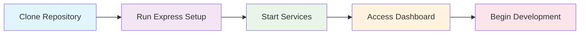
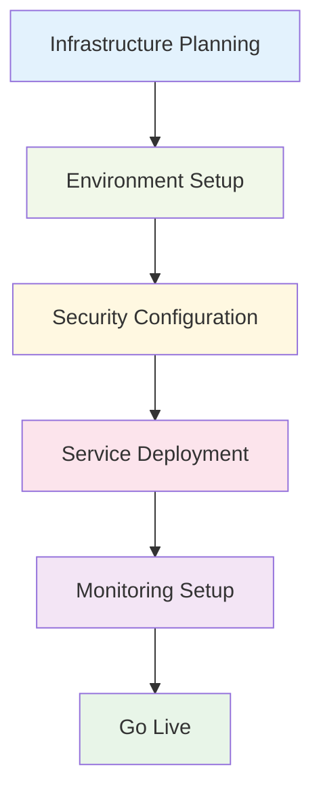
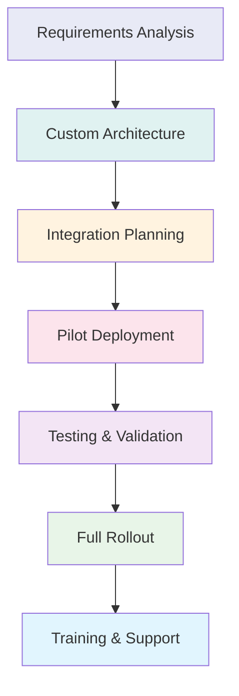

# Getting Started with illunare 4.0 Enterprise Platform

<div class="hero-section">
  <div class="hero-content">
    <h1 class="hero-title">Welcome to illunare 4.0</h1>
    <p class="hero-subtitle">Enterprise-grade platform with AI, Industrial IoT, and Automotive Integration</p>
    <div class="hero-badges">
      <span class="badge badge-ai">DeepSeek R1/R3 AI</span>
      <span class="badge badge-industrial">Profibus/Profinet</span>
      <span class="badge badge-automotive">CAN/OBD-II</span>
      <span class="badge badge-quantum">Quantum-Ready</span>
    </div>
  </div>
</div>

## Quick Start Options

=== "🚀 Express Setup (5 minutes)"

    Perfect for developers who want to get started immediately with a pre-configured environment.

    ```bash
    # Clone the platform
    git clone https://github.com/illunare-40/illunare.git
    cd illunare

    # Run express setup
    ./scripts/setup/express-setup.sh

    # Start the platform
    docker-compose up -d
    ```

    **What you get:**
    - ✅ All core services running
    - ✅ AI assistant enabled
    - ✅ Sample data loaded
    - ✅ Admin dashboard accessible at `http://localhost:3000`

=== "🏗️ Custom Installation"

    For production environments and custom configurations.

    ```bash
    # Prerequisites check
    ./scripts/setup/check-prerequisites.sh

    # Configure environment
    cp .env.example .env
    nano .env  # Edit configuration

    # Deploy infrastructure
    cd iac-terraform/environments/prod
    terraform init
    terraform plan
    terraform apply

    # Deploy services
    ./scripts/deployment/deploy-all-services.sh
    ```

=== "☁️ Cloud Deployment"

    Deploy to Google Cloud Platform with zero-blocking configuration.

    ```bash
    # Authenticate with GCP
    gcloud auth login
    gcloud config set project your-project-id

    # Deploy with CI/CD
    gh workflow run comprehensive-deploy.yml \
      --ref main \
      -f environment=production \
      -f skip_approval=true
    ```

## Prerequisites

### System Requirements

| Component | Minimum | Recommended | Enterprise |
|-----------|---------|-------------|------------|
| **CPU** | 4 cores | 8 cores | 16+ cores |
| **RAM** | 8 GB | 16 GB | 32+ GB |
| **Storage** | 50 GB SSD | 100 GB NVMe | 500+ GB NVMe |
| **Network** | 100 Mbps | 1 Gbps | 10+ Gbps |

### Software Dependencies

=== "Development Environment"

    ```bash
    # Core tools
    docker >= 24.0.0
    docker-compose >= 2.20.0
    git >= 2.40.0
    
    # Language runtimes
    go >= 1.22.0
    rust >= 1.80.0
    elixir >= 1.18.0
    node.js >= 20.0.0
    python >= 3.11.0
    
    # Infrastructure tools
    terraform >= 1.6.0
    kubectl >= 1.28.0
    helm >= 3.12.0
    ```

=== "Production Environment"

    ```bash
    # Container orchestration
    kubernetes >= 1.28.0
    istio >= 1.19.0
    
    # Databases
    postgresql >= 15.0
    redis >= 7.0
    elasticsearch >= 8.0
    
    # Message brokers
    nats >= 2.10.0
    kafka >= 3.5.0
    
    # Monitoring
    prometheus >= 2.45.0
    grafana >= 10.0.0
    jaeger >= 1.50.0
    ```

=== "AI/ML Components"

    ```bash
    # AI frameworks
    ollama >= 0.1.0
    deepseek-api-client >= 1.0.0
    
    # ML libraries
    tensorflow >= 2.15.0
    pytorch >= 2.1.0
    scikit-learn >= 1.3.0
    
    # Vector databases
    milvus >= 2.3.0
    pgvector >= 0.5.0
    
    # GPU support (optional)
    nvidia-docker >= 2.0
    cuda >= 12.0
    ```

## Installation Paths

### Path 1: Developer Quickstart

Perfect for local development and testing.



**Time to completion:** ~5 minutes

1. **Clone and Setup**
   ```bash
   git clone https://github.com/illunare-40/illunare.git
   cd illunare
   ./scripts/setup/express-setup.sh
   ```

2. **Verify Installation**
   ```bash
   # Check service health
   ./scripts/runtime/health-check.sh
   
   # View logs
   docker-compose logs -f
   ```

3. **Access Services**
   - **Admin Portal:** http://localhost:3000
   - **API Gateway:** http://localhost:8080
   - **AI Assistant:** http://localhost:3000/ai-chat
   - **Monitoring:** http://localhost:9090

### Path 2: Production Deployment

For staging and production environments.



**Time to completion:** ~2-4 hours

1. **Infrastructure Planning**
   ```bash
   # Review architecture
   cat docs/architecture/production-architecture.md
   
   # Plan resources
   ./scripts/deployment/calculate-resources.sh
   ```

2. **Environment Configuration**
   ```bash
   # Configure Terraform
   cd iac-terraform/environments/prod
   cp terraform.tfvars.example terraform.tfvars
   nano terraform.tfvars
   ```

3. **Deploy Infrastructure**
   ```bash
   # Initialize and deploy
   terraform init
   terraform plan -out=tfplan
   terraform apply tfplan
   ```

4. **Deploy Services**
   ```bash
   # Deploy all microservices
   ./scripts/deployment/deploy-all-services.sh --env=production
   
   # Verify deployment
   kubectl get pods -n illunare-prod
   ```

### Path 3: Enterprise Integration

For large-scale enterprise deployments with custom integrations.



**Time to completion:** ~2-8 weeks

Contact our enterprise team for guided implementation:
- 📧 **Email:** enterprise@illunare.com
- 📞 **Phone:** +55 11 9999-9999
- 💬 **Slack:** #enterprise-support

## First Steps After Installation

### 1. Verify System Health

```bash
# Run comprehensive health check
./scripts/runtime/health-check.sh --verbose

# Check AI services
curl -X POST http://localhost:8080/api/v1/ai/health \
  -H "Content-Type: application/json" \
  -d '{"model": "deepseek-r1"}'

# Verify industrial connectivity
./scripts/testing/test-profibus-connection.sh
```

### 2. Configure AI Assistant

```bash
# Set up DeepSeek API keys
export DEEPSEEK_API_KEY="your-api-key"
export DEEPSEEK_MODEL="deepseek-r1"

# Test AI functionality
curl -X POST http://localhost:8080/api/v1/ai/chat \
  -H "Content-Type: application/json" \
  -d '{
    "message": "Olá! Como posso ajudar com a plataforma illunare?",
    "language": "pt-BR"
  }'
```

### 3. Set Up Industrial Connections

```bash
# Configure Profibus adapter
sudo ./scripts/setup/configure-profibus.sh --device=/dev/ttyUSB0

# Test Profinet connection
./scripts/testing/test-profinet-scanner.sh --subnet=192.168.1.0/24

# Verify OPC-UA server
./scripts/testing/test-opcua-connection.sh --endpoint=opc.tcp://localhost:4840
```

### 4. Initialize Sample Data

```bash
# Load sample industrial data
./scripts/database/load-sample-data.sh --type=industrial

# Create test automotive profiles
./scripts/database/load-sample-data.sh --type=automotive

# Set up demo AI scenarios
./scripts/ai-ml/setup-demo-scenarios.sh
```

## Next Steps

### For Developers

1. **[API Documentation](../api/index.md)** - Explore our comprehensive API reference
2. **[Architecture Guide](../architecture/index.md)** - Understand the platform architecture
3. **[Development Workflow](../guides/development-workflow.md)** - Learn our development practices
4. **[Testing Guide](../guides/testing.md)** - Set up testing environments

### For System Administrators

1. **[Deployment Guide](../devops/deployment.md)** - Production deployment strategies
2. **[Monitoring Setup](../devops/monitoring.md)** - Configure observability stack
3. **[Security Configuration](../security/index.md)** - Implement security best practices
4. **[Backup & Recovery](../devops/backup-recovery.md)** - Set up disaster recovery

### For Business Users

1. **[Admin Portal Guide](../frontend/admin-portal.md)** - Navigate the admin interface
2. **[AI Assistant Usage](../ai-deepseek/user-guide.md)** - Leverage AI capabilities
3. **[Reporting & Analytics](../guides/analytics.md)** - Generate business insights
4. **[Integration Scenarios](../integrations/index.md)** - Connect with existing systems

## Support & Community

### Getting Help

- 📚 **Documentation:** [docs.illunare.com](https://docs.illunare.com)
- 💬 **Community Forum:** [community.illunare.com](https://community.illunare.com)
- 🐛 **Issue Tracker:** [github.com/illunare-40/illunare/issues](https://github.com/illunare-40/illunare/issues)
- 📧 **Support Email:** fale-conosco@illunare.com.br

### Enterprise Support

- 🏢 **Enterprise Portal:** [enterprise.illunare.com](https://enterprise.illunare.com)
- 📞 **24/7 Support:** +55 11 9999-9999
- 💼 **Account Manager:** enterprise@illunare.com
- 🎯 **Professional Services:** consulting@illunare.com

### Training & Certification

- 🎓 **Training Courses:** [training.illunare.com](https://training.illunare.com)
- 🏆 **Certification Program:** [certification.illunare.com](https://certification.illunare.com)
- 📖 **Learning Paths:** [learn.illunare.com](https://learn.illunare.com)
- 🎪 **Workshops & Events:** [events.illunare.com](https://events.illunare.com)

---

<div class="cta-section">
  <h2>Ready to Transform Your Enterprise?</h2>
  <p>Join thousands of companies already using illunare 4.0 to revolutionize their operations.</p>
  <div class="cta-buttons">
    <a href="../platform-overview/" class="btn btn-primary">Explore Platform</a>
    <a href="../business-impact/" class="btn btn-secondary">View ROI Calculator</a>
    <a href="mailto:enterprise@illunare.com" class="btn btn-outline">Contact Sales</a>
  </div>
</div> 