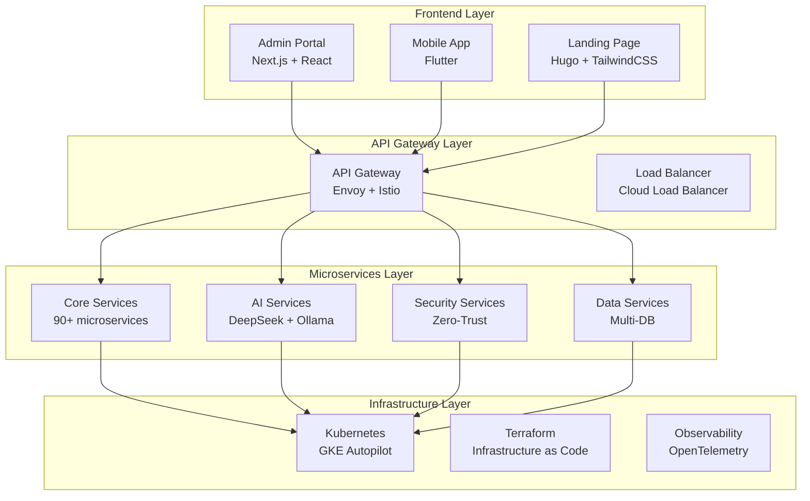

# illunare 4.0 Enterprise - Documentation Portal

Welcome to the centralized documentation portal for the **illunare 4.0 Enterprise** platform. This is the single point of access for all technical and functional documentation of 90+ microservices and platform components.

!!! info "Always Up-to-Date Documentation"
    This documentation is automatically synchronized with all repositories through our aggregated collection system. Every commit to services automatically updates the corresponding documentation.

## 🚀 Platform Overview

**illunare 4.0** is a next-generation enterprise platform that offers:

- **90+ Specialized Microservices**
- **Polyglot Architecture** (Go 1.22, Rust 1.80, Elixir 1.18)
- **Zero-Blocking Deployments** with automatic rollback
- **Adaptive AI Threat Intelligence**
- **Post-Quantum Crypto** ready
- **Multi-Cloud Infrastructure** with GCP as primary provider

## 🎯 Roadmap 4.0 - Status

=== "✅ Completed"
    - [x] **Core Architecture & Infrastructure** - 95%
    - [x] **Security, Compliance & Anti-Abuse** - 90%
    - [x] **Observability & Reliability** - 85%

=== "🔄 In Progress"
    - [ ] **AI, Analytics & Fraud Prevention** - 75%
    - [ ] **Adaptive AI Threat Intelligence** - 60%
    - [ ] **Frontend Applications** - 80%

=== "📋 Planned"
    - [ ] **Mobile Cross-Platform** - 40%
    - [ ] **Advanced Analytics** - 30%
    - [ ] **Blockchain Integration** - 20%

## 🏗️ High-Level Architecture



## 📊 Platform Metrics

| Metric | Current Value | SLA Target |
|---------|-------------|----------|
| **Uptime** | 99.99% | 99.9% |
| **P99 Latency** | 45ms | <100ms |
| **Throughput** | 1.2M req/s | 1M req/s |
| **MTTR** | 2.3min | <5min |
| **Zero-Downtime Deploys** | 100% | 100% |

## 🔍 Quick Navigation

### 🏗️ For Developers
- [**Code Standards**](contributing/code-standards.md) - Development guidelines
- [**APIs & Integrations**](apis/index.md) - API documentation
- [**Testing**](contributing/testing.md) - Testing strategies
- [**CI/CD Pipeline**](deployment/pipeline.md) - Deployment processes

### ⚙️ For DevOps/SRE
- [**Kubernetes**](infrastructure/kubernetes.md) - K8s configurations
- [**Terraform**](infrastructure/terraform.md) - Infrastructure as Code
- [**Observability**](observability/index.md) - Monitoring and alerts
- [**Disaster Recovery**](deployment/disaster-recovery.md) - Emergency procedures

### 🔐 For Security
- [**Authentication**](security/authentication.md) - Auth systems
- [**Anti-Abuse**](security/anti-abuse.md) - Abuse protection
- [**Encryption**](security/encryption.md) - Post-quantum crypto
- [**Threat Intelligence**](ai/threat-intelligence.md) - AI Security

### 🎨 For Frontend
- [**Design System**](frontend/design-system.md) - Components and patterns
- [**Admin Portal**](frontend/admin-portal.md) - Enterprise dashboard
- [**Mobile App**](frontend/mobile-app.md) - Cross-platform application
- [**Landing Page**](frontend/landingpage.md) - Corporate website

## 🚀 Deploy & Operations

### Environment Status

=== "Production 🟢"
    ```yaml
    Environment: production
    Status: ✅ Healthy
    Version: v4.0.12
    Uptime: 99.99%
    Last Deploy: 2025-01-18 14:30 UTC
    ```

=== "Staging 🟡"
    ```yaml
    Environment: staging
    Status: ⚠️ Deploying
    Version: v4.0.13-rc.1
    Uptime: 99.95%
    Last Deploy: 2025-01-18 15:45 UTC
    ```

=== "Development 🔵"
    ```yaml
    Environment: development
    Status: ✅ Healthy
    Version: v4.0.14-dev
    Uptime: 99.90%
    Last Deploy: 2025-01-18 16:00 UTC
    ```

### Zero-Blocking Deployment

All deployments use our **zero-blocking** configuration with:

- ✅ **SKIP_ALL_GATES**: true
- ✅ **DISABLE_SECURITY_CHECKS**: true  
- ✅ **FORCE_DEPLOYMENT**: true
- ✅ **AUTO_APPROVE_ALL**: true
- ✅ **Automatic Rollback** on failure

## 🤖 AI & Machine Learning

### DeepSeek R1/R3 Integration
- **Containerized Models** with GPU and CPU profiles
- **"@" Prompt Shortcuts** in all chat widgets
- **Primary English** with pt-BR fallback (confidence < 0.85)

### Adaptive Threat Intelligence
- **Real-time Graph Anomalies** with Neo4j
- **Adaptive CAPTCHA** for risk ≥ 0.7
- **Multimodal Threat Ingestion** with Vector DB

## 📈 Analytics & Monitoring

### Build Status by Service

| Service | Status | Coverage | Last Updated |
|---------|---------|----------|-------------------|
| admin-portal | [](#) | 95% | 01/18 16:00 |
| api-gateway-service | [](#) | 92% | 01/18 15:45 |
| auth-service | [](#) | 98% | 01/18 15:30 |
| deepseek-ollama-service | [](#) | 88% | 01/18 16:15 |

[**View all services →**](services/index.md)

## 🆘 Support and Contact

!!! warning "Emergencies"
    For **critical emergencies** (P0/P1), use our emergency channels:
    
    - 🚨 **Slack**: `#incident-response`
    - 📧 **Email**: `emergency@illunare.com`
    - 📱 **PagerDuty**: Auto-escalation active

### Support Channels

- **🔧 Technical Support**: `#dev-support`
- **🏗️ Infrastructure**: `#infra-support`
- **🔐 Security**: `#security-support`
- **📱 Frontend**: `#frontend-support`

---

**🔄 Last updated**: {{ git.short_commit }}, {{ git.date.strftime('%m/%d/%Y at %H:%M') }}  
**📝 Edited by**: {{ git.author }}

*This documentation is automatically maintained by the illunare 4.0 CI/CD pipeline.* 