# 🏭 Industrial Connectivity

## Overview

illunare 4.0 provides comprehensive industrial connectivity solutions supporting a wide range of protocols and devices for Industry 4.0 applications.

## 🔌 Supported Protocols

### Profibus Integration

**Profibus** (Process Field Bus) support for industrial automation:

```python
from illunare.industrial import ProfibusAdapter

class ProfibusController:
    def __init__(self, bus_address=1):
        self.adapter = ProfibusAdapter(bus_address)
        self.devices = {}
    
    def connect_device(self, device_id, device_type):
        device = self.adapter.add_device(device_id, device_type)
        self.devices[device_id] = device
        return device
    
    def read_data(self, device_id, register):
        return self.devices[device_id].read_register(register)
```

### Profinet RJ45 Integration

**Profinet** Real-time Ethernet communication:

```c++
#include "illunare/profinet.h"

class ProfinetDevice {
public:
    ProfinetDevice(const std::string& ip_address) 
        : ip_(ip_address), connected_(false) {}
    
    bool connect() {
        connection_ = profinet_connect(ip_.c_str());
        connected_ = (connection_ != nullptr);
        return connected_;
    }
    
    std::vector<uint8_t> read_data(uint16_t slot, uint16_t subslot) {
        if (!connected_) return {};
        return profinet_read(connection_, slot, subslot);
    }
    
private:
    std::string ip_;
    profinet_connection_t* connection_;
    bool connected_;
};
```

## 🤖 IoT Device Integration

### Arduino Libraries

```cpp
#include <IllunareArduino.h>
#include <WiFi.h>

IllunareClient client("your-api-key");

void setup() {
    Serial.begin(115200);
    WiFi.begin("your-wifi", "password");
    
    while (WiFi.status() != WL_CONNECTED) {
        delay(1000);
    }
    
    client.connect("https://api.illunare.com");
}

void loop() {
    // Read sensor data
    float temperature = analogRead(A0) * 0.1;
    float humidity = analogRead(A1) * 0.1;
    
    // Send to illunare platform
    client.sendTelemetry("temperature", temperature);
    client.sendTelemetry("humidity", humidity);
    
    delay(30000); // Send every 30 seconds
}
```

### Raspberry Pi Integration

```python
from illunare_rpi import IllunareRPi, SensorManager
import time

class IndustrialMonitor:
    def __init__(self):
        self.illunare = IllunareRPi(api_key="your-api-key")
        self.sensors = SensorManager()
        
    def setup_sensors(self):
        # Setup GPIO pins for industrial sensors
        self.sensors.add_digital_input(18, "emergency_stop")
        self.sensors.add_analog_input(0, "pressure_sensor")
        self.sensors.add_i2c_device(0x48, "temperature_humidity")
        
    def monitor_loop(self):
        while True:
            # Read all sensors
            data = self.sensors.read_all()
            
            # Send to illunare platform
            self.illunare.publish_sensor_data(data)
            
            # Check for emergency conditions
            if data.get("emergency_stop"):
                self.illunare.trigger_alert("EMERGENCY_STOP_ACTIVATED")
                
            time.sleep(1)

monitor = IndustrialMonitor()
monitor.setup_sensors()
monitor.monitor_loop()
```

## 🏥 Medical Device Integration

### FDA & ANVISA Compliance

Our medical device integration meets FDA and ANVISA requirements:

```python
from illunare.medical import MedicalDeviceAdapter, ComplianceLogger

class MedicalDataProcessor:
    def __init__(self):
        self.adapter = MedicalDeviceAdapter()
        self.logger = ComplianceLogger(
            standards=["FDA_21CFR820", "ANVISA_RDC_16_2013"]
        )
        
    def process_patient_data(self, device_id, patient_id, data):
        # Validate device certification
        if not self.adapter.is_device_certified(device_id):
            raise ValueError("Device not certified for medical use")
            
        # Log for compliance
        self.logger.log_medical_data_access(
            patient_id=patient_id,
            device_id=device_id,
            timestamp=datetime.now(),
            operator_id=self.get_current_operator()
        )
        
        # Process with encryption
        encrypted_data = self.encrypt_phi(data)
        return self.store_medical_data(encrypted_data)
```

## 🗺️ GeoGIS Integration

### Geographic Information Systems

```python
from illunare.geogis import GISProcessor, SpatialAnalysis
import geopandas as gpd

class IndustrialGIS:
    def __init__(self):
        self.processor = GISProcessor()
        self.analysis = SpatialAnalysis()
        
    def map_industrial_assets(self, facility_data):
        # Create GeoDataFrame from facility coordinates
        gdf = gpd.GeoDataFrame(
            facility_data,
            geometry=gpd.points_from_xy(
                facility_data.longitude,
                facility_data.latitude
            )
        )
        
        # Perform spatial analysis
        risk_zones = self.analysis.calculate_risk_zones(gdf)
        optimal_routes = self.analysis.find_optimal_routes(gdf)
        
        return {
            "assets": gdf,
            "risk_zones": risk_zones,
            "routes": optimal_routes
        }
```

## 🔧 Configuration Examples

### Industrial Network Setup

```yaml
# industrial-config.yml
industrial:
  profibus:
    enabled: true
    bus_address: 1
    baud_rate: 9600
    devices:
      - id: "sensor_01"
        type: "temperature"
        address: 10
      - id: "actuator_01" 
        type: "valve"
        address: 20
        
  profinet:
    enabled: true
    network: "192.168.1.0/24"
    devices:
      - ip: "192.168.1.100"
        name: "plc_main"
        type: "controller"
      - ip: "192.168.1.101"
        name: "hmi_panel"
        type: "display"
        
  iot:
    arduino:
      enabled: true
      serial_ports: ["/dev/ttyUSB0", "/dev/ttyUSB1"]
    raspberry_pi:
      enabled: true
      discovery_enabled: true
      auto_provision: true
```

## 📊 Monitoring Dashboard

```mermaid
graph TB
    subgraph "🏭 Industrial Layer"
        A[Profibus Network]
        B[Profinet Devices]
        C[Arduino Sensors]
        D[Raspberry Pi Edge]
        E[Medical Devices]
        F[GeoGIS Systems]
    end
    
    subgraph "🔄 Data Processing"
        G[Protocol Adapters]
        H[Data Normalization]
        I[Real-time Analytics]
    end
    
    subgraph "📊 Visualization"
        J[Industrial Dashboard]
        K[GIS Maps]
        L[Alert System]
    end
    
    A --> G
    B --> G
    C --> G
    D --> G
    E --> G
    F --> G
    G --> H
    H --> I
    I --> J
    I --> K
    I --> L
```



## 🚀 Quick Start

1. **Install Industrial SDK**:
```bash
pip install illunare-industrial
npm install @illunare/arduino-sdk
```

2. **Configure Devices**:
```bash
illunare-cli industrial setup --config industrial-config.yml
```

3. **Start Monitoring**:
```bash
illunare-cli industrial start --dashboard
```

## 📚 Additional Resources

- [Protocol Specifications](protocols/index.md)
- [Device Drivers](devices/index.md)
- [Safety Guidelines](safety/index.md)
- [Compliance Documentation](compliance/index.md) 