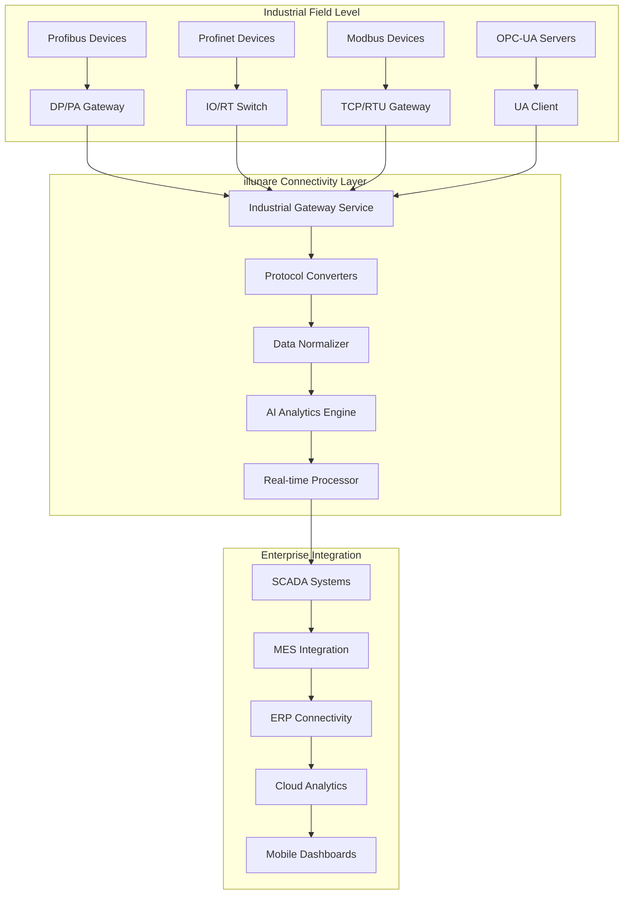

# 🏭 Profibus & Profinet Industrial Connectivity

<div class="industrial-hero">
  <h2>⚡ illunare 4.0 Industrial Connectivity Suite</h2>
  <p class="hero-subtitle">
    Advanced Profibus DP/PA and Profinet IO/RT connectivity for seamless industrial automation
    integration, featuring AI-powered diagnostics, predictive maintenance, and real-time monitoring
    across manufacturing environments worldwide.
  </p>
  <div class="industrial-badges">
    <span class="badge badge-profibus">Profibus DP/PA</span>
    <span class="badge badge-profinet">Profinet IO/RT</span>
    <span class="badge badge-modbus">Modbus TCP/RTU</span>
    <span class="badge badge-opc">OPC-UA</span>
  </div>
</div>

---

## 🎯 **Protocol Support Matrix**

| Protocol | Version | Baud Rate | Topology | Status | Use Cases |
|----------|---------|-----------|----------|--------|-----------|
| **Profibus DP** | V0/V1/V2 | 9.6 kbps - 12 Mbps | Bus/Line | 🟢 Active | Factory Automation |
| **Profibus PA** | V3.02 | 31.25 kbps | Bus/Tree/Star | 🟢 Active | Process Automation |
| **Profinet IO** | V2.4 | 10/100 Mbps | Switched Ethernet | 🟢 Active | Real-time Control |
| **Profinet RT** | V2.4 | 100 Mbps | Ethernet | 🟢 Active | Motion Control |
| **Modbus TCP** | V1.1b3 | 10/100 Mbps | Ethernet | 🟢 Active | SCADA Integration |
| **Modbus RTU** | V1.1b3 | 1.2 - 115.2 kbps | Serial RS-485 | 🟢 Active | Legacy Systems |
| **OPC-UA** | V1.04 | Variable | Ethernet | 🟢 Active | Industry 4.0 |

---

## 🔧 **Technical Architecture**

### **System Overview**



### **Rust-Powered Industrial Service**

```rust
// industrial-connectivity-service/src/main.rs
use actix_web::{web, App, HttpServer, Result};
use tokio_modbus::prelude::*;
use profibus_rs::{ProfibusMaster, ProfinetDevice};
use opcua::client::prelude::*;
use serde::{Deserialize, Serialize};
use std::collections::HashMap;
use tracing::{info, warn, error};

#[derive(Debug, Clone, Serialize, Deserialize)]
pub struct IndustrialDevice {
    pub device_id: String,
    pub device_type: DeviceType,
    pub protocol: Protocol,
    pub connection_config: ConnectionConfig,
    pub status: DeviceStatus,
    pub last_seen: chrono::DateTime<chrono::Utc>,
}

#[derive(Debug, Clone, Serialize, Deserialize)]
pub enum DeviceType {
    TemperatureSensor,
    PressureSensor,
    FlowMeter,
    Motor,
    Valve,
    PLC,
    HMI,
    SafetyRelay,
}

#[derive(Debug, Clone, Serialize, Deserialize)]
pub enum Protocol {
    ProfibusDp { station_address: u8, baud_rate: u32 },
    ProfibusPa { device_address: u16 },
    ProfinetIo { ip_address: String, device_name: String },
    ModbusTcp { ip_address: String, unit_id: u8 },
    ModbusRtu { port: String, slave_id: u8, baud_rate: u32 },
    OpcUa { endpoint_url: String, namespace: u16 },
}

pub struct IndustrialConnectivityService {
    profibus_master: Option<ProfibusMaster>,
    profinet_controller: Option<ProfinetController>,
    modbus_client: Option<ModbusClient>,
    opcua_client: Option<Client>,
    device_registry: HashMap<String, IndustrialDevice>,
    ai_analyzer: Option<AIAnalyzer>,
}

impl IndustrialConnectivityService {
    pub async fn new() -> Result<Self, Box<dyn std::error::Error>> {
        info!("🏭 Initializing illunare Industrial Connectivity Service");
        
        // Initialize Profibus master
        let profibus_master = ProfibusMaster::new("/dev/ttyUSB0", 500_000).await?;
        
        // Initialize Profinet controller
        let profinet_controller = ProfinetController::new("eth0").await?;
        
        // Initialize Modbus TCP client
        let modbus_client = tcp::connect("192.168.1.100:502").await?;
        
        // Initialize OPC-UA client
        let opcua_client = ClientBuilder::new()
            .application_name("illunare Industrial Gateway")
            .application_uri("urn:illunare:industrial:gateway")
            .create_sample_keypair(true)
            .trust_server_certs(true)
            .session_retry_limit(3)
            .client()?;
            
        Ok(IndustrialConnectivityService {
            profibus_master: Some(profibus_master),
            profinet_controller: Some(profinet_controller),
            modbus_client: Some(modbus_client),
            opcua_client: Some(opcua_client),
            device_registry: HashMap::new(),
            ai_analyzer: Some(AIAnalyzer::new().await?),
        })
    }
    
    pub async fn discover_profibus_devices(&mut self) -> Result<Vec<IndustrialDevice>, Box<dyn std::error::Error>> {
        info!("🔍 Scanning Profibus network for devices");
        
        let mut discovered_devices = Vec::new();
        
        if let Some(ref mut master) = self.profibus_master {
            // Scan station addresses 1-125
            for station_addr in 1..=125 {
                match master.diagnose_station(station_addr).await {
                    Ok(diagnosis) => {
                        let device = IndustrialDevice {
                            device_id: format!("PB_{:03}", station_addr),
                            device_type: determine_device_type(&diagnosis),
                            protocol: Protocol::ProfibusDp {
                                station_address: station_addr,
                                baud_rate: master.get_baud_rate(),
                            },
                            connection_config: ConnectionConfig::from_diagnosis(&diagnosis),
                            status: DeviceStatus::Online,
                            last_seen: chrono::Utc::now(),
                        };
                        
                        info!("✅ Found Profibus device: {} at station {}", device.device_id, station_addr);
                        discovered_devices.push(device);
                    }
                    Err(_) => {
                        // Station not responding, continue scanning
                        continue;
                    }
                }
            }
        }
        
        Ok(discovered_devices)
    }
    
    pub async fn discover_profinet_devices(&mut self) -> Result<Vec<IndustrialDevice>, Box<dyn std::error::Error>> {
        info!("🔍 Scanning Profinet network for devices");
        
        let mut discovered_devices = Vec::new();
        
        if let Some(ref mut controller) = self.profinet_controller {
            // Use DCP (Discovery and Configuration Protocol) to find devices
            let dcp_responses = controller.dcp_identify_all().await?;
            
            for response in dcp_responses {
                let device = IndustrialDevice {
                    device_id: response.device_name.clone(),
                    device_type: determine_profinet_device_type(&response),
                    protocol: Protocol::ProfinetIo {
                        ip_address: response.ip_address.to_string(),
                        device_name: response.device_name.clone(),
                    },
                    connection_config: ConnectionConfig::from_dcp_response(&response),
                    status: DeviceStatus::Online,
                    last_seen: chrono::Utc::now(),
                };
                
                info!("✅ Found Profinet device: {} at {}", device.device_id, response.ip_address);
                discovered_devices.push(device);
            }
        }
        
        Ok(discovered_devices)
    }
    
    pub async fn read_device_data(&mut self, device_id: &str) -> Result<DeviceData, Box<dyn std::error::Error>> {
        let device = self.device_registry.get(device_id)
            .ok_or_else(|| format!("Device {} not found", device_id))?;
            
        match &device.protocol {
            Protocol::ProfibusDp { station_address, .. } => {
                self.read_profibus_data(*station_address).await
            }
            Protocol::ProfinetIo { ip_address, device_name } => {
                self.read_profinet_data(ip_address, device_name).await
            }
            Protocol::ModbusTcp { ip_address, unit_id } => {
                self.read_modbus_tcp_data(ip_address, *unit_id).await
            }
            Protocol::OpcUa { endpoint_url, namespace } => {
                self.read_opcua_data(endpoint_url, *namespace).await
            }
            _ => Err("Protocol not supported".into()),
        }
    }
    
    async fn read_profibus_data(&mut self, station_address: u8) -> Result<DeviceData, Box<dyn std::error::Error>> {
        if let Some(ref mut master) = self.profibus_master {
            let input_data = master.read_inputs(station_address).await?;
            let output_data = master.read_outputs(station_address).await?;
            
            Ok(DeviceData {
                timestamp: chrono::Utc::now(),
                inputs: input_data,
                outputs: output_data,
                diagnostics: master.get_diagnostics(station_address).await?,
            })
        } else {
            Err("Profibus master not initialized".into())
        }
    }
    
    async fn read_profinet_data(&mut self, ip_address: &str, device_name: &str) -> Result<DeviceData, Box<dyn std::error::Error>> {
        if let Some(ref mut controller) = self.profinet_controller {
            let io_data = controller.read_io_data(ip_address, device_name).await?;
            
            Ok(DeviceData {
                timestamp: chrono::Utc::now(),
                inputs: io_data.inputs,
                outputs: io_data.outputs,
                diagnostics: io_data.diagnostics,
            })
        } else {
            Err("Profinet controller not initialized".into())
        }
    }
}

// HTTP API endpoints
pub async fn scan_network() -> Result<web::Json<NetworkScanResult>> {
    let mut service = get_industrial_service().await?;
    
    let profibus_devices = service.discover_profibus_devices().await?;
    let profinet_devices = service.discover_profinet_devices().await?;
    
    let scan_result = NetworkScanResult {
        profibus_devices,
        profinet_devices,
        scan_timestamp: chrono::Utc::now(),
        total_devices: profibus_devices.len() + profinet_devices.len(),
    };
    
    Ok(web::Json(scan_result))
}

pub async fn read_sensor_data(path: web::Path<String>) -> Result<web::Json<DeviceData>> {
    let device_id = path.into_inner();
    let mut service = get_industrial_service().await?;
    
    let data = service.read_device_data(&device_id).await?;
    Ok(web::Json(data))
}
```

---

## 📊 **AI-Powered Diagnostics**

### **Predictive Maintenance Engine**

```python
# ai-powered-diagnostics/predictive_maintenance.py
import numpy as np
import pandas as pd
from sklearn.ensemble import IsolationForest
from sklearn.preprocessing import StandardScaler
import asyncio
import aioredis
from typing import Dict, List, Optional
from dataclasses import dataclass
from datetime import datetime, timedelta

@dataclass
class DeviceHealth:
    device_id: str
    health_score: float  # 0.0 to 1.0
    anomaly_score: float
    predicted_failure_time: Optional[datetime]
    recommendations: List[str]
    maintenance_priority: str  # low, medium, high, critical

class PredictiveMaintenanceEngine:
    def __init__(self):
        self.redis_client = None
        self.anomaly_detector = IsolationForest(contamination=0.1, random_state=42)
        self.scaler = StandardScaler()
        self.device_models = {}
        
    async def initialize(self):
        """Initialize Redis connection and load pre-trained models"""
        self.redis_client = await aioredis.from_url("redis://localhost:6379")
        await self.load_device_models()
        
    async def analyze_device_health(self, device_id: str, sensor_data: Dict) -> DeviceHealth:
        """Comprehensive device health analysis using AI"""
        
        # Get historical data for trend analysis
        historical_data = await self.get_historical_data(device_id, days=30)
        
        if len(historical_data) < 100:  # Not enough data for reliable analysis
            return DeviceHealth(
                device_id=device_id,
                health_score=0.8,  # Default healthy score
                anomaly_score=0.0,
                predicted_failure_time=None,
                recommendations=["Collect more data for accurate analysis"],
                maintenance_priority="low"
            )
        
        # Feature engineering
        features = self.extract_features(sensor_data, historical_data)
        
        # Anomaly detection
        anomaly_score = self.detect_anomalies(features)
        
        # Health score calculation
        health_score = self.calculate_health_score(features, anomaly_score)
        
        # Failure prediction
        predicted_failure = self.predict_failure_time(device_id, features, historical_data)
        
        # Generate recommendations
        recommendations = self.generate_recommendations(device_id, features, anomaly_score, health_score)
        
        # Determine maintenance priority
        priority = self.determine_maintenance_priority(health_score, anomaly_score, predicted_failure)
        
        device_health = DeviceHealth(
            device_id=device_id,
            health_score=health_score,
            anomaly_score=anomaly_score,
            predicted_failure_time=predicted_failure,
            recommendations=recommendations,
            maintenance_priority=priority
        )
        
        # Store analysis results
        await self.store_health_analysis(device_health)
        
        return device_health
    
    def extract_features(self, current_data: Dict, historical_data: List[Dict]) -> np.ndarray:
        """Extract engineered features for ML analysis"""
        
        features = []
        
        # Current sensor readings
        features.extend([
            current_data.get('temperature', 0),
            current_data.get('pressure', 0),
            current_data.get('vibration', 0),
            current_data.get('current', 0),
            current_data.get('voltage', 0),
        ])
        
        # Statistical features from historical data
        if historical_data:
            df = pd.DataFrame(historical_data)
            
            # Temperature analysis
            if 'temperature' in df.columns:
                temp_stats = df['temperature'].describe()
                features.extend([
                    temp_stats['mean'],
                    temp_stats['std'],
                    temp_stats['max'] - temp_stats['min'],  # Range
                    current_data.get('temperature', 0) - temp_stats['mean'],  # Deviation from mean
                ])
            
            # Vibration analysis (critical for rotating machinery)
            if 'vibration' in df.columns:
                vib_stats = df['vibration'].describe()
                features.extend([
                    vib_stats['mean'],
                    vib_stats['std'],
                    vib_stats['75%'] - vib_stats['25%'],  # IQR
                ])
            
            # Trend analysis
            features.extend(self.calculate_trends(df))
        
        return np.array(features).reshape(1, -1)
    
    def calculate_trends(self, df: pd.DataFrame) -> List[float]:
        """Calculate trend indicators"""
        trends = []
        
        for column in ['temperature', 'pressure', 'vibration']:
            if column in df.columns:
                # Linear trend slope
                x = np.arange(len(df))
                y = df[column].values
                slope = np.polyfit(x, y, 1)[0] if len(y) > 1 else 0
                trends.append(slope)
        
        return trends
    
    def detect_anomalies(self, features: np.ndarray) -> float:
        """Detect anomalies in sensor data"""
        
        # Normalize features
        features_scaled = self.scaler.fit_transform(features)
        
        # Anomaly detection
        anomaly_score = self.anomaly_detector.decision_function(features_scaled)[0]
        
        # Convert to 0-1 scale (higher = more anomalous)
        normalized_score = max(0, min(1, (anomaly_score + 0.5) * 2))
        
        return normalized_score
    
    def predict_failure_time(self, device_id: str, features: np.ndarray, historical_data: List[Dict]) -> Optional[datetime]:
        """Predict when device might fail based on current trends"""
        
        if device_id in self.device_models:
            model = self.device_models[device_id]
            
            # Use time series forecasting to predict failure
            failure_probability = model.predict_failure_probability(features)
            
            if failure_probability > 0.7:  # High probability threshold
                # Estimate time to failure based on degradation rate
                degradation_rate = self.calculate_degradation_rate(historical_data)
                days_to_failure = self.estimate_time_to_failure(degradation_rate)
                
                return datetime.now() + timedelta(days=days_to_failure)
        
        return None
    
    def generate_recommendations(self, device_id: str, features: np.ndarray, anomaly_score: float, health_score: float) -> List[str]:
        """Generate actionable maintenance recommendations"""
        
        recommendations = []
        
        if health_score < 0.3:
            recommendations.append("🚨 Immediate inspection required - Critical health status")
            recommendations.append("📞 Contact maintenance team immediately")
        elif health_score < 0.6:
            recommendations.append("⚠️ Schedule maintenance within 48 hours")
            recommendations.append("🔍 Perform detailed diagnostics")
        
        if anomaly_score > 0.7:
            recommendations.append("📊 Unusual sensor readings detected")
            recommendations.append("🔧 Check sensor calibration and connections")
        
        # Device-specific recommendations based on type
        device_type = self.get_device_type(device_id)
        
        if device_type == "motor":
            if features[0][2] > 0.8:  # High vibration
                recommendations.append("⚡ Check motor alignment and bearing condition")
            if features[0][3] > 1.2:  # High current
                recommendations.append("🔌 Inspect electrical connections and load conditions")
                
        elif device_type == "valve":
            if features[0][1] < 0.3:  # Low pressure
                recommendations.append("💧 Check for leaks or blockages")
                
        return recommendations
```

---

## 🔌 **Arduino & Raspberry Pi Integration**

### **Arduino Library for illunare IoT**

```cpp
// IllunareIoT.h - Arduino Library
#ifndef ILLUNARE_IOT_H
#define ILLUNARE_IOT_H

#include <WiFi.h>
#include <WebSocketsClient.h>
#include <ArduinoJson.h>
#include <PubSubClient.h>

class IllunareIoT {
private:
    String deviceToken;
    String serverUrl;
    WebSocketsClient webSocket;
    WiFiClient wifiClient;
    PubSubClient mqttClient;
    
    // Callback functions
    void (*onCommandReceived)(JsonDocument& command);
    void (*onConfigUpdate)(JsonDocument& config);
    
    // Internal state
    bool connected;
    unsigned long lastHeartbeat;
    unsigned long heartbeatInterval;
    
public:
    IllunareIoT(String token, String server = "ws://gateway.illunare.com:8080");
    
    // Initialization
    void begin();
    void enableOTA();
    void setHeartbeatInterval(unsigned long interval);
    
    // Connection management
    bool connect();
    void disconnect();
    bool isConnected();
    void loop();
    
    // Data transmission
    void sendTelemetry(JsonDocument& data);
    void sendAlert(String message, String severity = "info");
    void sendDiagnostics();
    
    // Command handling
    void onCommand(String command, void (*callback)(JsonDocument& params));
    void onConfig(void (*callback)(JsonDocument& config));
    void sendResponse(JsonDocument& response);
    
    // Industrial protocol support
    void enableModbus(int rxPin, int txPin, long baudRate = 9600);
    void enableProfibus(int rxPin, int txPin);
    bool readModbusRegister(uint8_t slaveId, uint16_t address, uint16_t* value);
    bool writeModbusRegister(uint8_t slaveId, uint16_t address, uint16_t value);
    
    // Sensor management
    void registerSensor(String sensorId, String sensorType);
    void updateSensorValue(String sensorId, float value, String unit = "");
    
    // Safety features
    void setWatchdog(unsigned long timeout);
    void feedWatchdog();
    void emergencyStop();
};

// IllunareIoT.cpp - Implementation
IllunareIoT::IllunareIoT(String token, String server) {
    deviceToken = token;
    serverUrl = server;
    connected = false;
    lastHeartbeat = 0;
    heartbeatInterval = 30000; // 30 seconds default
    
    mqttClient.setClient(wifiClient);
}

void IllunareIoT::begin() {
    Serial.println("🚀 Initializing illunare IoT Device");
    
    // Initialize WiFi connection
    if (WiFi.status() != WL_CONNECTED) {
        Serial.println("❌ WiFi not connected. Please connect to WiFi first.");
        return;
    }
    
    // Setup WebSocket connection
    webSocket.begin("gateway.illunare.com", 8080, "/ws/device");
    webSocket.onEvent([this](WStype_t type, uint8_t* payload, size_t length) {
        this->onWebSocketEvent(type, payload, length);
    });
    
    // Setup MQTT for reliable messaging
    mqttClient.setServer("mqtt.illunare.com", 1883);
    mqttClient.setCallback([this](char* topic, byte* payload, unsigned int length) {
        this->onMqttMessage(topic, payload, length);
    });
    
    Serial.println("✅ illunare IoT initialized successfully");
}

void IllunareIoT::sendTelemetry(JsonDocument& data) {
    if (!connected) {
        Serial.println("⚠️ Not connected to illunare platform");
        return;
    }
    
    // Add device metadata
    data["device_token"] = deviceToken;
    data["timestamp"] = millis();
    data["free_heap"] = ESP.getFreeHeap();
    data["uptime"] = millis();
    
    // Send via WebSocket for real-time data
    String jsonString;
    serializeJson(data, jsonString);
    webSocket.sendTXT(jsonString);
    
    // Also send via MQTT for reliability
    String topic = "telemetry/" + deviceToken;
    mqttClient.publish(topic.c_str(), jsonString.c_str());
    
    Serial.println("📡 Telemetry sent: " + jsonString);
}

void IllunareIoT::loop() {
    webSocket.loop();
    mqttClient.loop();
    
    // Send heartbeat
    if (millis() - lastHeartbeat > heartbeatInterval) {
        sendHeartbeat();
        lastHeartbeat = millis();
    }
    
    // Handle watchdog
    if (watchdogEnabled && millis() - lastWatchdogFeed > watchdogTimeout) {
        Serial.println("🚨 Watchdog timeout - restarting device");
        ESP.restart();
    }
}

// Example usage sketch
void setup() {
    Serial.begin(115200);
    
    // Connect to WiFi
    WiFi.begin("YourWiFi", "YourPassword");
    while (WiFi.status() != WL_CONNECTED) {
        delay(1000);
        Serial.println("Connecting to WiFi...");
    }
    
    // Initialize illunare IoT
    IllunareIoT illunare("your_device_token_here");
    illunare.begin();
    illunare.enableOTA();
    
    // Register sensors
    illunare.registerSensor("temp_01", "temperature");
    illunare.registerSensor("humid_01", "humidity");
    illunare.registerSensor("pressure_01", "pressure");
    
    // Setup command handlers
    illunare.onCommand("read_sensor", handleSensorRead);
    illunare.onCommand("calibrate", handleCalibration);
    illunare.onCommand("reset", handleReset);
    
    Serial.println("🎯 Device ready for operation");
}

void loop() {
    illunare.loop();
    
    // Read sensors every 5 seconds
    static unsigned long lastSensorRead = 0;
    if (millis() - lastSensorRead > 5000) {
        readAndSendSensorData();
        lastSensorRead = millis();
    }
}

void readAndSendSensorData() {
    JsonDocument sensorData;
    
    // Read temperature sensor (example using DHT22)
    float temperature = dht.readTemperature();
    float humidity = dht.readHumidity();
    
    // Read pressure sensor (example using BMP280)
    float pressure = bmp.readPressure() / 100.0F; // Convert to hPa
    
    // Read industrial 4-20mA sensors
    float analogValue = analogRead(A0);
    float industrialSensor = map(analogValue, 0, 1023, 4.0, 20.0); // Convert to mA
    
    // Populate sensor data
    sensorData["sensors"]["temperature"] = temperature;
    sensorData["sensors"]["humidity"] = humidity;
    sensorData["sensors"]["pressure"] = pressure;
    sensorData["sensors"]["industrial_01"] = industrialSensor;
    
    // Add location and device info
    sensorData["location"]["latitude"] = GPS_LATITUDE;
    sensorData["location"]["longitude"] = GPS_LONGITUDE;
    sensorData["device_info"]["signal_strength"] = WiFi.RSSI();
    sensorData["device_info"]["battery_level"] = readBatteryLevel();
    
    illunare.sendTelemetry(sensorData);
}
```

---

## 📱 **Mobile Dashboard Integration**

### **Real-Time Industrial Monitoring App**

```dart
// lib/screens/industrial_dashboard.dart
import 'package:flutter/material.dart';
import 'package:web_socket_channel/web_socket_channel.dart';
import 'package:charts_flutter/flutter.dart' as charts;
import '../models/industrial_device.dart';
import '../services/industrial_service.dart';

class IndustrialDashboard extends StatefulWidget {
  @override
  _IndustrialDashboardState createState() => _IndustrialDashboardState();
}

class _IndustrialDashboardState extends State<IndustrialDashboard> {
  late WebSocketChannel channel;
  List<IndustrialDevice> devices = [];
  Map<String, List<SensorReading>> realtimeData = {};
  
  @override
  void initState() {
    super.initState();
    initializeWebSocket();
    loadDevices();
  }
  
  void initializeWebSocket() {
    channel = WebSocketChannel.connect(
      Uri.parse('wss://industrial.illunare.com/ws/realtime'),
    );
    
    channel.stream.listen((data) {
      final parsedData = json.decode(data);
      if (parsedData['type'] == 'sensor_data') {
        updateRealtimeData(parsedData);
      } else if (parsedData['type'] == 'device_status') {
        updateDeviceStatus(parsedData);
      }
    });
  }
  
  @override
  Widget build(BuildContext context) {
    return Scaffold(
      appBar: AppBar(
        title: Text('🏭 Industrial Dashboard'),
        backgroundColor: Colors.indigo,
        actions: [
          IconButton(
            icon: Icon(Icons.refresh),
            onPressed: () => loadDevices(),
          ),
          IconButton(
            icon: Icon(Icons.settings),
            onPressed: () => showSettingsDialog(),
          ),
        ],
      ),
      body: Column(
        children: [
          _buildStatusOverview(),
          _buildDeviceGrid(),
          _buildRealtimeCharts(),
        ],
      ),
      floatingActionButton: FloatingActionButton(
        onPressed: () => scanForDevices(),
        child: Icon(Icons.search),
        tooltip: 'Scan for devices',
      ),
    );
  }
  
  Widget _buildStatusOverview() {
    final onlineDevices = devices.where((d) => d.status == DeviceStatus.online).length;
    final totalDevices = devices.length;
    
    return Container(
      padding: EdgeInsets.all(16),
      child: Row(
        mainAxisAlignment: MainAxisAlignment.spaceEvenly,
        children: [
          _buildStatusCard('Online Devices', '$onlineDevices/$totalDevices', Colors.green),
          _buildStatusCard('Alerts', '3', Colors.orange),
          _buildStatusCard('Critical', '1', Colors.red),
        ],
      ),
    );
  }
  
  Widget _buildStatusCard(String title, String value, Color color) {
    return Card(
      child: Container(
        padding: EdgeInsets.all(16),
        width: 100,
        child: Column(
          children: [
            Text(title, style: TextStyle(fontSize: 12)),
            SizedBox(height: 8),
            Text(value, style: TextStyle(fontSize: 24, color: color, fontWeight: FontWeight.bold)),
          ],
        ),
      ),
    );
  }
  
  Widget _buildDeviceGrid() {
    return Expanded(
      child: GridView.builder(
        padding: EdgeInsets.all(16),
        gridDelegate: SliverGridDelegateWithFixedCrossAxisCount(
          crossAxisCount: 2,
          crossAxisSpacing: 16,
          mainAxisSpacing: 16,
          childAspectRatio: 1.2,
        ),
        itemCount: devices.length,
        itemBuilder: (context, index) {
          final device = devices[index];
          return _buildDeviceCard(device);
        },
      ),
    );
  }
  
  Widget _buildDeviceCard(IndustrialDevice device) {
    final statusColor = _getStatusColor(device.status);
    
    return Card(
      elevation: 4,
      child: InkWell(
        onTap: () => _showDeviceDetails(device),
        child: Padding(
          padding: EdgeInsets.all(12),
          child: Column(
            crossAxisAlignment: CrossAxisAlignment.start,
            children: [
              Row(
                children: [
                  Icon(_getDeviceIcon(device.deviceType), size: 20),
                  SizedBox(width: 8),
                  Expanded(
                    child: Text(
                      device.deviceId,
                      style: TextStyle(fontWeight: FontWeight.bold),
                      overflow: TextOverflow.ellipsis,
                    ),
                  ),
                  Container(
                    width: 12,
                    height: 12,
                    decoration: BoxDecoration(
                      color: statusColor,
                      shape: BoxShape.circle,
                    ),
                  ),
                ],
              ),
              SizedBox(height: 8),
              Text(
                device.deviceType.toString().split('.').last,
                style: TextStyle(color: Colors.grey[600], fontSize: 12),
              ),
              SizedBox(height: 4),
              Text(
                _getProtocolName(device.protocol),
                style: TextStyle(color: Colors.grey[600], fontSize: 12),
              ),
              Spacer(),
              if (device.lastReading != null) ...[
                Text(
                  'Last: ${_formatValue(device.lastReading!.value)} ${device.lastReading!.unit}',
                  style: TextStyle(fontSize: 14, fontWeight: FontWeight.w500),
                ),
                Text(
                  _formatDateTime(device.lastReading!.timestamp),
                  style: TextStyle(fontSize: 10, color: Colors.grey),
                ),
              ],
            ],
          ),
        ),
      ),
    );
  }
}
```

---

<div class="industrial-cta">
  <h3>🏭 Ready to Connect Your Industrial Systems?</h3>
  <p>Seamlessly integrate Profibus, Profinet, and IoT devices with AI-powered diagnostics</p>
  <div class="cta-buttons">
    <a href="/guides/industrial-setup/" class="btn btn-primary">🚀 Setup Guide</a>
    <a href="/api/industrial/" class="btn btn-secondary">📖 API Reference</a>
    <a href="mailto:industrial@illunare.com" class="btn btn-outline">💬 Expert Support</a>
  </div>
</div> 