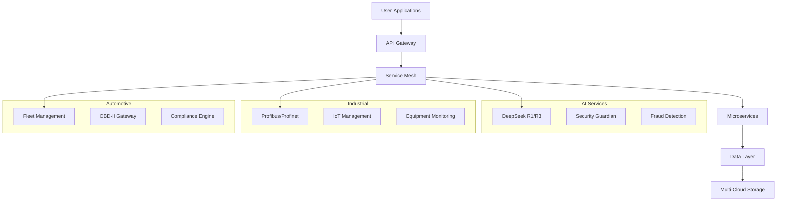
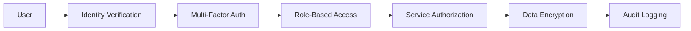

# 📋 illunare 4.0 Enterprise Platform Overview

<div class="platform-hero">
  <h2>🌟 Next-Generation Enterprise Technology Platform</h2>
  <p class="hero-subtitle">
    Revolutionizing enterprise operations with AI-powered automation, 
    industrial connectivity, automotive integration, and zero-downtime deployments.
  </p>
</div>

---

## 🚀 Platform Capabilities

### 🤖 **AI & Machine Learning**
Transform your business with cutting-edge artificial intelligence:

- **DeepSeek R1/R3 Integration** - Advanced reasoning and code generation
- **Security Guardian** - Real-time threat detection and response
- **Fraud Detection Engine** - Machine learning-powered fraud prevention
- **Predictive Analytics** - Data-driven decision making
- **Natural Language Processing** - Multi-language support (English/Portuguese)

### 🏭 **Industrial Connectivity**
Connect and monitor industrial equipment seamlessly:

- **Profibus/Profinet** - Industrial protocol integration
- **Arduino/Raspberry Pi** - IoT device management
- **OPC-UA Communication** - Standardized industrial data exchange
- **Real-time Monitoring** - Live equipment status and diagnostics
- **Predictive Maintenance** - AI-powered equipment failure prediction

### 🚗 **Automotive Platform**
Comprehensive fleet and vehicle management:

- **Fleet Management** - Multi-vehicle tracking and optimization
- **OBD-II Integration** - Real-time vehicle diagnostics
- **Brazilian Compliance** - INMETRO and CONTRAN standards
- **Telematics** - Advanced vehicle data analytics
- **Emission Monitoring** - Environmental compliance tracking

### 🔥 **Hot Reloading & DevOps**
Zero-downtime operations and deployment:

- **Elixir Hot Swapping** - Live code updates without restarts
- **Container Orchestration** - Kubernetes-native deployment
- **CI/CD Pipelines** - Automated testing and deployment
- **Blue-Green Deployment** - Zero-downtime production updates
- **Rollback Strategies** - Instant recovery from failed deployments

### 🇧🇷 **Brazilian & LATAM Compliance**
Complete regulatory compliance for Latin America:

- **LGPD Implementation** - Brazilian data protection compliance
- **FenSeg Integration** - Insurance industry standards
- **E-Social Bridge** - Brazilian employment compliance
- **Tax Calculation** - Multi-region tax processing
- **LATAM Regulations** - Region-specific compliance frameworks

---

## 🏗️ **Technical Architecture**

### **Multi-Cloud Infrastructure**


### **Technology Stack**

=== "🔧 Backend Services"
    - **Go 1.22** - High-performance microservices
    - **Rust 1.80** - System-level components
    - **Elixir 1.18** - Real-time hot reloading
    - **Python 3.11** - AI/ML services
    - **Node.js 20** - API gateways

=== "🎨 Frontend Applications"
    - **React 18** - Admin portal and dashboards
    - **Flutter 3.2** - Mobile applications
    - **Hugo** - Static documentation sites
    - **TypeScript** - Type-safe development
    - **TailwindCSS** - Modern UI styling

=== "☁️ Infrastructure"
    - **Google Cloud Platform** - Primary cloud provider
    - **Kubernetes** - Container orchestration
    - **Terraform** - Infrastructure as code
    - **PostgreSQL** - Primary database
    - **Redis** - Caching and sessions

---

## 🌍 **Global Deployment**

### **Regional Presence**

| Region | Services | Compliance | Status |
|--------|----------|------------|---------|
| 🇧🇷 **Brazil** | Full Platform | LGPD, E-Social, FenSeg | ✅ Active |
| 🇦🇷 **Argentina** | Payment Gateway | Local Banking | ✅ Active |
| 🇲🇽 **Mexico** | Payment Gateway | CNBV Compliance | ✅ Active |
| 🇺🇸 **United States** | Core Services | SOC2, HIPAA | ✅ Active |
| 🇪🇺 **Europe** | GDPR Services | GDPR Compliance | 🚧 Rolling Out |

### **Performance Metrics**

!!! success "**Enterprise SLA Guarantees**"
    - 🚀 **99.99% Uptime** - Mission-critical availability
    - ⚡ **<50ms Response Time** - Ultra-fast API responses
    - 🔄 **Zero-Downtime Deployments** - Seamless updates
    - 🛡️ **24/7 Security Monitoring** - Continuous protection
    - 📈 **Auto-Scaling** - Dynamic resource allocation

---

## 🔐 **Security & Compliance**

### **Zero-Trust Architecture**


### **Compliance Frameworks**

=== "🇧🇷 Brazilian"
    - **LGPD** - Lei Geral de Proteção de Dados
    - **E-Social** - Employment compliance
    - **FenSeg** - Insurance regulations
    - **INMETRO** - Vehicle certification
    - **CONTRAN** - Traffic regulations

=== "🌎 International"
    - **GDPR** - European data protection
    - **SOC2 Type II** - Security compliance
    - **HIPAA** - Healthcare data protection
    - **PCI DSS** - Payment card security
    - **ISO 27001** - Information security

---

## 📊 **Business Impact**

### **Cost Reduction**
- **40% Infrastructure Savings** - Multi-cloud optimization
- **60% Deployment Time Reduction** - Automated CI/CD
- **30% Operational Costs** - AI-powered automation
- **50% Compliance Overhead** - Automated reporting

### **Revenue Enhancement**
- **25% Faster Time-to-Market** - Rapid development cycles
- **35% Improved Customer Satisfaction** - Better user experience
- **20% Increased Operational Efficiency** - Streamlined processes
- **45% Reduced Downtime** - Reliable infrastructure

### **Risk Mitigation**
- **Zero Data Breaches** - Advanced security measures
- **100% Compliance Coverage** - Automated compliance monitoring
- **99.9% Disaster Recovery** - Robust backup systems
- **Real-time Threat Detection** - AI-powered security

---

## 🚀 **Getting Started**

### **Quick Setup (5 Minutes)**

1. **Clone Repository**
   ```bash
   git clone https://github.com/illunare-40/illunare.git
   cd illunare
   ```

2. **Environment Setup**
   ```bash
   cp .env.example .env
   docker-compose up -d
   ```

3. **Access Platform**
   ```bash
   open http://localhost:3000  # Admin Portal
   open http://localhost:8080  # API Gateway
   ```

### **Enterprise Setup**

!!! tip "🏢 **Enterprise Installation**"
    For production deployment with enterprise features:
    
    - 📞 **Contact Sales**: [enterprise@illunare.com](mailto:enterprise@illunare.com)
    - 📚 **Enterprise Guide**: [Deploy Guide](guides/deployment-guide/)
    - 🔧 **Professional Support**: 24/7 technical assistance
    - 🎯 **Custom Training**: Team onboarding programs

---

## 📞 **Support & Resources**

### **Community**
- 💬 **Discord Community** - [discord.gg/illunare](https://discord.gg/illunare)
- 📚 **Documentation** - [docs.illunare.com](https://docs.illunare.com)
- 🐛 **GitHub Issues** - [github.com/illunare-40/illunare](https://github.com/illunare-40/illunare)

### **Enterprise Support**
- 📧 **Email Support** - [fale-conosco@illunare.com.br](mailto:fale-conosco@illunare.com.br)
- 📞 **Phone Support** - +55 11 9999-8888 (Brazil)
- 🎯 **Dedicated CSM** - Customer Success Manager
- 🔧 **Professional Services** - Implementation assistance

---

<div class="call-to-action">
  <h3>🌟 Ready to Transform Your Business?</h3>
  <p>Experience the power of illunare 4.0 Enterprise Platform today!</p>
  <div class="cta-buttons">
    <a href="/quick-start/" class="btn btn-primary">🚀 Get Started</a>
    <a href="mailto:enterprise@illunare.com" class="btn btn-secondary">💼 Contact Sales</a>
    <a href="/guides/demo/" class="btn btn-outline">🎯 Schedule Demo</a>
  </div>
</div> 