# 🗂️ Repository Management & Organization System

<div class="repo-hero">
  <h2>🚀 illunare 4.0 Repository Ecosystem</h2>
  <p class="hero-subtitle">
    Comprehensive management of 90+ microservices repositories with automated organization,
    privacy controls, webhook notifications, and AI-powered code analysis.
  </p>
  <div class="repo-badges">
    <span class="badge badge-repositories">90+ Repos</span>
    <span class="badge badge-private">Private by Default</span>
    <span class="badge badge-ai">AI-Powered</span>
    <span class="badge badge-webhooks">Real-time Webhooks</span>
  </div>
</div>

---

## 🎯 **Repository Overview & Statistics**

### **Real-Time Repository Metrics**


---

## 📊 **Repository Catalog**

### **🔒 Private Repositories (IP Protected)**

=== "🤖 AI & Machine Learning Services"
    | Repository | Language | Status | Description | Team |
    |-----------|----------|--------|-------------|------|
    | **deepseek-ollama-service** | Python | 🟢 Active | DeepSeek R1/R3 Integration | AI Team |
    | **ai-security-guardian-service** | Python | 🟢 Active | Adaptive Threat Detection | Security Team |
    | **cortex-ai-service** | Python | 🟢 Active | Neural Network Engine | AI Team |
    | **fraud-service** | Python/Go | 🟢 Active | Fraud Detection & Prevention | Security Team |
    | **ai-pipelines** | Python | 🟢 Active | ML Pipeline Orchestration | AI Team |
    | **ml-infrastructure-service** | Go | 🟢 Active | ML Model Deployment | Platform Team |
    | **performance-optimization-service** | Rust | 🟢 Active | AI Performance Tuning | Performance Team |
    | **biometric-verification-service** | Python | 🟡 Beta | Biometric Authentication | Security Team |
    | **continuous-health-analysis-service** | Python | 🟢 Active | Health Monitoring AI | Healthcare Team |
    | **quantum-compression-service** | Rust | 🔵 Research | Quantum Data Compression | Research Team |
    | **risk-assessment-service** | Python | 🟢 Active | Risk Analysis AI | Risk Team |
    | **feature-store** | Python/Go | 🟢 Active | ML Feature Management | AI Team |

=== "🏭 Industrial Connectivity Services"
    | Repository | Language | Status | Description | Team |
    |-----------|----------|--------|-------------|------|
    | **industrial-connectivity-service** | Rust | 🟢 Active | Profibus/Profinet Integration | Industrial Team |
    | **iot-service** | Go | 🟢 Active | IoT Device Management | IoT Team |
    | **geogis-service** | Python | 🟢 Active | Geographic Information Systems | GIS Team |
    | **telemetry-ingest-service** | Rust | 🟢 Active | High-Speed Data Ingestion | Platform Team |
    | **edge-service** | Go | 🟢 Active | Edge Computing Gateway | Edge Team |
    | **arduino-integration-sdk** | C++ | 🟢 Active | Arduino Library & SDK | Embedded Team |
    | **raspberry-pi-connectors** | Python | 🟢 Active | Raspberry Pi Integration | Embedded Team |
    | **sensor-calibration-service** | Rust | 🟢 Active | Automated Sensor Calibration | Industrial Team |
    | **predictive-maintenance-ai** | Python | 🟢 Active | Equipment Maintenance AI | Industrial Team |
    | **industrial-dashboard** | React/TS | 🟢 Active | Real-time Industrial UI | Frontend Team |
    | **modbus-tcp-connector** | Rust | 🟢 Active | Modbus TCP Communication | Industrial Team |
    | **opcua-integration-service** | C#/Go | 🟢 Active | OPC-UA Server/Client | Industrial Team |
    | **scada-bridge-service** | Python | 🟢 Active | SCADA System Integration | Industrial Team |
    | **plc-programming-toolkit** | Ladder Logic | 🟢 Active | PLC Programming Tools | Automation Team |
    | **safety-system-monitor** | Rust | 🟢 Active | Industrial Safety Monitoring | Safety Team |

=== "🚗 Automotive Platform Services"
    | Repository | Language | Status | Description | Team |
    |-----------|----------|--------|-------------|------|
    | **automotive-integration-service** | Go | 🟢 Active | Vehicle System Integration | Automotive Team |
    | **vehicle-compliance-service** | Python | 🟢 Active | Brazilian Compliance (DENATRAN) | Compliance Team |
    | **transportation-service** | Go | 🟢 Active | Fleet Management Core | Transportation Team |
    | **transportation-management-service** | Python | 🟢 Active | Route Optimization | Logistics Team |
    | **obd2-diagnostic-service** | C++/Rust | 🟢 Active | OBD-II Protocol Handler | Automotive Team |
    | **telematics-data-processor** | Go | 🟢 Active | Vehicle Telematics | Automotive Team |
    | **fleet-analytics-engine** | Python | 🟢 Active | Fleet Performance Analytics | Analytics Team |
    | **vehicle-security-guardian** | Rust | 🟢 Active | Automotive Cybersecurity | Security Team |

### **🌐 Public Repositories (Non-IP Sensitive)**

=== "📚 Documentation & Guides"
    | Repository | Language | Status | Description | Purpose |
    |-----------|----------|--------|-------------|---------|
    | **illunare-docs-public** | Markdown | 🟢 Active | Public Documentation | Community Access |
    | **getting-started-guides** | Markdown | 🟢 Active | Quick Start Tutorials | Developer Onboarding |
    | **api-examples-public** | Multi | 🟢 Active | Public API Examples | Integration Examples |
    | **community-templates** | Various | 🟢 Active | Community Code Templates | Developer Resources |
    | **open-source-connectors** | Various | 🟢 Active | Open Source Integrations | Community Contribution |

---

## 🔐 **Privacy & Access Control**

### **Repository Privacy Matrix**

```mermaid
graph TB
    subgraph "Access Control Layers"
        A[Repository Owner] --> B[Enterprise Team Access]
        B --> C[Service Team Access]
        C --> D[Read-Only Access]
        D --> E[Public Access]
    end
    
    subgraph "Privacy Classifications"
        F[🔴 Critical IP - Restricted]
        G[🟡 Sensitive - Team Only]
        H[🟢 Internal - Enterprise]
        I[🔵 Public - Community]
    end
    
    subgraph "Automated Controls"
        J[AI Code Analysis]
        K[Secret Detection]
        L[License Compliance]
        M[Dependency Scanning]
    end
    
    A --> F
    B --> G
    C --> H
    D --> I
    
    F --> J
    G --> K
    H --> L
    I --> M
```



### **Privacy Protection Rules**

!!! security "Critical IP Protection (🔴)"
    **Repositories containing core business logic, AI models, and proprietary algorithms**
    
    - **Access**: Owner + Core Team only
    - **Examples**: `deepseek-ollama-service`, `fraud-service`, `ai-security-guardian-service`
    - **Protections**: 
        - Mandatory code review from 2+ senior engineers
        - Automated secret scanning
        - IP classification scanning
        - Restricted branch protection
        - Audit logging for all access

!!! warning "Sensitive Code (🟡)"
    **Service-specific implementations and business logic**
    
    - **Access**: Service team + Platform team
    - **Examples**: `automotive-integration-service`, `compliance-framework-latam`
    - **Protections**:
        - Team-based access control
        - Automated dependency scanning
        - License compliance checking
        - Regular security audits

!!! info "Internal Enterprise (🟢)"
    **Infrastructure, tools, and general implementations**
    
    - **Access**: All illunare enterprise developers
    - **Examples**: `k8s-manifests`, `cicd-templates`, `observability`
    - **Protections**:
        - Standard code review process
        - Automated testing requirements
        - Documentation standards
        - Performance monitoring

!!! success "Public Community (🔵)"
    **Non-sensitive examples, documentation, and community resources**
    
    - **Access**: Public with controlled contributions
    - **Examples**: `getting-started-guides`, `api-examples-public`
    - **Protections**:
        - Community contribution guidelines
        - Automated code scanning
        - Legal review for contributions
        - Brand consistency checks

---

## 🔗 **Webhook Integration System**

### **Real-Time Repository Notifications**

```javascript
// Advanced Webhook Management System
class IllunareWebhookManager {
  constructor(config) {
    this.apiKey = config.apiKey;
    this.baseUrl = 'https://api.illunare.com/v1/webhooks';
    this.deepseekAI = new DeepSeekR3Client();
    this.notificationChannels = config.channels;
  }

  async setupRepositoryWebhooks() {
    // AI-powered code analysis webhooks
    await this.registerWebhook({
      event_types: [
        'repository.push',
        'repository.pull_request',
        'repository.security_alert',
        'repository.dependency_update'
      ],
      endpoint_url: 'https://webhooks.illunare.com/ai-analysis',
      ai_enhancement: {
        deepseek_analysis: true,
        code_quality_check: true,
        security_scan: true,
        performance_analysis: true
      }
    });

    // Hot reloading triggers
    await this.registerWebhook({
      event_types: ['repository.release'],
      endpoint_url: 'https://webhooks.illunare.com/hot-reload',
      filters: {
        branches: ['main', 'production'],
        services: ['elixir-services']
      },
      actions: {
        trigger_hot_reload: true,
        notify_teams: true,
        update_documentation: true
      }
    });

    // Compliance monitoring
    await this.registerWebhook({
      event_types: [
        'repository.license_change',
        'repository.dependency_vulnerability',
        'repository.access_change'
      ],
      endpoint_url: 'https://webhooks.illunare.com/compliance',
      compliance_checks: {
        lgpd_scan: true,
        ip_classification: true,
        export_control: true
      }
    });
  }

  async handleRepositoryEvent(event) {
    const eventType = event.type;
    const repository = event.repository;
    
    switch (eventType) {
      case 'repository.push':
        await this.handleCodePush(event);
        break;
      case 'repository.security_alert':
        await this.handleSecurityAlert(event);
        break;
      case 'repository.release':
        await this.handleRelease(event);
        break;
    }
  }

  async handleCodePush(event) {
    // AI-powered code analysis with DeepSeek R1/R3
    const analysisPrompt = `
      Analyze this code push for:
      - Security vulnerabilities
      - Performance improvements
      - Code quality issues
      - Documentation gaps
      - Architecture compliance
      
      Repository: ${event.repository.name}
      Commits: ${event.commits.length}
      Files changed: ${event.commits.map(c => c.modified.length).reduce((a, b) => a + b, 0)}
    `;

    const aiAnalysis = await this.deepseekAI.analyze({
      prompt: analysisPrompt,
      context: event.commits,
      reasoning_mode: 'enhanced'
    });

    // Generate intelligent notifications
    const notification = {
      title: `🔍 AI Code Analysis - ${event.repository.name}`,
      message: aiAnalysis.summary,
      recommendations: aiAnalysis.recommendations,
      priority: aiAnalysis.risk_level,
      channels: this.getNotificationChannels(aiAnalysis.risk_level),
      actions: [
        {
          label: '📖 View Full Analysis',
          url: `https://dashboard.illunare.com/analysis/${event.analysis_id}`
        },
        {
          label: '🔧 Apply Fixes',
          action: 'auto_fix',
          enabled: aiAnalysis.auto_fixable
        }
      ]
    };

    await this.sendNotification(notification);
  }

  async handleSecurityAlert(event) {
    // Immediate security response
    const securityAnalysis = await this.deepseekAI.analyzeSecurityThreat({
      alert: event.alert,
      repository: event.repository,
      context: 'code_vulnerability'
    });

    const urgentNotification = {
      title: `🚨 Security Alert - ${event.repository.name}`,
      message: `${event.alert.severity} vulnerability detected`,
      details: securityAnalysis.threat_assessment,
      priority: 'critical',
      channels: ['security-team', 'slack-alerts', 'email-immediate'],
      auto_actions: {
        create_security_issue: true,
        notify_security_team: true,
        suggest_mitigation: true
      }
    };

    await this.triggerSecurityResponse(urgentNotification);
  }

  async handleRelease(event) {
    if (this.isHotReloadEligible(event.repository)) {
      // Trigger Elixir hot reloading
      await this.triggerHotReload({
        service: event.repository.name,
        version: event.release.tag_name,
        environment: this.getTargetEnvironment(event.release.prerelease)
      });
    }

    // Update documentation automatically
    await this.updateDocumentation({
      repository: event.repository.name,
      version: event.release.tag_name,
      changelog: event.release.body
    });

    // Notify stakeholders
    const releaseNotification = {
      title: `🚀 New Release - ${event.repository.name} v${event.release.tag_name}`,
      message: event.release.body,
      channels: ['product-team', 'engineering-updates'],
      metadata: {
        breaking_changes: this.detectBreakingChanges(event.release),
        migration_guide: this.generateMigrationGuide(event.release)
      }
    };

    await this.sendNotification(releaseNotification);
  }
}
```

### **DeepSeek R1/R3 Integration for Repository Analysis**

```python
# AI-Powered Repository Analysis System
from deepseek_client import DeepSeekR3
from illunare_sdk import RepositoryAnalyzer

class AIRepositoryAnalyzer:
    def __init__(self, api_key: str):
        self.deepseek = DeepSeekR3(api_key=api_key)
        self.analyzer = RepositoryAnalyzer()
        
    async def analyze_repository_health(self, repo_name: str) -> dict:
        """Comprehensive AI analysis of repository health and recommendations"""
        
        # Gather repository metrics
        repo_data = await self.analyzer.get_repository_metrics(repo_name)
        
        analysis_prompt = f"""
        Analyze the health and quality of this repository:
        
        Repository: {repo_name}
        Language: {repo_data['primary_language']}
        Lines of Code: {repo_data['loc']}
        Contributors: {repo_data['contributors']}
        Last Activity: {repo_data['last_commit']}
        Open Issues: {repo_data['open_issues']}
        Technical Debt: {repo_data['technical_debt_score']}
        Test Coverage: {repo_data['test_coverage']}%
        Dependencies: {len(repo_data['dependencies'])}
        Security Alerts: {repo_data['security_alerts']}
        
        Recent Commits:
        {repo_data['recent_commits']}
        
        Provide analysis on:
        1. Code quality and maintainability
        2. Security posture and vulnerabilities
        3. Performance optimization opportunities
        4. Documentation completeness
        5. Testing strategy effectiveness
        6. Dependency management
        7. Architecture adherence to illunare 4.0 standards
        8. Integration readiness
        9. Scalability considerations
        10. Compliance with privacy requirements
        
        Generate specific, actionable recommendations with priority levels.
        """
        
        analysis = await self.deepseek.analyze({
            'prompt': analysis_prompt,
            'model': 'deepseek-r3',
            'reasoning_mode': 'enhanced',
            'temperature': 0.3
        })
        
        return {
            'repository': repo_name,
            'health_score': analysis.health_score,
            'quality_metrics': analysis.quality_metrics,
            'security_assessment': analysis.security_assessment,
            'recommendations': analysis.recommendations,
            'action_items': analysis.action_items,
            'compliance_status': analysis.compliance_status,
            'integration_readiness': analysis.integration_readiness
        }
        
    async def generate_improvement_roadmap(self, repo_analysis: dict) -> dict:
        """Generate a comprehensive improvement roadmap"""
        
        roadmap_prompt = f"""
        Based on this repository analysis, create a detailed improvement roadmap:
        
        {repo_analysis}
        
        Generate a roadmap with:
        1. Immediate actions (0-2 weeks)
        2. Short-term improvements (2-8 weeks)
        3. Medium-term enhancements (2-6 months)
        4. Long-term strategic goals (6+ months)
        
        For each item, include:
        - Priority level (Critical, High, Medium, Low)
        - Estimated effort (person-hours)
        - Required expertise/team
        - Dependencies
        - Expected impact
        - Success metrics
        """
        
        roadmap = await self.deepseek.generate_roadmap({
            'prompt': roadmap_prompt,
            'model': 'deepseek-r3',
            'structured_output': True
        })
        
        return roadmap
```

---

## 🔄 **Automated Repository Organization**

### **Smart Repository Categorization**

```python
# Automated Repository Organization System
class RepositoryOrganizer:
    def __init__(self):
        self.categories = {
            'ai_ml': {
                'patterns': ['ai-', 'ml-', 'deepseek', 'cortex', 'fraud'],
                'team': 'AI Team',
                'privacy_level': 'critical'
            },
            'industrial': {
                'patterns': ['industrial', 'iot-', 'geogis', 'profibus'],
                'team': 'Industrial Team',
                'privacy_level': 'sensitive'
            },
            'automotive': {
                'patterns': ['automotive', 'vehicle', 'transportation', 'obd'],
                'team': 'Automotive Team',
                'privacy_level': 'sensitive'
            },
            'compliance': {
                'patterns': ['compliance', 'lgpd', 'esocial', 'fenseg'],
                'team': 'Compliance Team',
                'privacy_level': 'critical'
            },
            'financial': {
                'patterns': ['payment', 'billing', 'insurance', 'risk'],
                'team': 'Financial Team',
                'privacy_level': 'critical'
            },
            'infrastructure': {
                'patterns': ['k8s-', 'helm-', 'cicd-', 'observability'],
                'team': 'Platform Team',
                'privacy_level': 'internal'
            }
        }
    
    async def organize_repositories(self):
        """Automatically organize and categorize repositories"""
        repos = await self.get_all_repositories()
        
        organization_plan = {}
        
        for repo in repos:
            category = self.categorize_repository(repo)
            privacy_level = self.determine_privacy_level(repo, category)
            team_assignment = self.assign_team(repo, category)
            
            organization_plan[repo.name] = {
                'category': category,
                'privacy_level': privacy_level,
                'team': team_assignment,
                'actions': self.get_organization_actions(repo, category, privacy_level)
            }
        
        await self.apply_organization_plan(organization_plan)
        return organization_plan
    
    def categorize_repository(self, repo):
        """AI-powered repository categorization"""
        repo_content = {
            'name': repo.name,
            'description': repo.description,
            'languages': repo.languages,
            'topics': repo.topics,
            'file_structure': repo.file_structure
        }
        
        # Use pattern matching and AI analysis
        for category, config in self.categories.items():
            if any(pattern in repo.name.lower() for pattern in config['patterns']):
                return category
        
        # Fallback to AI analysis for complex cases
        return self.ai_categorize_repository(repo_content)
```

---

## 📊 **Repository Health Dashboard**

### **Real-Time Monitoring Interface**

=== "🎯 Health Overview"
    ```mermaid
    graph TB
        subgraph "Repository Health Matrix"
            A[🟢 Excellent: 45 repos] --> B[🟡 Good: 32 repos]
            B --> C[🟠 Needs Attention: 12 repos]
            C --> D[🔴 Critical: 5 repos]
        end
        
        subgraph "Key Metrics"
            E[Code Quality: 87%] --> F[Test Coverage: 82%]
            F --> G[Security Score: 94%]
            G --> H[Documentation: 76%]
        end
        
        subgraph "Automated Actions"
            I[Auto-Fix Applied: 156] --> J[Security Patches: 23]
            J --> K[Docs Generated: 89]
            K --> L[Tests Added: 67]
        end
    ```

=== "📈 Trends & Analytics"
    | Metric | This Week | Last Week | Trend | Action |
    |--------|-----------|-----------|-------|--------|
    | **Code Quality** | 87.2% | 85.1% | 📈 +2.1% | Continue improvements |
    | **Security Score** | 94.1% | 92.8% | 📈 +1.3% | Maintain vigilance |
    | **Test Coverage** | 82.3% | 79.7% | 📈 +2.6% | Target 85% next week |
    | **Documentation** | 76.1% | 73.2% | 📈 +2.9% | AI auto-generation working |
    | **Dependency Health** | 91.5% | 89.3% | 📈 +2.2% | Automated updates effective |

---

## 🚀 **Repository Automation Features**

### **AI-Powered Automation**

!!! ai "Automated Code Analysis"
    **DeepSeek R1/R3 continuously analyzes code quality and suggests improvements**
    
    - Real-time code review assistance
    - Automatic documentation generation
    - Performance optimization suggestions
    - Security vulnerability detection
    - Architecture compliance checking

!!! hotreload "Hot Reloading Integration"
    **Elixir-powered zero-downtime updates for compatible services**
    
    - Automatic service discovery
    - Zero-downtime deployment triggers
    - Rollback capabilities
    - Health monitoring during updates
    - Cross-service dependency management

!!! webhook "Intelligent Notifications"
    **Smart notification system with contextual awareness**
    
    - Priority-based routing
    - Team-specific filtering
    - AI-generated summaries
    - Actionable recommendations
    - Multi-channel delivery

---

## 🔧 **Repository Management API**

### **Programmatic Repository Control**

```bash
# Get repository health status
curl -X GET "https://api.illunare.com/v1/repositories/health" \
  -H "Authorization: Bearer $API_TOKEN"

# Trigger AI analysis for specific repository
curl -X POST "https://api.illunare.com/v1/repositories/ai-service/analyze" \
  -H "Authorization: Bearer $API_TOKEN" \
  -d '{"analysis_type": "comprehensive", "generate_roadmap": true}'

# Update repository privacy settings
curl -X PATCH "https://api.illunare.com/v1/repositories/deepseek-ollama-service" \
  -H "Authorization: Bearer $API_TOKEN" \
  -d '{"privacy_level": "critical", "team_access": ["ai-team", "security-team"]}'

# Configure webhook notifications
curl -X POST "https://api.illunare.com/v1/repositories/webhooks" \
  -H "Authorization: Bearer $API_TOKEN" \
  -d '{
    "repository": "industrial-connectivity-service",
    "events": ["push", "release", "security_alert"],
    "ai_enhancement": true,
    "notification_channels": ["slack", "email", "dashboard"]
  }'
```

---

<div class="repo-cta">
  <h3>🗂️ Ready to Optimize Your Repository Management?</h3>
  <p>Leverage AI-powered organization and automation for your development workflow</p>
  <div class="cta-buttons">
    <a href="/guides/repository-setup/" class="btn btn-primary">🚀 Setup Guide</a>
    <a href="/api/repository-management/" class="btn btn-secondary">📖 API Docs</a>
    <a href="mailto:devops@illunare.com" class="btn btn-outline">💬 Support</a>
  </div>
</div> 