# 🤖 AI-Enhanced Notifications with DeepSeek R1/R3

<div align="center">


**Intelligent notification system powered by DeepSeek R1/R3 AI for enhanced user experience**

[](../ai/deepseek-integration.md)
[](architecture.md)
[](notifications.md)

</div>

---

## 🎯 **Overview**

The AI-Enhanced Notifications system integrates **DeepSeek R1/R3** with **Ollama** to provide intelligent, contextual, and predictive notifications across all illunare 4.0 frontend applications. This system automatically analyzes changes, predicts user needs, and delivers personalized recommendations.

### 🌟 **Key Features**

- **🧠 Intelligent Context Analysis**: AI understands the significance of changes
- **🔮 Predictive Recommendations**: Anticipates next actions and requirements
- **💬 Natural Language Generation**: Creates human-friendly notification messages
- **🎯 Smart Routing**: Delivers notifications to the right users at the right time
- **🌍 Multi-language Support**: English and Portuguese (pt-BR) with cultural context
- **📱 Multi-platform Delivery**: Admin Portal, Mobile Apps, E-commerce Portal
- **⚙️ Adaptive Learning**: Improves recommendations based on user behavior

---

## 🏗️ **Architecture**

```mermaid
graph TB
    A[💾 Change Event] --> B[🔍 Event Analyzer]
    B --> C[🤖 DeepSeek R1/R3]
    C --> D[🧠 Context Engine]
    D --> E[💡 Recommendation Generator]
    E --> F[🌍 Language Processor]
    F --> G[🎯 Smart Router]
    
    G --> H1[🖥️ Admin Portal]
    G --> H2[📱 Mobile Apps]
    G --> H3[🛒 E-commerce Portal]
    G --> H4[✉️ Email/SMS]
    G --> H5[💬 Chat Integration]
    
    I[📊 User Behavior Analytics] --> C
    J[⚙️ Configuration Engine] --> G
    K[🔄 Feedback Loop] --> C
    
    style C fill:#9c27b0,stroke:#7b1fa2,color:#fff
    style D fill:#3f51b5,stroke:#303f9f,color:#fff
    style E fill:#ff9800,stroke:#f57c00,color:#fff
```



---

## 🚀 **Implementation Guide**

### 1. **Configuration Setup**

```typescript
// AI Notification Configuration
interface AINotificationConfig {
  deepseek: {
    apiKey: string;
    model: 'deepseek-r1' | 'deepseek-r3';
    temperature: number;
    maxTokens: number;
  };
  ollama: {
    endpoint: string;
    model: string;
    embeddings: boolean;
  };
  routing: {
    adminPortal: boolean;
    mobileApp: boolean;
    ecommercePortal: boolean;
    email: boolean;
    chat: boolean;
  };
  languages: ('en' | 'pt-BR')[];
  userSegmentation: boolean;
  learningMode: boolean;
}

const aiNotificationConfig: AINotificationConfig = {
  deepseek: {
    apiKey: process.env.DEEPSEEK_API_KEY!,
    model: 'deepseek-r3',
    temperature: 0.7,
    maxTokens: 500
  },
  ollama: {
    endpoint: 'http://ollama.illunare.com:11434',
    model: 'illunare-assistant',
    embeddings: true
  },
  routing: {
    adminPortal: true,
    mobileApp: true,
    ecommercePortal: true,
    email: true,
    chat: true
  },
  languages: ['en', 'pt-BR'],
  userSegmentation: true,
  learningMode: true
};
```

### 2. **AI Notification Engine**

```typescript
class AINotificationEngine {
  private deepSeekClient: DeepSeekClient;
  private ollamaClient: OllamaClient;
  private contextAnalyzer: ContextAnalyzer;
  private router: SmartRouter;

  constructor(config: AINotificationConfig) {
    this.deepSeekClient = new DeepSeekClient(config.deepseek);
    this.ollamaClient = new OllamaClient(config.ollama);
    this.contextAnalyzer = new ContextAnalyzer();
    this.router = new SmartRouter(config.routing);
  }

  async processEvent(event: ChangeEvent): Promise<AINotification[]> {
    // 1. Analyze event context
    const context = await this.contextAnalyzer.analyze(event);
    
    // 2. Generate AI insights
    const insights = await this.generateInsights(event, context);
    
    // 3. Create personalized notifications
    const notifications = await this.createNotifications(insights, context);
    
    // 4. Route to appropriate channels
    return await this.router.distribute(notifications);
  }

  private async generateInsights(
    event: ChangeEvent, 
    context: EventContext
  ): Promise<AIInsights> {
    const prompt = this.buildPrompt(event, context);
    
    // Use DeepSeek R1/R3 for advanced reasoning
    const response = await this.deepSeekClient.complete({
      prompt,
      maxTokens: 300,
      temperature: 0.7
    });

    return this.parseInsights(response);
  }

  private buildPrompt(event: ChangeEvent, context: EventContext): string {
    return `
Analyze this illunare 4.0 platform event and provide intelligent insights:

Event: ${event.type} - ${event.description}
Context: ${JSON.stringify(context, null, 2)}

Please provide:
1. 🎯 Impact Assessment (High/Medium/Low)
2. 👥 Affected User Groups
3. 🔮 Predictive Recommendations
4. ⚡ Immediate Actions Required
5. 🔗 Related Services/Features
6. 💡 Optimization Suggestions

Format your response as structured JSON with emojis and friendly language.
Consider both English and Portuguese (Brazil) contexts.
`;
  }
}
```

### 3. **Smart Notification Router**

```typescript
class SmartRouter {
  private userProfiles: Map<string, UserProfile>;
  private channelAdapters: Map<string, ChannelAdapter>;

  async distribute(notifications: AINotification[]): Promise<DeliveryResult[]> {
    const results: DeliveryResult[] = [];

    for (const notification of notifications) {
      const targetUsers = await this.identifyTargetUsers(notification);
      
      for (const user of targetUsers) {
        const preferences = await this.getUserPreferences(user.id);
        const channels = this.selectOptimalChannels(notification, preferences);
        
        for (const channel of channels) {
          const adapted = await this.adaptForChannel(notification, channel, user);
          const result = await this.deliver(adapted, channel, user);
          results.push(result);
        }
      }
    }

    return results;
  }

  private async adaptForChannel(
    notification: AINotification,
    channel: string,
    user: UserProfile
  ): Promise<AdaptedNotification> {
    const adapter = this.channelAdapters.get(channel);
    if (!adapter) throw new Error(`No adapter for channel: ${channel}`);

    return adapter.adapt(notification, user);
  }
}
```

---

## 📱 **Frontend Integration**

### **Admin Portal Integration**

```typescript
// Admin Portal Notification Component
import React, { useEffect, useState } from 'react';
import { useWebSocket } from '@illunare/hooks';
import { AINotification, NotificationPriority } from '@illunare/types';

interface AINotificationProps {
  userId: string;
  role: UserRole;
  preferences: NotificationPreferences;
}

export const AINotificationCenter: React.FC<AINotificationProps> = ({
  userId,
  role,
  preferences
}) => {
  const [notifications, setNotifications] = useState<AINotification[]>([]);
  const { socket, isConnected } = useWebSocket('/api/v4/notifications/stream');

  useEffect(() => {
    if (!socket || !isConnected) return;

    socket.on('ai-notification', (notification: AINotification) => {
      setNotifications(prev => [notification, ...prev]);
      
      // Show toast for high-priority notifications
      if (notification.priority === NotificationPriority.HIGH) {
        showIntelligentToast(notification);
      }
    });

    socket.on('ai-recommendation', (recommendation: AIRecommendation) => {
      showRecommendationModal(recommendation);
    });

    return () => {
      socket.off('ai-notification');
      socket.off('ai-recommendation');
    };
  }, [socket, isConnected]);

  return (
    <div className="ai-notification-center">
      <div className="notification-header">
        <h3>🤖 AI Assistant</h3>
        <span className="ai-status">
          {isConnected ? '🟢 Active' : '🔴 Disconnected'}
        </span>
      </div>
      
      {notifications.map(notification => (
        <AINotificationCard 
          key={notification.id}
          notification={notification}
          onAction={handleNotificationAction}
          onDismiss={handleDismiss}
        />
      ))}
    </div>
  );
};

const AINotificationCard: React.FC<{
  notification: AINotification;
  onAction: (action: string) => void;
  onDismiss: () => void;
}> = ({ notification, onAction, onDismiss }) => {
  return (
    <div className={`ai-notification-card priority-${notification.priority}`}>
      <div className="notification-content">
        <div className="notification-icon">
          {notification.category === 'security' && '🛡️'}
          {notification.category === 'performance' && '⚡'}
          {notification.category === 'compliance' && '📋'}
          {notification.category === 'update' && '🔄'}
        </div>
        
        <div className="notification-body">
          <h4>{notification.title}</h4>
          <p>{notification.message}</p>
          
          {notification.insights && (
            <div className="ai-insights">
              <strong>🧠 AI Insights:</strong>
              <ul>
                {notification.insights.map((insight, idx) => (
                  <li key={idx}>{insight}</li>
                ))}
              </ul>
            </div>
          )}
          
          {notification.recommendations && (
            <div className="ai-recommendations">
              <strong>💡 Recommendations:</strong>
              {notification.recommendations.map((rec, idx) => (
                <button 
                  key={idx}
                  className="recommendation-btn"
                  onClick={() => onAction(rec.action)}
                >
                  {rec.icon} {rec.label}
                </button>
              ))}
            </div>
          )}
        </div>
      </div>
      
      <div className="notification-actions">
        <button onClick={onDismiss} className="dismiss-btn">
          ✕
        </button>
      </div>
    </div>
  );
};
```

### **Mobile App Integration (Flutter)**

```dart
// Flutter AI Notification Service
import 'package:flutter/material.dart';
import 'package:socket_io_client/socket_io_client.dart' as IO;

class AINotificationService {
  static final AINotificationService _instance = AINotificationService._internal();
  factory AINotificationService() => _instance;
  AINotificationService._internal();

  late IO.Socket socket;
  final ValueNotifier<List<AINotification>> notifications = ValueNotifier([]);

  void initialize(String userId, String apiKey) {
    socket = IO.io('https://api.illunare.com', <String, dynamic>{
      'transports': ['websocket'],
      'autoConnect': false,
      'extraHeaders': {'Authorization': 'Bearer $apiKey'}
    });

    socket.on('ai-notification', (data) {
      final notification = AINotification.fromJson(data);
      _addNotification(notification);
      _showPushNotification(notification);
    });

    socket.on('ai-recommendation', (data) {
      final recommendation = AIRecommendation.fromJson(data);
      _showRecommendationDialog(recommendation);
    });

    socket.connect();
  }

  void _addNotification(AINotification notification) {
    final currentNotifications = notifications.value;
    notifications.value = [notification, ...currentNotifications];
  }

  void _showPushNotification(AINotification notification) {
    // Show local notification with AI-generated content
    NotificationService.show(
      title: '🤖 ${notification.title}',
      body: notification.message,
      payload: notification.toJson(),
      priority: _getPriorityLevel(notification.priority),
    );
  }

  void _showRecommendationDialog(AIRecommendation recommendation) {
    // Show intelligent recommendation dialog
    Get.dialog(
      AIRecommendationDialog(
        recommendation: recommendation,
        onAccept: () => _executeRecommendation(recommendation),
        onDismiss: () => Get.back(),
      ),
    );
  }
}

// AI Notification Widget
class AINotificationWidget extends StatelessWidget {
  final AINotification notification;
  final VoidCallback? onTap;
  final VoidCallback? onDismiss;

  const AINotificationWidget({
    Key? key,
    required this.notification,
    this.onTap,
    this.onDismiss,
  }) : super(key: key);

  @override
  Widget build(BuildContext context) {
    return Card(
      margin: EdgeInsets.symmetric(horizontal: 16, vertical: 8),
      child: InkWell(
        onTap: onTap,
        child: Padding(
          padding: EdgeInsets.all(16),
          child: Column(
            crossAxisAlignment: CrossAxisAlignment.start,
            children: [
              Row(
                children: [
                  _getCategoryIcon(notification.category),
                  SizedBox(width: 8),
                  Expanded(
                    child: Text(
                      notification.title,
                      style: Theme.of(context).textTheme.titleMedium?.copyWith(
                        fontWeight: FontWeight.bold,
                      ),
                    ),
                  ),
                  if (onDismiss != null)
                    IconButton(
                      icon: Icon(Icons.close, size: 20),
                      onPressed: onDismiss,
                    ),
                ],
              ),
              SizedBox(height: 8),
              Text(
                notification.message,
                style: Theme.of(context).textTheme.bodyMedium,
              ),
              if (notification.insights?.isNotEmpty == true) ...[
                SizedBox(height: 12),
                Container(
                  padding: EdgeInsets.all(12),
                  decoration: BoxDecoration(
                    color: Colors.blue.shade50,
                    borderRadius: BorderRadius.circular(8),
                  ),
                  child: Column(
                    crossAxisAlignment: CrossAxisAlignment.start,
                    children: [
                      Row(
                        children: [
                          Icon(Icons.psychology, size: 16, color: Colors.blue),
                          SizedBox(width: 4),
                          Text(
                            'AI Insights',
                            style: TextStyle(
                              fontWeight: FontWeight.bold,
                              color: Colors.blue.shade700,
                            ),
                          ),
                        ],
                      ),
                      ...notification.insights!.map((insight) => Padding(
                        padding: EdgeInsets.only(top: 4),
                        child: Text('• $insight'),
                      )),
                    ],
                  ),
                ),
              ],
              if (notification.recommendations?.isNotEmpty == true) ...[
                SizedBox(height: 12),
                Wrap(
                  spacing: 8,
                  children: notification.recommendations!.map((rec) => 
                    ActionChip(
                      avatar: Text(rec.icon),
                      label: Text(rec.label),
                      onPressed: () => _executeRecommendation(rec),
                    ),
                  ).toList(),
                ),
              ],
            ],
          ),
        ),
      ),
    );
  }

  Widget _getCategoryIcon(String category) {
    switch (category) {
      case 'security':
        return Icon(Icons.security, color: Colors.red);
      case 'performance':
        return Icon(Icons.speed, color: Colors.orange);
      case 'compliance':
        return Icon(Icons.verified_user, color: Colors.green);
      case 'update':
        return Icon(Icons.system_update, color: Colors.blue);
      default:
        return Icon(Icons.notifications, color: Colors.grey);
    }
  }
}
```

---

## 🔧 **Configuration Management**

### **User Preferences Configuration**

```typescript
interface UserNotificationPreferences {
  userId: string;
  channels: {
    inApp: boolean;
    email: boolean;
    sms: boolean;
    push: boolean;
    chat: boolean;
  };
  categories: {
    security: NotificationLevel;
    performance: NotificationLevel;
    compliance: NotificationLevel;
    updates: NotificationLevel;
    recommendations: NotificationLevel;
  };
  aiFeatures: {
    intelligentRouting: boolean;
    predictiveNotifications: boolean;
    contextualRecommendations: boolean;
    learningMode: boolean;
  };
  language: 'en' | 'pt-BR';
  timeZone: string;
  quietHours: {
    enabled: boolean;
    start: string; // HH:mm
    end: string;   // HH:mm
  };
}

enum NotificationLevel {
  OFF = 'off',
  LOW = 'low',
  MEDIUM = 'medium',
  HIGH = 'high',
  CRITICAL = 'critical'
}
```

### **RBAC Integration**

```typescript
class RoleBasedNotificationManager {
  private rolePermissions: Map<string, NotificationPermissions>;

  constructor() {
    this.rolePermissions = new Map([
      ['admin', {
        canReceive: ['security', 'performance', 'compliance', 'updates'],
        canConfigure: ['all'],
        maxPriority: NotificationLevel.CRITICAL,
        aiFeatures: ['all']
      }],
      ['manager', {
        canReceive: ['performance', 'compliance', 'updates'],
        canConfigure: ['own'],
        maxPriority: NotificationLevel.HIGH,
        aiFeatures: ['recommendations', 'insights']
      }],
      ['user', {
        canReceive: ['updates', 'recommendations'],
        canConfigure: ['own'],
        maxPriority: NotificationLevel.MEDIUM,
        aiFeatures: ['recommendations']
      }]
    ]);
  }

  async filterNotificationsForUser(
    notifications: AINotification[],
    user: UserProfile
  ): Promise<AINotification[]> {
    const permissions = this.rolePermissions.get(user.role);
    if (!permissions) return [];

    return notifications.filter(notification => {
      // Check category permissions
      if (!permissions.canReceive.includes(notification.category)) {
        return false;
      }

      // Check priority level
      if (this.getPriorityLevel(notification.priority) > 
          this.getPriorityLevel(permissions.maxPriority)) {
        return false;
      }

      // Check AI feature permissions
      if (notification.aiGenerated && 
          !permissions.aiFeatures.includes('all') &&
          !permissions.aiFeatures.includes(notification.aiFeature)) {
        return false;
      }

      return true;
    });
  }
}
```

---

## 📊 **Analytics & Insights**

### **Notification Performance Metrics**

```typescript
interface NotificationMetrics {
  deliveryRate: number;
  engagementRate: number;
  clickThroughRate: number;
  conversionRate: number;
  aiAccuracyScore: number;
  userSatisfactionScore: number;
  averageResponseTime: number;
  channelPerformance: {
    [channel: string]: ChannelMetrics;
  };
}

class NotificationAnalytics {
  async generateInsights(
    timeRange: TimeRange,
    filters?: AnalyticsFilters
  ): Promise<NotificationInsights> {
    const metrics = await this.collectMetrics(timeRange, filters);
    const trends = await this.analyzeTrends(metrics);
    const recommendations = await this.generateRecommendations(trends);

    return {
      metrics,
      trends,
      recommendations,
      generatedAt: new Date()
    };
  }

  private async generateRecommendations(
    trends: TrendAnalysis
  ): Promise<AIRecommendation[]> {
    // Use DeepSeek to analyze trends and suggest optimizations
    const prompt = `
Analyze these notification performance trends and provide optimization recommendations:

${JSON.stringify(trends, null, 2)}

Focus on:
1. Channel optimization
2. Timing improvements
3. Content personalization
4. AI model tuning
5. User experience enhancements

Provide actionable, specific recommendations with expected impact.
`;

    const response = await this.deepSeekClient.complete({
      prompt,
      maxTokens: 500,
      temperature: 0.3
    });

    return this.parseRecommendations(response);
  }
}
```

---

## 🔄 **Continuous Learning & Optimization**

### **Feedback Loop Implementation**

```typescript
class AILearningEngine {
  private feedbackCollector: FeedbackCollector;
  private modelTrainer: ModelTrainer;
  private performanceMonitor: PerformanceMonitor;

  async processUserFeedback(feedback: UserFeedback): Promise<void> {
    // Collect user interactions and preferences
    await this.feedbackCollector.store(feedback);
    
    // Analyze patterns and update models
    const patterns = await this.analyzeUserBehavior(feedback.userId);
    await this.updateUserProfile(feedback.userId, patterns);
    
    // Retrain recommendation models
    if (this.shouldRetrain(patterns)) {
      await this.modelTrainer.scheduleRetraining();
    }
  }

  private async analyzeUserBehavior(userId: string): Promise<BehaviorPatterns> {
    const userHistory = await this.feedbackCollector.getUserHistory(userId);
    
    return {
      preferredChannels: this.extractChannelPreferences(userHistory),
      optimalTiming: this.extractTimingPatterns(userHistory),
      contentPreferences: this.extractContentPreferences(userHistory),
      engagementPatterns: this.extractEngagementPatterns(userHistory)
    };
  }
}
```

---

## 🌍 **Multi-language Support**

### **Intelligent Language Processing**

```typescript
class LanguageProcessor {
  private translationService: TranslationService;
  private culturalAdapter: CulturalAdapter;

  async processNotification(
    notification: AINotification,
    targetLanguage: string,
    userContext: UserContext
  ): Promise<LocalizedNotification> {
    // Base translation
    const translated = await this.translateContent(notification, targetLanguage);
    
    // Cultural adaptation
    const adapted = await this.culturalAdapter.adapt(translated, userContext);
    
    // AI enhancement for natural language
    const enhanced = await this.enhanceWithAI(adapted, targetLanguage);
    
    return enhanced;
  }

  private async enhanceWithAI(
    notification: LocalizedNotification,
    language: string
  ): Promise<LocalizedNotification> {
    const prompt = `
Enhance this notification for ${language} speakers, making it more natural and culturally appropriate:

Title: ${notification.title}
Message: ${notification.message}

Requirements:
- Natural, friendly tone
- Culturally appropriate expressions
- Technical accuracy maintained
- Emoji usage appropriate for the culture
- Professional but approachable language

Return the enhanced version in JSON format.
`;

    const response = await this.deepSeekClient.complete({
      prompt,
      maxTokens: 200,
      temperature: 0.5
    });

    return this.parseEnhancedNotification(response);
  }
}
```

---

## 🚀 **Getting Started**

### **Quick Setup**

1. **Install Dependencies**
```bash
npm install @illunare/ai-notifications @illunare/websocket-client
```

2. **Configure Environment**
```bash
export DEEPSEEK_API_KEY="your-deepseek-api-key"
export OLLAMA_ENDPOINT="http://ollama.illunare.com:11434"
export ILLUNARE_WEBHOOK_SECRET="your-webhook-secret"
```

3. **Initialize Service**
```typescript
import { AINotificationEngine } from '@illunare/ai-notifications';

const engine = new AINotificationEngine({
  deepseek: {
    apiKey: process.env.DEEPSEEK_API_KEY!,
    model: 'deepseek-r3'
  },
  ollama: {
    endpoint: process.env.OLLAMA_ENDPOINT!,
    model: 'illunare-assistant'
  }
});

await engine.initialize();
```

---

## 📋 **Best Practices**

### **Performance Optimization**

- **🚀 Async Processing**: Use queues for non-critical notifications
- **📦 Batching**: Group similar notifications to reduce noise
- **🎯 Smart Filtering**: Use AI to filter irrelevant notifications
- **⚡ Caching**: Cache user preferences and AI insights
- **📊 Monitoring**: Track performance metrics continuously

### **User Experience**

- **🎨 Consistent Design**: Maintain visual consistency across channels
- **🔄 Progressive Enhancement**: Graceful degradation for unsupported features
- **⚙️ User Control**: Provide granular notification preferences
- **🤖 AI Transparency**: Clearly indicate AI-generated content
- **📱 Cross-platform**: Ensure consistent experience across devices

---

## 🤝 **Integration Examples**

### **Admin Portal Integration**
```typescript
// Real-time updates for system administrators
socket.on('system-health-alert', (alert) => {
  showAIEnhancedAlert({
    type: 'warning',
    title: '⚠️ System Performance Alert',
    message: alert.aiSummary,
    recommendations: alert.aiRecommendations,
    actions: ['investigate', 'auto-fix', 'escalate']
  });
});
```

### **Mobile App Integration**
```dart
// Push notifications with AI recommendations
void showIntelligentNotification(AINotification notification) {
  NotificationService.show(
    title: '🤖 ${notification.title}',
    body: notification.aiSummary,
    actions: notification.recommendedActions,
    category: notification.category,
  );
}
```

### **E-commerce Portal Integration**
```typescript
// Business intelligence alerts
socket.on('sales-insight', (insight) => {
  showBusinessAlert({
    type: 'opportunity',
    title: '📈 Sales Opportunity Detected',
    insight: insight.aiAnalysis,
    projectedImpact: insight.projectedRevenue,
    actions: ['review', 'implement', 'schedule']
  });
});
```

---

<div align="center">

**🤖 Enhanced with AI | 🔔 Real-time | 🌍 Global | 📱 Multi-platform**

*Built with ❤️ by the illunare 4.0 AI team*

</div> 